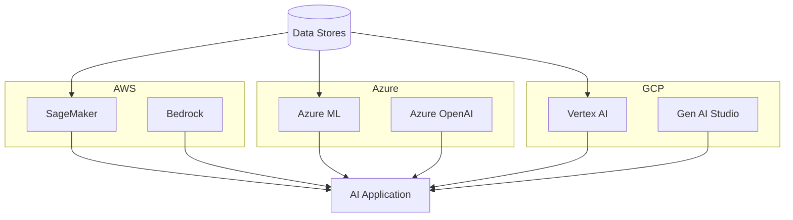

# Cloud for AI

> Choose the right cloud services from AWS, Azure, and GCP to power your AI solutions.

## TL;DR
- **AWS, Azure, and GCP** all provide managed AI platforms, but service names and integrations differ.
- **Managed services** accelerate delivery while **custom deployments** offer flexibility.
- **Best practices** focus on cost control, security, and scalability regardless of cloud.

## Quickstart (Do this now)
1. **Pick a platform**: Choose AWS SageMaker, Azure ML, or GCP Vertex AI for managed model hosting.
2. **Prepare data**: Use cloud storage like S3, Azure Blob, or Cloud Storage with proper access controls.
3. **Deploy models**: Start with serverless endpoints (e.g., Bedrock, Azure OpenAI, Vertex AI Endpoints).
4. **Monitor usage**: Track latency, errors, and spending with native monitoring tools.
5. **Plan for scale**: Enable autoscaling or use Kubernetes (EKS/AKS/GKE) for large workloads.

## The Idea (Slightly deeper)
Cloud providers offer similar building blocks for AI: data storage, model training, and inference services. While terminology differs, the underlying concepts—managed compute, serverless options, and integrated monitoring—map closely across providers.

## Diagram

## Cloud Service Comparison
| Capability | AWS | Azure | GCP |
|------------|-----|-------|-----|
| Managed ML platform | SageMaker | Azure ML | Vertex AI |
| Foundation model access | Bedrock | Azure OpenAI | Vertex AI Generative AI |
| Data lake storage | S3 | Azure Data Lake | Cloud Storage |
| Serverless functions | Lambda | Azure Functions | Cloud Functions |
| Kubernetes service | EKS | AKS | GKE |

## AWS Services
- **Amazon SageMaker** – end-to-end model training and deployment
- **AWS Bedrock** – managed access to foundation models
- **Amazon EC2 GPU Instances** – custom model hosting on GPUs
- **Amazon S3** – scalable object storage for datasets
- **AWS Lambda** – serverless compute for lightweight inference

## Azure Services
- **Azure Machine Learning** – build, train, and deploy ML models
- **Azure OpenAI Service** – hosted foundation models with enterprise features
- **Azure Kubernetes Service (AKS)** – container orchestration for AI workloads
- **Azure Blob Storage** – secure data lake for training data
- **Azure Functions** – serverless execution for event-driven AI

## GCP Services
- **Vertex AI** – unified platform for ML and generative AI
- **Generative AI Studio** – tools for building and tuning foundation models
- **Google Kubernetes Engine (GKE)** – scalable Kubernetes clusters
- **Cloud Storage** – durable object storage for datasets
- **Cloud Functions** – lightweight serverless compute

## Best Practices
- **Use managed services first** to reduce infrastructure overhead
- **Enable cost alerts** and choose spot/preemptible instances when possible
- **Secure data** with IAM roles, private networks, and encryption at rest and in transit
- **Automate scaling** using serverless endpoints or Kubernetes autoscalers
- **Log everything** for auditing, debugging, and performance tuning

## Key Concepts
- **Managed vs. Custom Deployment**: Trade off control for speed by using hosted services
- **Multi-Cloud Strategy**: Balance vendor lock-in with operational complexity
- **Cost Optimization**: Rightsize instances and leverage reserved/spot pricing
- **Security Baselines**: Apply least privilege and monitor for anomalies

## When to Use This
- **Use when**: Evaluating cloud options for deploying AI systems
- **Use when**: Building portable architectures that may span providers
- **Don't use when**: Running entirely on-prem or without internet access
- **Consider alternatives**: On-prem GPUs or specialized AI clouds

## Real-World Examples
- **Airbnb** uses **AWS SageMaker** for model training and inference
- **CarMax** leverages **Azure Machine Learning** for personalized recommendations
- **Twitter** (X) employs **GCP Vertex AI** to power content ranking models

## Common Pitfalls
- **Ignoring cost metrics**: Cloud AI services can scale spending quickly
- **Skipping security reviews**: Misconfigured IAM leads to data exposure
- **Over-optimizing early**: Start simple before adopting multi-cloud patterns

## Deep Dives & "Why it's awesome"
- **[AWS ML Services](https://aws.amazon.com/machine-learning/)** – Official overview of AWS AI offerings
- **[Azure AI Services](https://azure.microsoft.com/en-us/solutions/ai/)** – Microsoft’s catalog of AI tools
- **[Google Cloud AI](https://cloud.google.com/products/ai)** – GCP’s suite for AI development
- **[Cloud Cost Management](https://cloud.google.com/docs/enterprise/best-practices-for-cloud-cost-management)** – Strategies for controlling spend

## Next Steps
- **Learn more**: [Serving & Scaling](serving-and-scaling.md) – Deploy AI models in production
- **Explore**: [Orchestration Frameworks](orchestration-frameworks.md) – Coordinate workflows across services
- **Connect**: [AI Architecture Community](https://github.com/topics/ai-architecture) – Share cloud deployment tips

