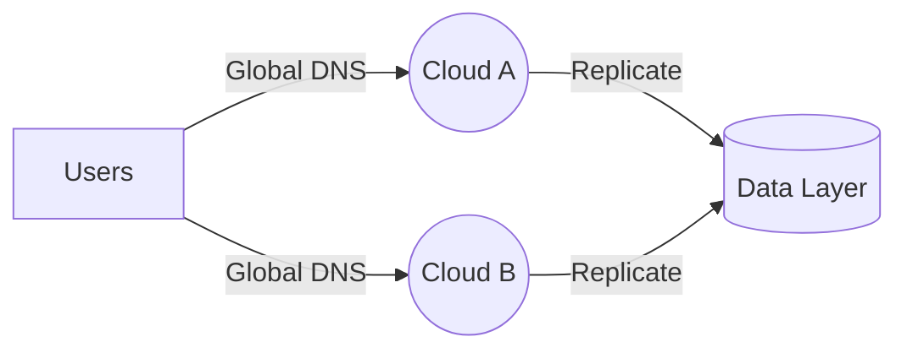

# Multi-Cloud

> Build AI systems that span multiple clouds for resilience, compliance, and cost optimization.

## TL;DR
- **Portability** keeps your workloads flexible so they can run on any cloud with minimal changes.
- **Data residency** ensures information stays in specific regions to meet compliance rules.
- **Failover** automatically shifts traffic to a healthy cloud when problems occur.
- **Cost arbitrage** saves money by running workloads where prices are lowest.

## Quickstart (Do this now)
1. **Abstract your infrastructure** using containers and tools like Terraform or Crossplane.
2. **Tag and segment data** based on residency requirements and enforce policies programmatically.
3. **Set up health checks and global DNS** to redirect users during outages.
4. **Compare provider pricing** and schedule non-critical jobs where compute is cheapest.

## The Idea (Slightly deeper)
Multi-cloud architectures leverage services from more than one cloud provider. By avoiding single-vendor dependencies, teams gain flexibility, negotiate better pricing, and reduce the blast radius of outages. The trade-off is increased complexity in networking, identity, and monitoring.

**Portability** comes from using standards-based tooling such as containers, Kubernetes, or Terraform. When your deployment artifacts are cloud-agnostic, switching providers becomes a configuration change rather than a rewrite.

**Data residency** matters for regulations like GDPR or HIPAA. Storing and processing data in the required geography keeps auditors happy and reduces legal risk.

**Failover** protects availability. If Cloud A fails, traffic automatically shifts to Cloud B, keeping your service online.

**Cost arbitrage** lets you take advantage of regional or provider pricing differences. By moving batch jobs or training runs to the lowest-cost environment, you keep budgets under control.

## Diagram

## Key Concepts
- **Portability**: Standardized deployments that run anywhere.
- **Data Residency**: Geolocation controls on where data lives and is processed.
- **Failover**: Automated routing to maintain uptime across providers.
- **Cost Arbitrage**: Dynamic workload placement to optimize pricing.

## When to Use This
- You need vendor neutrality or want to negotiate better contracts.
- Compliance rules require data to stay within specific borders.
- Uptime is critical and a single-cloud outage is unacceptable.
- You have elastic workloads that can move to chase lower prices.

## Real-World Examples
- **Dropbox** migrated some workloads from AWS to on-prem and other clouds for cost control.
- **European banks** store customer data within EU regions to meet GDPR requirements.
- **Gaming platforms** shift traffic between clouds during regional outages.
- **ML training farms** spread jobs across clouds to use cheaper spot instances.

## Common Pitfalls
- **Hidden provider lock-in**: Managed services that don't have equivalents elsewhere limit portability.
- **Data duplication issues**: Keeping replicas in sync across regions can introduce latency and consistency problems.
- **Unprepared failover drills**: Switchover paths rot if not tested regularly.
- **Egress fees**: Moving data between clouds can erode cost savings.

## Deep Dives & "Why it's awesome"
- **[Google Anthos](https://cloud.google.com/anthos)** – Manage Kubernetes clusters across clouds from a single control plane.
- **[Azure Arc](https://azure.microsoft.com/en-us/products/azure-arc/)** – Extend Azure services and management to any infrastructure.
- **[HashiCorp Terraform](https://www.terraform.io/)** – Provision and configure multi-cloud resources with one workflow.
- **[Crossplane](https://www.crossplane.io/)** – Kubernetes-based control plane for multi-cloud infrastructure.

## Next Steps
- **Learn more**: [Serving & Scaling](serving-and-scaling.md) – Run workloads efficiently across environments.
- **Try it**: Experiment with a small app deployed to two clouds and practice failover.
- **Connect**: Research pricing calculators from AWS, Azure, and GCP to compare costs.
