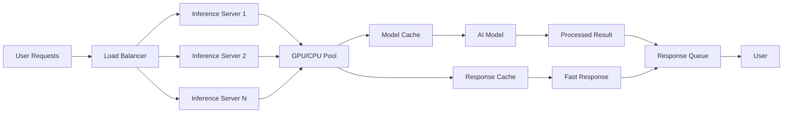

# Serving & Scaling

> **One-line promise**: Deploy AI models that handle thousands of users with fast response times and automatic scaling.

## TL;DR (Explain Like I'm 12)
- **Inference servers** are like restaurants that serve AI answers instead of food - they take orders and deliver results quickly.
- **Batching** is like cooking multiple meals at once instead of one at a time - it's more efficient.
- **GPU vs CPU** is like using a sports car vs a regular car - GPUs are faster for AI but cost more.
- **Autoscaling** means your system automatically grows bigger when busy and smaller when quiet.

## Quickstart (Do this now)
1. **Choose your server**: Pick vLLM, TensorRT, or cloud-native inference services
2. **Set up batching**: Group similar requests together to process them efficiently
3. **Optimize your model**: Use quantization and model compression to reduce size
4. **Add monitoring**: Track response times, throughput, and error rates
5. **Test scaling**: Simulate high traffic to see how your system handles load

## The Idea (Slightly deeper)
**Inference servers** are specialized software that runs AI models and serves predictions to users. They're optimized for speed, efficiency, and handling many requests at once.

**Batching** groups multiple similar requests together and processes them as a batch. This is much more efficient than handling each request individually, like cooking multiple meals at once.

**GPU vs CPU** choice depends on your needs. GPUs (Graphics Processing Units) are much faster for AI inference but cost more. CPUs are cheaper but slower. For production AI, GPUs usually win.

**Autoscaling** automatically adjusts your system size based on demand. When traffic increases, it adds more servers. When traffic decreases, it removes servers to save money.

## Diagram (Mermaid)

## Key Concepts
- **Inference Server**: Software that runs AI models and serves predictions
- **Batching**: Processing multiple requests together for efficiency
- **Token Throughput**: How many words/tokens your system can process per second
- **Model Quantization**: Reducing model size while maintaining accuracy
- **Response Caching**: Storing common answers to avoid recomputing
- **Load Balancing**: Distributing requests across multiple servers

## When to Use This
- **Use when**: Deploying AI models to production environments
- **Use when**: Expecting high traffic or many concurrent users
- **Use when**: Need fast response times (under 1 second)
- **Don't use when**: Building simple prototypes or personal projects
- **Consider alternatives**: Cloud AI services for low-traffic applications

## Real-World Examples
- **vLLM**: High-performance inference server for LLMs → [vLLM](https://vllm.ai/) (open-source inference server used by major companies for production LLM serving)
- **TensorRT**: NVIDIA's optimized inference engine → [TensorRT](https://developer.nvidia.com/tensorrt) (industry-standard for GPU-accelerated AI inference)
- **AWS Inferentia**: Custom chips designed for AI inference → [AWS Inferentia](https://aws.amazon.com/machine-learning/inferentia/) (cost-effective AI inference with specialized hardware)
- **Azure ML Endpoints**: Managed AI model serving → [Azure ML Endpoints](https://learn.microsoft.com/en-us/azure/machine-learning/how-to-deploy-managed-online-endpoints) (enterprise-grade model serving with automatic scaling)

## Common Pitfalls
- **No batching**: Always batch similar requests for better efficiency
- **Missing caching**: Cache common responses to reduce compute costs
- **Poor monitoring**: Track performance metrics to identify bottlenecks
- **Ignoring costs**: Monitor spending on compute resources

## Deep Dives & "Why it's awesome"
- **[vLLM Documentation](https://docs.vllm.ai/)** - High-performance inference server with automatic batching and optimization
- **[TensorRT Developer Guide](https://docs.nvidia.com/deeplearning/tensorrt/developer-guide/index.html)** - NVIDIA's comprehensive guide to GPU-optimized inference
- **[AWS ML Inference Best Practices](https://docs.aws.amazon.com/sagemaker/latest/dg/deploy-model.html)** - AWS framework for deploying ML models in production
- **[Azure ML Deployment](https://learn.microsoft.com/en-us/azure/machine-learning/how-to-deploy-managed-online-endpoints)** - Microsoft's approach to AI model serving with enterprise features
- **[Google Cloud AI Platform Prediction](https://cloud.google.com/ai-platform/prediction/docs)** - Google's managed AI model serving platform
- **[Model Serving Architecture](https://www.tensorflow.org/tfx/serving/architecture)** - TensorFlow's production-ready model serving framework

## Latency Budget Checklist
- **Pre-compute**: Generate common responses ahead of time
- **Cache aggressively**: Store results for repeated requests
- **Truncate context**: Limit input size to reduce processing time
- **Choose right model**: Pick smaller, faster models when accuracy allows
- **Use CDNs**: Serve static content from edge locations
- **Optimize network**: Minimize data transfer between services

## Next Steps
- **Learn more**: [Orchestration Frameworks](ai-architecture-topics/orchestration-frameworks.md) - How to coordinate multiple AI services
- **Try it**: [vLLM Quickstart](https://docs.vllm.ai/en/latest/getting_started/quickstart.html) - Deploy your first high-performance inference server
- **Connect**: [AI Inference Community](https://github.com/topics/ai-inference) - Join discussions about AI model serving

## Sources
https://docs.vllm.ai/
https://docs.nvidia.com/deeplearning/tensorrt/developer-guide/index.html
https://docs.aws.amazon.com/sagemaker/latest/dg/deploy-model.html
https://learn.microsoft.com/en-us/azure/machine-learning/how-to-deploy-managed-online-endpoints
https://cloud.google.com/ai-platform/prediction/docs
https://www.tensorflow.org/tfx/serving/architecture
https://vllm.ai/
https://developer.nvidia.com/tensorrt
https://aws.amazon.com/machine-learning/inferentia/
https://learn.microsoft.com/en-us/azure/machine-learning/how-to-deploy-managed-online-endpoints
