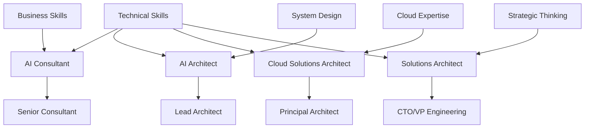

# AI Architecture Career Guide

> **One-line promise**: Build a successful AI architecture career with clear role paths, portfolio strategies, and profile optimization techniques.

## TL;DR (Explain Like I'm 12)
- **AI Consultant** helps companies figure out how to use AI to solve business problems.
- **AI Architect** designs the technical systems that make AI work in real companies.
- **Cloud Solutions Architect** builds AI systems that run on cloud platforms like AWS or Azure.
- **Solutions Architect** creates complete systems that solve business problems, often including AI.

## Quickstart (Do this now)
1. **Pick your target role**: Choose the career path that matches your skills and interests
2. **Build your portfolio**: Create 2-3 AI projects that showcase your abilities
3. **Optimize your profile**: Update LinkedIn and resume with AI-focused keywords
4. **Network strategically**: Connect with people in your target role
5. **Apply with confidence**: Use your portfolio and optimized profile to land interviews

## The Idea (Slightly deeper)
**AI architecture careers** combine technical AI skills with business understanding and system design. You need to know how AI works, how to build systems, and how to solve real business problems.

**Role progression** typically moves from technical implementation to system design to strategic consulting. Each role builds on the previous one, adding new skills and responsibilities.

**Portfolio building** is crucial because AI architecture is practical - employers want to see real systems you've built, not just theoretical knowledge.

**Profile optimization** ensures recruiters and hiring managers can find you and understand your value proposition.

## Diagram (Mermaid)

## Key Concepts
- **Role Specialization**: Different AI architecture roles require different skill combinations
- **Portfolio Development**: Building real projects that demonstrate your capabilities
- **Profile Optimization**: Making yourself discoverable and attractive to employers
- **Career Progression**: Understanding how roles evolve and advance
- **Skill Stack**: Technical, business, and soft skills needed for each role

## When to Use This
- **Use when**: Planning your AI architecture career path
- **Use when**: Building your professional profile and portfolio
- **Use when**: Applying for AI architecture positions
- **Don't use when**: You're just starting to learn AI basics
- **Consider alternatives**: Basic AI courses for foundational knowledge

## Role Snapshots

### AI Consultant
**What the job does**: Helps companies understand how AI can solve their business problems and creates implementation roadmaps.

**Skills stack**: AI knowledge, business analysis, communication, project management, stakeholder management.

**Portfolio checklist**: 
- Business case studies showing AI ROI
- Implementation roadmaps and strategies
- Client testimonials and success stories
- Industry-specific AI solutions

**Resume/LinkedIn keywords**: AI Strategy, Business Transformation, Digital Innovation, AI Roadmap, Change Management, Stakeholder Engagement, ROI Analysis, Process Optimization, AI Adoption, Business Process Reengineering.

### AI Architect
**What the job does**: Designs the technical architecture for AI systems, including data pipelines, model serving, and integration points.

**Skills stack**: System design, AI/ML engineering, data architecture, API design, security, scalability.

**Portfolio checklist**:
- End-to-end AI system designs
- Architecture diagrams and documentation
- Performance and scalability metrics
- Security and compliance implementations

**Resume/LinkedIn keywords**: AI Architecture, System Design, Machine Learning Engineering, Data Pipeline Design, API Architecture, Scalable Systems, AI Infrastructure, Model Serving, Data Architecture, System Integration.

### Cloud Solutions Architect
**What the job does**: Designs AI systems that run on cloud platforms, optimizing for cost, performance, and cloud-native features.

**Skills stack**: Cloud platform expertise (AWS/Azure/GCP), AI services, cost optimization, security, compliance.

**Portfolio checklist**:
- Cloud-native AI system designs
- Cost optimization case studies
- Multi-cloud architecture examples
- Security and compliance implementations

**Resume/LinkedIn keywords**: Cloud Architecture, AWS Solutions Architect, Azure Solutions Architect, GCP Cloud Architect, Cloud-Native Design, Cost Optimization, Multi-Cloud Strategy, Cloud Security, Serverless Architecture, Container Orchestration.

### Solutions Architect
**What the job does**: Creates complete technical solutions that solve business problems, often including AI components as part of larger systems.

**Skills stack**: Enterprise architecture, system integration, business analysis, technical leadership, project management.

**Portfolio checklist**:
- End-to-end solution architectures
- Business problem to technical solution mappings
- Integration and migration strategies
- Enterprise architecture frameworks

**Resume/LinkedIn keywords**: Enterprise Architecture, Solution Design, System Integration, Technical Leadership, Business Analysis, Digital Transformation, Technology Strategy, Architecture Governance, Solution Architecture, Enterprise Integration.

## Profile Polish

### LinkedIn Headline Examples
- "AI Solutions Architect | Building Scalable AI Systems | AWS/Azure Expert"
- "AI Consultant | Digital Transformation | Helping Companies Scale with AI"
- "Cloud Solutions Architect | AI Infrastructure | Cost Optimization Specialist"
- "Senior AI Architect | Enterprise AI Systems | Strategic Technology Leadership"

### "About" Paragraph Template
"AI Solutions Architect with [X] years of experience designing and implementing intelligent systems that drive business value. Specialized in [specific AI areas] with expertise in [cloud platforms/technologies]. Passionate about [specific interests] and helping organizations [specific outcomes]. Proven track record of [quantifiable achievements]."

### 6-Bullet Resume Formula
- **Impact**: "Led AI transformation initiative resulting in [X% improvement]"
- **Scope**: "Architected [X] AI systems serving [Y] users"
- **Technology**: "Implemented [specific AI technologies] on [cloud platforms]"
- **Leadership**: "Managed team of [X] engineers delivering [Y] projects"
- **Business Value**: "Generated [X] in cost savings through AI optimization"
- **Innovation**: "Pioneered [specific AI approach] adopted by [X] teams"

## Portfolio Building

### Sample Portfolio Outline
1. **Executive Summary**: 2-3 sentence overview of your AI architecture expertise
2. **Case Studies**: 3-5 detailed project examples with business impact
3. **Technical Deep Dives**: Architecture diagrams and implementation details
4. **Results & Metrics**: Quantifiable outcomes and performance improvements
5. **Technologies Used**: Comprehensive list of tools, platforms, and frameworks
6. **Testimonials**: Client and colleague recommendations
7. **Blog/Content**: Articles demonstrating thought leadership

### Project Types to Include
- **RAG Systems**: Knowledge management and question-answering applications
- **ML Pipelines**: End-to-end machine learning workflows
- **AI APIs**: Scalable AI service architectures
- **Data Platforms**: AI-ready data infrastructure designs
- **Security Implementations**: AI safety and compliance solutions

## Real-World Examples
- **AI Consultants** at McKinsey and BCG help Fortune 500 companies develop AI strategies
- **AI Architects** at Google and Microsoft design systems used by millions of users
- **Cloud Solutions Architects** at AWS and Azure build reference architectures for enterprise customers
- **Solutions Architects** at consulting firms create complete technology solutions for complex business problems

## Common Pitfalls
- **Generic portfolio**: Make each project specific to your target role
- **Missing business context**: Always explain the business problem and impact
- **Poor presentation**: Use clear diagrams and professional formatting
- **Ignoring keywords**: Include relevant terms for ATS systems and recruiters

## Deep Dives & "Why it's awesome"
- **[TealHQ Career Paths](https://www.tealhq.com/career-paths)** - Comprehensive career guidance with salary data and skill requirements
- **[LinkedIn AI Architecture Jobs](https://www.linkedin.com/jobs/ai-architect-jobs/)** - Real job postings showing current market requirements
- **[AWS Solutions Architect Blog](https://aws.amazon.com/blogs/architecture/)** - Industry insights and best practices from AWS experts
- **[Azure Architecture Center](https://learn.microsoft.com/en-us/azure/architecture/)** - Microsoft's comprehensive architecture guidance and examples

## Next Steps
- **Learn more**: [Interview Prep](interview-prep.md) - Prepare for AI architecture job interviews
- **Try it**: [LinkedIn Profile Optimization](https://www.linkedin.com/learning/topics/profile-optimization) - Optimize your professional profile
- **Connect**: [AI Architecture Community](https://github.com/topics/ai-architecture) - Join discussions about AI architecture careers

## Sources
https://www.tealhq.com/career-paths
https://www.linkedin.com/jobs/ai-architect-jobs/
https://aws.amazon.com/blogs/architecture/
https://learn.microsoft.com/en-us/azure/architecture/
