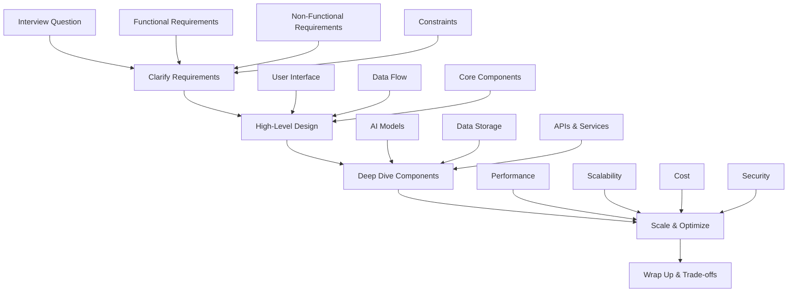

# AI Architecture Interview Prep

> **One-line promise**: Ace AI architecture interviews with proven frameworks, practice questions, and strategic preparation techniques.

## TL;DR (Explain Like I'm 12)
- **System design interviews** are like being asked to design a city - you need to think about roads, buildings, and how everything connects.
- **GenAI system design** means designing AI systems that can generate text, images, or other content.
- **Practice questions** help you get comfortable with the interview format and common problems.
- **Frameworks** give you a step-by-step way to approach any design problem.

## Quickstart (Do this now)
1. **Learn the framework**: Master the 4-step system design approach
2. **Practice GenAI scenarios**: Work through 3-5 GenAI system design questions
3. **Build your toolkit**: Understand common AI patterns and trade-offs
4. **Mock interviews**: Practice with friends or use online platforms
5. **Review and refine**: Identify weak areas and focus your preparation

## The Idea (Slightly deeper)
**AI architecture interviews** test your ability to design complex systems that can handle real-world problems. You need to show you can think through requirements, design scalable solutions, and explain your decisions clearly.

**GenAI system design** focuses on building systems that generate content using large language models, image generators, or other AI models. These systems have unique challenges around cost, latency, and quality.

**Interview frameworks** give you a structured way to approach any design problem, ensuring you cover all the important aspects and don't miss critical details.

**Practice questions** help you develop the mental models and communication skills needed to succeed in real interviews.

## Diagram (Mermaid)

## Key Concepts
- **Requirements Clarification**: Understanding what you're building and why
- **High-Level Design**: Creating a bird's-eye view of the system
- **Component Deep Dive**: Detailed design of key system parts
- **Scaling Strategy**: How the system handles growth and load
- **Trade-off Analysis**: Balancing different design priorities

## When to Use This
- **Use when**: Preparing for AI architecture job interviews
- **Use when**: Practicing system design skills
- **Use when**: Building confidence in technical discussions
- **Don't use when**: You're just starting to learn AI basics
- **Consider alternatives**: Basic AI courses for foundational knowledge

## How to Think in Interviews

### 4-Step Framework
1. **Clarify**: Ask questions to understand requirements, constraints, and goals
2. **High-Level**: Draw a simple diagram showing the main components and flow
3. **Deep Dive**: Explain key components in detail, including AI models and data
4. **Scale & Optimize**: Discuss performance, scalability, and trade-offs

### Communication Tips
- **Think out loud**: Explain your reasoning as you go
- **Use diagrams**: Draw simple boxes and arrows to illustrate your design
- **Ask for feedback**: Check if your understanding matches the interviewer's expectations
- **Show trade-offs**: Demonstrate you understand design decisions have consequences

## GenAI System Design Framework

### Clarify Requirements
- **What type of content** are you generating? (text, images, code, etc.)
- **Who are the users** and what's their use case?
- **What's the expected volume** of requests?
- **What quality standards** are required?
- **What are the constraints** (cost, latency, accuracy)?

### High-Level Design
- **User Interface**: How users interact with the system
- **AI Model Layer**: Where the generation happens
- **Data Flow**: How requests move through the system
- **Storage**: Where generated content and metadata are stored

### Deep Dive Components
- **Model Selection**: Choosing the right AI model for the task
- **Prompt Engineering**: Designing effective inputs for the AI
- **Response Processing**: Handling and formatting AI outputs
- **Quality Control**: Ensuring generated content meets standards

### Scale & Optimize
- **Performance**: Response time and throughput optimization
- **Cost Management**: Balancing quality with cost per request
- **Scalability**: Handling increased load and traffic
- **Security**: Protecting against prompt injection and abuse

## Practice Questions

### Question 1: AI-Powered Customer Support Chatbot
**What the interviewer wants to learn**: Can you design a system that provides helpful customer support using AI?

**Structured answer**:
- **Requirements**: 24/7 support, handle common questions, escalate complex issues
- **High-level**: Web interface → AI model → knowledge base → human escalation
- **Components**: RAG system for knowledge retrieval, LLM for response generation
- **Scale**: Load balancing, caching, monitoring response quality

**Follow-up**: How would you handle cases where the AI gives incorrect information?

### Question 2: Content Generation Platform
**What the interviewer wants to learn**: Can you design a system that generates different types of content?

**Structured answer**:
- **Requirements**: Generate text, images, and code based on user prompts
- **High-level**: User dashboard → content generation → review → delivery
- **Components**: Multiple AI models, content moderation, user management
- **Scale**: Queue system, parallel processing, cost optimization

**Follow-up**: How would you implement content filtering and safety measures?

### Question 3: AI-Powered Search Engine
**What the interviewer wants to learn**: Can you design a search system that understands user intent?

**Structured answer**:
- **Requirements**: Natural language queries, relevant results, fast response
- **High-level**: Query processing → intent understanding → search → ranking
- **Components**: NLP models, vector database, ranking algorithms
- **Scale**: Distributed search, caching, result personalization

**Follow-up**: How would you handle search result bias and fairness?

### Question 4: Real-Time AI Translation Service
**What the interviewer wants to learn**: Can you design a system that translates content in real-time?

**Structured answer**:
- **Requirements**: Support multiple languages, low latency, high accuracy
- **High-level**: Input → language detection → translation → output
- **Components**: Translation models, language detection, streaming
- **Scale**: Edge computing, model optimization, quality monitoring

**Follow-up**: How would you handle rare languages or dialects?

### Question 5: AI Content Recommendation System
**What the interviewer wants to learn**: Can you design a system that suggests relevant content?

**Structured answer**:
- **Requirements**: Personalized recommendations, real-time updates, diverse content
- **High-level**: User behavior → feature extraction → recommendation → ranking
- **Components**: ML models, user profiles, content features, A/B testing
- **Scale**: Real-time processing, model serving, recommendation diversity

**Follow-up**: How would you prevent recommendation echo chambers?

### Question 6: AI-Powered Code Review Assistant
**What the interviewer wants to learn**: Can you design a system that helps review code?

**Structured answer**:
- **Requirements**: Code analysis, security checks, improvement suggestions
- **High-level**: Code input → analysis → review → feedback
- **Components**: Code parsing, security scanning, LLM analysis
- **Scale**: Parallel processing, incremental analysis, integration with CI/CD

**Follow-up**: How would you handle false positives in security scanning?

### Question 7: AI Image Generation Service
**What the interviewer wants to learn**: Can you design a system that generates images from text?

**Structured answer**:
- **Requirements**: Text-to-image generation, content moderation, fast response
- **High-level**: Text input → image generation → moderation → delivery
- **Components**: Diffusion models, content filters, image storage
- **Scale**: GPU optimization, queue management, cost control

**Follow-up**: How would you implement content safety and prevent misuse?

### Question 8: AI-Powered Data Analysis Platform
**What the interviewer wants to learn**: Can you design a system that analyzes data using AI?

**Structured answer**:
- **Requirements**: Data ingestion, AI analysis, visualization, insights
- **High-level**: Data input → processing → AI analysis → visualization
- **Components**: Data pipeline, ML models, dashboard, alerting
- **Scale**: Data processing, model training, real-time insights

**Follow-up**: How would you handle data privacy and security?

## Common AI/ML Topics to Review

### Model Types
- **Large Language Models (LLMs)**: GPT, Claude, LLaMA for text generation
- **Diffusion Models**: DALL-E, Stable Diffusion for image generation
- **Transformer Models**: BERT, T5 for understanding and generation
- **Multimodal Models**: GPT-4V, Claude 3 for text + image

### Evaluation Metrics
- **Accuracy**: How often the AI gives correct answers
- **Latency**: How quickly the system responds
- **Throughput**: How many requests the system can handle
- **Cost per Request**: How much each AI operation costs

### System Considerations
- **Model Drift**: When AI performance degrades over time
- **Data Privacy**: Protecting sensitive information
- **MLOps**: Managing the machine learning lifecycle
- **Monitoring**: Tracking system performance and quality

## Behavioral Questions

### Leadership Examples
- **Team Management**: "Tell me about a time you led a team through a technical challenge"
- **Stakeholder Communication**: "How do you explain complex technical concepts to non-technical people?"
- **Conflict Resolution**: "Describe a situation where you had to resolve a disagreement about technical direction"

### Technical Challenges
- **Problem Solving**: "Walk me through how you debugged a complex system issue"
- **Learning New Technologies**: "How do you stay current with rapidly changing AI technologies?"
- **Quality Assurance**: "What's your approach to ensuring AI systems are reliable and safe?"

## Stay Current

### Industry Resources
- **ByteByteGo**: System design interview preparation and real-world examples
- **AI Research Papers**: Latest developments in AI models and techniques
- **Cloud Provider Blogs**: AWS, Azure, and Google Cloud AI updates
- **AI Conferences**: NeurIPS, ICML, and industry events

### Practice Platforms
- **System Design Interviews**: Online platforms for practicing design questions
- **AI Hackathons**: Build real projects and learn from others
- **Open Source Projects**: Contribute to AI projects to gain experience
- **Technical Blogs**: Write about AI architecture to solidify your knowledge

## Real-World Examples
- **OpenAI's ChatGPT**: Demonstrates how to build a scalable AI chat service
- **GitHub Copilot**: Shows AI integration into developer workflows
- **Notion AI**: Illustrates AI-powered productivity tool design
- **Midjourney**: Examples of AI image generation at scale

## Common Pitfalls
- **Jumping to solutions**: Always clarify requirements first
- **Ignoring non-functional requirements**: Consider performance, security, and cost
- **Poor communication**: Practice explaining technical concepts clearly
- **No trade-off analysis**: Show you understand design decisions have consequences

## Deep Dives & "Why it's awesome"
- **[ByteByteGo System Design](https://bytebytego.com/)** - Comprehensive system design interview preparation with real-world examples
- **[System Design Primer](https://github.com/donnemartin/system-design-primer)** - Open-source guide to system design interviews
- **[AI System Design Examples](https://github.com/topics/ai-system-design)** - Real-world AI system architectures and implementations
- **[Interview Preparation Resources](https://github.com/topics/interview-prep)** - Community-curated interview preparation materials

## Next Steps
- **Learn more**: [AI Architecture Patterns](ai-architecture-topics/ai-architecture-patterns.md) - Master the patterns you'll design in interviews
- **Try it**: [System Design Practice](https://bytebytego.com/) - Start practicing with real system design questions
- **Connect**: [AI Interview Community](https://github.com/topics/ai-interview) - Join discussions about AI interview preparation

## Sources
https://bytebytego.com/
https://github.com/donnemartin/system-design-primer
https://github.com/topics/ai-system-design
https://github.com/topics/interview-prep
