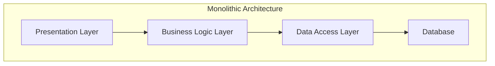
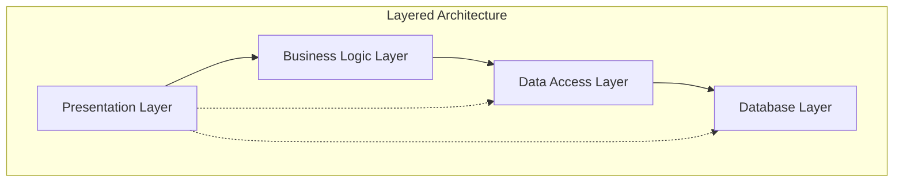
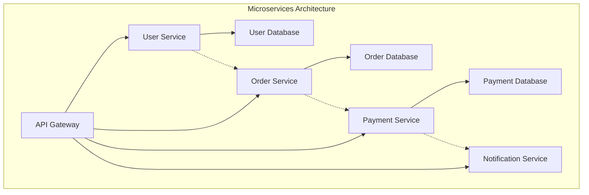
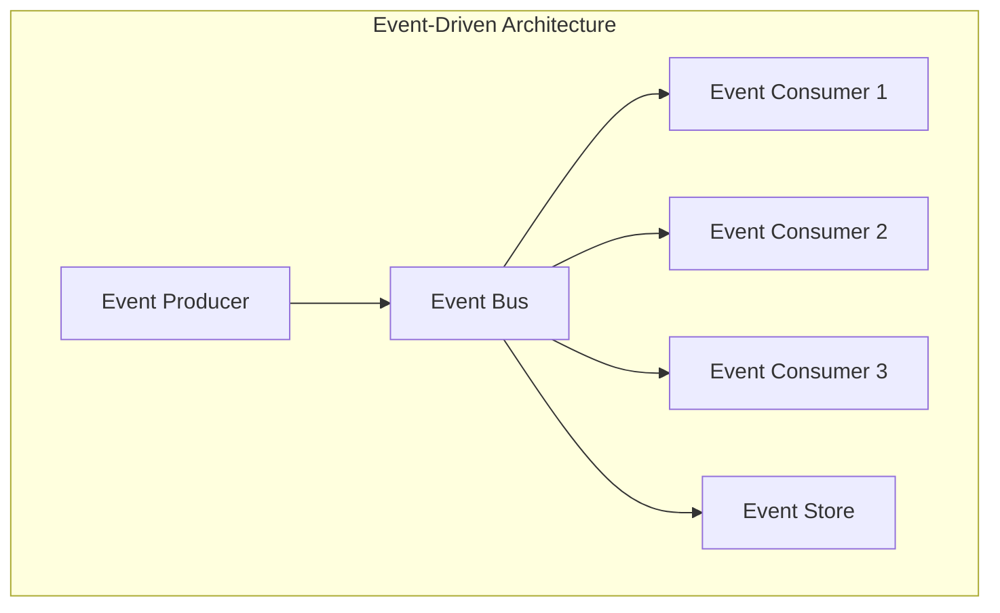
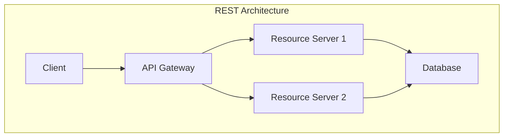

# Architectural Patterns and Styles

> **📚 Part of the [Awesome AI Architect](../README.md) knowledge base** - Master architectural patterns and styles for designing robust, scalable, and maintainable solutions

## TL;DR

**Architectural patterns and styles provide proven solutions to common design problems.** They represent the collective wisdom of the software architecture community, offering reusable approaches to organizing systems, managing complexity, and achieving quality attributes. Understanding these patterns is essential for making informed architectural decisions.

**Key takeaway:** Patterns are not one-size-fits-all solutions—they're tools in your architectural toolkit that must be chosen based on context, requirements, and tradeoffs.

## Overview

Architectural patterns and styles are recurring solutions to common problems in software architecture. They provide a shared vocabulary for architects and offer proven approaches to organizing systems, managing complexity, and achieving specific quality attributes. These patterns have evolved over decades of software development and represent best practices for different architectural concerns.

## Common Architectural Principles

### Separation of Concerns
Each component should have a single, well-defined responsibility.

**Benefits:**
- Improved maintainability
- Better testability
- Increased flexibility
- Easier understanding

**Implementation:**
- Layered architectures
- Microservices
- Domain-driven design
- Modular monoliths

### Single Responsibility Principle
A component should have only one reason to change.

**Benefits:**
- Reduced coupling
- Easier testing
- Clearer code organization
- Better maintainability

### Don't Repeat Yourself (DRY)
Every piece of knowledge should have a single representation.

**Benefits:**
- Reduced maintenance burden
- Consistency across the system
- Easier updates
- Less chance of inconsistencies

**Balance:** Don't over-abstract—some duplication is acceptable.

### Keep It Simple, Stupid (KISS)
Solutions should be as simple as possible, but no simpler.

**Benefits:**
- Easier to understand
- Simpler to maintain
- Less prone to bugs
- Faster development

## Architectural Styles

### Monolithic Architecture

A monolithic architecture is a single, self-contained application where all components are tightly coupled and deployed together.

**Characteristics:**
- Single deployment unit
- Shared memory space
- Tight coupling between components
- Single technology stack
- Centralized data management

**Benefits:**
- Simple to develop and deploy
- Easy to test
- No network latency between components
- Simple debugging
- Easy to scale vertically

**Drawbacks:**
- Difficult to scale horizontally
- Technology lock-in
- Single point of failure
- Hard to maintain as system grows
- Difficult to adopt new technologies

**When to Use:**
- Small to medium applications
- Simple business logic
- Limited team size
- Rapid prototyping
- Legacy system modernization

### Layered Architecture

A layered architecture organizes components into horizontal layers, where each layer has a specific responsibility and can only communicate with adjacent layers.

**Common Layers:**
- **Presentation Layer**: User interface and user interaction
- **Business Logic Layer**: Core business rules and processes
- **Data Access Layer**: Data persistence and retrieval
- **Database Layer**: Data storage

**Benefits:**
- Clear separation of concerns
- Easy to understand and maintain
- Reusable components
- Technology independence within layers
- Easy to test individual layers

**Drawbacks:**
- Performance overhead
- Difficult to change layer responsibilities
- Can lead to anemic domain models
- Tight coupling between adjacent layers

**When to Use:**
- Traditional business applications
- Systems with clear layer boundaries
- Teams new to architecture
- Legacy system integration

### Microservices Architecture

Microservices architecture decomposes applications into small, independent services that communicate over well-defined APIs.

**Characteristics:**
- Service independence
- Decentralized data management
- Technology diversity
- Fault isolation
- Independent deployment

**Benefits:**
- Independent scaling
- Technology flexibility
- Fault isolation
- Team autonomy
- Easier to understand individual services

**Drawbacks:**
- Increased complexity
- Network latency
- Data consistency challenges
- Distributed system complexity
- Operational overhead

**When to Use:**
- Large, complex applications
- Multiple teams
- Different scalability requirements
- Technology diversity needs
- Independent deployment requirements

### Event-Driven Architecture

Event-driven architecture uses events to trigger and communicate between decoupled services.

**Key Components:**
- **Event Producers**: Generate events
- **Event Consumers**: React to events
- **Event Bus/Message Broker**: Routes events
- **Event Store**: Persists events

**Benefits:**
- Loose coupling
- Scalability
- Flexibility
- Real-time processing
- Fault tolerance

**Drawbacks:**
- Eventual consistency
- Complex debugging
- Event ordering challenges
- Message delivery guarantees
- Increased complexity

**When to Use:**
- Real-time systems
- High-volume data processing
- Systems with many integrations
- Event sourcing requirements
- Asynchronous processing needs

### REST Architecture

REST (Representational State Transfer) is an architectural style for designing networked applications.

**REST Principles:**
- **Stateless**: Each request contains all necessary information
- **Client-Server**: Separation of concerns
- **Cacheable**: Responses can be cached
- **Uniform Interface**: Consistent API design
- **Layered System**: Hierarchical layers
- **Code on Demand**: Optional executable code

**Benefits:**
- Simple and lightweight
- Platform independent
- Scalable
- Cacheable
- Easy to understand

**Drawbacks:**
- Limited to HTTP
- No built-in security
- Over-fetching/under-fetching
- No real-time capabilities
- Limited query capabilities

**When to Use:**
- Web APIs
- Mobile applications
- Integration between systems
- Public APIs
- Simple CRUD operations

## Performance and Scalability Patterns

### Load Balancing

Distribute incoming requests across multiple servers to improve performance and availability.

**Types:**
- **Round Robin**: Distribute requests evenly
- **Least Connections**: Route to server with fewest connections
- **Weighted**: Assign different weights to servers
- **IP Hash**: Route based on client IP

**Benefits:**
- Improved performance
- High availability
- Scalability
- Fault tolerance

### Caching

Store frequently accessed data in fast storage to improve performance.

**Types:**
- **Application Caching**: In-memory caching
- **Database Caching**: Query result caching
- **CDN Caching**: Content delivery network
- **Browser Caching**: Client-side caching

**Strategies:**
- **Cache-Aside**: Application manages cache
- **Write-Through**: Write to cache and database
- **Write-Behind**: Write to cache, async to database
- **Refresh-Ahead**: Proactive cache refresh

### Database Sharding

Partition data across multiple databases to improve performance and scalability.

**Sharding Strategies:**
- **Horizontal Sharding**: Split by rows
- **Vertical Sharding**: Split by columns
- **Directory-Based**: Use lookup service
- **Range-Based**: Split by value ranges

**Benefits:**
- Improved performance
- Scalability
- Fault isolation
- Independent scaling

**Challenges:**
- Complex queries
- Data consistency
- Rebalancing
- Cross-shard transactions

## Integration Patterns

### API Gateway

A single entry point for all client requests that routes to appropriate services.

**Functions:**
- Request routing
- Authentication and authorization
- Rate limiting
- Load balancing
- Monitoring and logging

**Benefits:**
- Centralized management
- Security enforcement
- Performance optimization
- Service abstraction

### Message Queues

Asynchronous communication between services using message queues.

**Types:**
- **Point-to-Point**: One-to-one messaging
- **Publish-Subscribe**: One-to-many messaging
- **Request-Reply**: Synchronous-like messaging

**Benefits:**
- Decoupling
- Reliability
- Scalability
- Asynchronous processing

### Service Mesh

Infrastructure layer for service-to-service communication.

**Components:**
- **Sidecar Proxy**: Handles communication
- **Control Plane**: Manages configuration
- **Data Plane**: Handles traffic

**Benefits:**
- Service discovery
- Load balancing
- Security
- Observability

## Fault Tolerance Patterns

### Circuit Breaker

Prevent cascade failures by stopping calls to failing services.

**States:**
- **Closed**: Normal operation
- **Open**: Failing, reject calls
- **Half-Open**: Testing if service recovered

**Benefits:**
- Fault isolation
- Fast failure detection
- Automatic recovery
- Prevents cascade failures

### Retry Pattern

Automatically retry failed operations with exponential backoff.

**Strategies:**
- **Fixed Delay**: Constant delay between retries
- **Exponential Backoff**: Increasing delay
- **Jitter**: Random variation in delay
- **Circuit Breaker**: Stop retrying after threshold

**Benefits:**
- Transient failure handling
- Improved reliability
- Automatic recovery
- Configurable behavior

### Bulkhead Pattern

Isolate resources to prevent cascade failures.

**Types:**
- **Thread Pool Isolation**: Separate thread pools
- **Connection Pool Isolation**: Separate connection pools
- **Service Isolation**: Separate service instances

**Benefits:**
- Fault isolation
- Resource protection
- Improved availability
- Predictable performance

## Security Patterns

### Authentication

Verify the identity of users and systems.

**Methods:**
- **Username/Password**: Traditional authentication
- **Multi-Factor Authentication**: Multiple factors
- **Single Sign-On**: Centralized authentication
- **OAuth**: Delegated authentication
- **JWT**: Token-based authentication

### Authorization

Control access to resources based on user roles and permissions.

**Models:**
- **Role-Based Access Control (RBAC)**: Roles and permissions
- **Attribute-Based Access Control (ABAC)**: Attributes and policies
- **Discretionary Access Control (DAC)**: Owner-controlled
- **Mandatory Access Control (MAC)**: System-controlled

### Data Encryption

Protect data confidentiality and integrity.

**Types:**
- **Encryption at Rest**: Encrypt stored data
- **Encryption in Transit**: Encrypt data in motion
- **End-to-End Encryption**: Encrypt from source to destination

**Algorithms:**
- **Symmetric**: Same key for encryption/decryption
- **Asymmetric**: Public/private key pairs
- **Hashing**: One-way encryption

## Release Patterns

### Blue-Green Deployment

Maintain two identical production environments and switch between them.

**Process:**
1. Deploy new version to green environment
2. Test green environment
3. Switch traffic from blue to green
4. Keep blue as rollback option

**Benefits:**
- Zero downtime
- Fast rollback
- Easy testing
- Reduced risk

### Canary Deployment

Gradually roll out new versions to a subset of users.

**Process:**
1. Deploy to small percentage of users
2. Monitor metrics and feedback
3. Gradually increase percentage
4. Full rollout or rollback

**Benefits:**
- Risk mitigation
- Real-world testing
- Gradual rollout
- Easy rollback

### Feature Flags

Control feature availability without code deployment.

**Types:**
- **Boolean Flags**: On/off switches
- **Percentage Rollouts**: Gradual enablement
- **User Targeting**: Specific user groups
- **A/B Testing**: Compare variants

**Benefits:**
- Risk reduction
- Gradual rollout
- A/B testing
- Easy rollback

## Pattern Selection Guidelines

### Consider Context

- **Team Size**: Larger teams may benefit from microservices
- **Technology Stack**: Some patterns work better with certain technologies
- **Business Requirements**: Performance, scalability, reliability needs
- **Timeline**: Some patterns take longer to implement

### Evaluate Tradeoffs

- **Complexity vs. Flexibility**: More complex patterns offer more flexibility
- **Performance vs. Maintainability**: Optimizations may reduce maintainability
- **Consistency vs. Availability**: CAP theorem tradeoffs
- **Simplicity vs. Scalability**: Simple solutions may not scale

### Start Simple

- Begin with simple patterns
- Evolve as requirements become clearer
- Don't over-engineer initially
- Refactor when needed

## Best Practices

### 1. Understand the Problem
Choose patterns based on specific problems, not because they're popular.

### 2. Consider Tradeoffs
Every pattern has benefits and drawbacks—understand them before choosing.

### 3. Start Simple
Begin with simple patterns and evolve as needed.

### 4. Document Decisions
Record why specific patterns were chosen and their tradeoffs.

### 5. Monitor and Adapt
Continuously monitor pattern effectiveness and adapt as needed.

### 6. Team Capability
Consider your team's ability to implement and maintain patterns.

### 7. Technology Constraints
Ensure patterns are compatible with your technology stack.

## Common Anti-Patterns

### 1. Golden Hammer
Using the same pattern for every problem.

### 2. Architecture Astronaut
Over-engineering with complex patterns.

### 3. Copy-Paste Architecture
Copying patterns without understanding context.

### 4. Pattern Proliferation
Using too many patterns in a single system.

### 5. Premature Optimization
Choosing complex patterns before understanding requirements.

## Conclusion

Architectural patterns and styles are essential tools for solution architects. They provide proven solutions to common problems and help create systems that are maintainable, scalable, and reliable. However, patterns are not silver bullets—they must be chosen based on context, requirements, and tradeoffs.

The key to successful pattern selection is understanding the problem you're trying to solve, evaluating the tradeoffs of different patterns, and choosing the simplest solution that meets your requirements. Remember that patterns can evolve over time as your system and requirements change.

---

## References

- "Patterns of Enterprise Application Architecture" by Martin Fowler
- "Building Microservices" by Sam Newman
- "Software Architecture in Practice" by Len Bass, Paul Clements, and Rick Kazman
- "Designing Data-Intensive Applications" by Martin Kleppmann
- "Microservices Patterns" by Chris Richardson
- "Enterprise Integration Patterns" by Gregor Hohpe and Bobby Woolf
- "Building Evolutionary Architectures" by Neal Ford, Rebecca Parsons, and Patrick Kua
