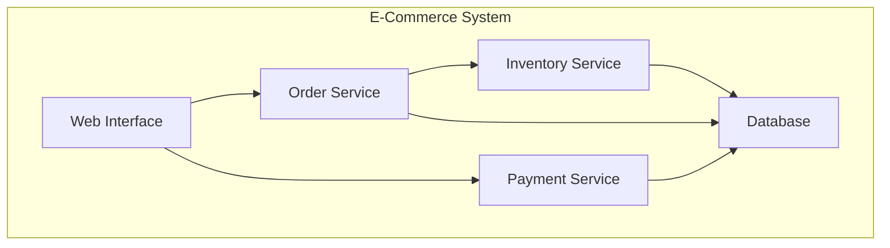
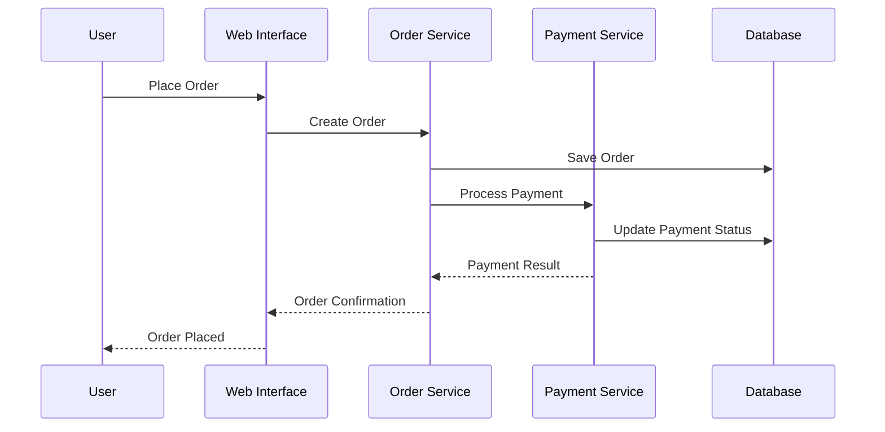
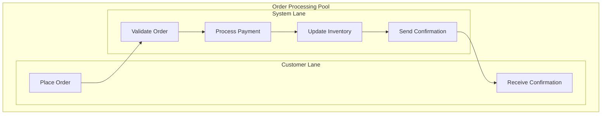
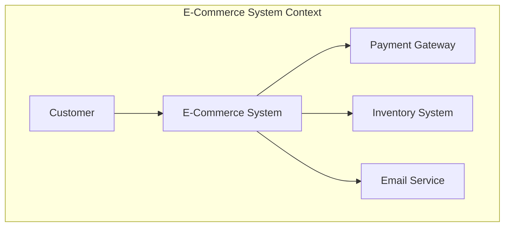
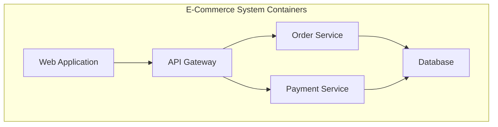

# Architecture Modeling

> **📚 Part of the [Awesome AI Architect](../README.md) knowledge base** - Master architecture modeling techniques and notations for effective communication and documentation

## TL;DR

**Architecture modeling is the art of creating visual representations of system architecture to communicate design decisions, facilitate understanding, and guide implementation.** Effective modeling uses appropriate notations, follows best practices, and serves the needs of different stakeholders.

**Key takeaway:** Good architecture models are not just pretty pictures—they're communication tools that help stakeholders understand, validate, and implement architectural decisions.

## Overview

Architecture modeling involves creating visual representations of system architecture using various notations and diagrams. These models serve multiple purposes: communication with stakeholders, documentation of design decisions, analysis of system properties, and guidance for implementation teams. The choice of modeling notation depends on the audience, purpose, and level of detail required.

## Types of Architecture Models

### Structural Models

Structural models show the static organization of system components and their relationships.

**Common Types:**
- **Component Diagrams**: Show system components and their interfaces
- **Class Diagrams**: Show object-oriented design
- **Package Diagrams**: Show logical organization
- **Deployment Diagrams**: Show physical deployment

### Behavioral Models

Behavioral models show how the system behaves over time and responds to events.

**Common Types:**
- **Sequence Diagrams**: Show interactions between components
- **Activity Diagrams**: Show business processes and workflows
- **State Diagrams**: Show system state changes
- **Use Case Diagrams**: Show user interactions

### Cross-Cutting Models

Cross-cutting models address concerns that span multiple components.

**Common Types:**
- **Security Models**: Show security boundaries and controls
- **Performance Models**: Show performance characteristics
- **Deployment Models**: Show physical architecture
- **Integration Models**: Show system integration points

## Modeling Notations

### Unified Modeling Language (UML)

UML is the most widely used modeling language for software architecture.

#### Component Diagrams

Show the structure of system components and their relationships.

**Key Elements:**
- **Components**: Rectangular boxes representing system parts
- **Interfaces**: Circles or lollipops showing provided/required interfaces
- **Dependencies**: Dashed arrows showing relationships
- **Ports**: Connection points on components

**Example:**

#### Sequence Diagrams

Show interactions between components over time.

**Key Elements:**
- **Lifelines**: Vertical lines representing components
- **Messages**: Arrows showing interactions
- **Activation Boxes**: Show when components are active
- **Return Messages**: Show responses

**Example:**

#### Class Diagrams

Show object-oriented design with classes, attributes, and methods.

**Key Elements:**
- **Classes**: Rectangles with name, attributes, and methods
- **Relationships**: Inheritance, association, composition, aggregation
- **Visibility**: Public (+), Private (-), Protected (#)
- **Multiplicity**: One-to-one, one-to-many relationships

#### State Diagrams

Show how system states change in response to events.

**Key Elements:**
- **States**: Rounded rectangles representing system states
- **Transitions**: Arrows showing state changes
- **Events**: Triggers for state changes
- **Actions**: Activities performed during transitions

### Business Process Model and Notation (BPMN)

BPMN is specifically designed for modeling business processes.

#### Key Elements

**Flow Objects:**
- **Events**: Circles representing start, intermediate, and end events
- **Activities**: Rectangles representing tasks or processes
- **Gateways**: Diamonds representing decision points

**Connecting Objects:**
- **Sequence Flows**: Solid arrows showing process flow
- **Message Flows**: Dashed arrows showing message exchange
- **Associations**: Dotted lines showing relationships

**Swimlanes:**
- **Pools**: Represent different organizations or systems
- **Lanes**: Represent different roles or departments

**Example:**

### C4 Model

The C4 model provides a hierarchical approach to software architecture modeling.

#### Levels of Detail

**Level 1 - System Context:**
- Shows the system in its environment
- Identifies users and external systems
- High-level view for stakeholders

**Level 2 - Container Diagram:**
- Shows the high-level shape of the architecture
- Identifies major containers and their responsibilities
- Shows how containers communicate

**Level 3 - Component Diagram:**
- Shows how a container is made up of components
- Shows the responsibilities of each component
- Shows the technology choices

**Level 4 - Code Diagram:**
- Shows how components are implemented
- Shows classes and their relationships
- Most detailed level

#### Example C4 Diagrams

**System Context:**

**Container Diagram:**

### ArchiMate

ArchiMate is an enterprise architecture modeling language.

#### Core Layers

**Business Layer:**
- Business actors, roles, and processes
- Business services and functions
- Business objects and data

** Application Layer:**
- Application components and interfaces
- Application services and functions
- Data objects

**Technology Layer:**
- Technology components and interfaces
- Technology services and functions
- Artifacts and data

#### Key Elements

**Active Structure Elements:**
- Actors, roles, components, nodes
- Represent who or what performs behavior

**Behavior Elements:**
- Processes, functions, services, events
- Represent what happens

**Passive Structure Elements:**
- Objects, data objects, artifacts
- Represent what is acted upon

## Flowcharts and Mind Maps

### Flowcharts

Flowcharts show the flow of control through a process or algorithm.

**Key Elements:**
- **Start/End**: Ovals or rounded rectangles
- **Process**: Rectangles
- **Decision**: Diamonds
- **Input/Output**: Parallelograms
- **Connectors**: Arrows

**Best Practices:**
- Use standard symbols
- Keep it simple and clear
- Use consistent formatting
- Include decision criteria
- Show all possible paths

### Mind Maps

Mind maps show hierarchical information and relationships.

**Key Elements:**
- **Central Topic**: Main subject in the center
- **Branches**: Main categories radiating out
- **Sub-branches**: Detailed topics
- **Keywords**: Key concepts and ideas

**Benefits:**
- Visual organization of information
- Easy to understand relationships
- Flexible and adaptable
- Good for brainstorming

## Best Drawing Practices

### General Principles

#### 1. Know Your Audience
- **Executives**: High-level, business-focused diagrams
- **Developers**: Technical, detailed diagrams
- **Operations**: Infrastructure and deployment diagrams
- **Users**: User experience and workflow diagrams

#### 2. Use Consistent Notation
- Stick to one notation per diagram
- Use standard symbols and conventions
- Maintain consistent formatting
- Include a legend when needed

#### 3. Keep It Simple
- Focus on essential information
- Avoid unnecessary details
- Use clear, readable text
- Maintain good visual hierarchy

#### 4. Make It Readable
- Use appropriate font sizes
- Ensure good contrast
- Avoid overcrowding
- Use white space effectively

### Diagram Layout

#### 1. Logical Flow
- Arrange elements in logical order
- Use consistent direction (top-to-bottom, left-to-right)
- Group related elements together
- Show clear relationships

#### 2. Visual Hierarchy
- Use size to show importance
- Use color to show categories
- Use position to show relationships
- Use emphasis to highlight key points

#### 3. Clarity
- Use descriptive labels
- Avoid abbreviations when possible
- Include necessary context
- Remove unnecessary elements

### Color and Styling

#### 1. Color Usage
- Use color purposefully
- Maintain consistency across diagrams
- Consider colorblind accessibility
- Use color to show categories or status

#### 2. Typography
- Use readable fonts
- Maintain consistent font sizes
- Use bold for emphasis
- Avoid too many font styles

#### 3. Visual Elements
- Use appropriate line weights
- Maintain consistent spacing
- Use shapes to show different types
- Include visual cues for relationships

## Architecture Modeling Tools

### Enterprise Architecture Tools

#### Sparx Systems Enterprise Architect
- Comprehensive UML modeling
- Code generation and reverse engineering
- Team collaboration features
- Integration with development tools

#### Archi
- Free, open-source ArchiMate modeling
- Cross-platform compatibility
- Plugin architecture
- Active community support

#### Orbus Software iServer
- Enterprise architecture management
- Integration with Microsoft Office
- Collaborative modeling
- Governance and compliance

### Cloud Architecture Tools

#### AWS Architecture Center
- Pre-built architecture diagrams
- Best practice guidance
- Integration with AWS services
- Free to use

#### Azure Architecture Center
- Microsoft Azure reference architectures
- Solution templates
- Best practice guidance
- Integration with Azure services

#### Google Cloud Architecture Center
- Google Cloud reference architectures
- Solution patterns
- Best practice guidance
- Integration with Google Cloud

### General Purpose Tools

#### Lucidchart
- Web-based diagramming
- Real-time collaboration
- Extensive template library
- Integration with popular tools

#### Draw.io (now diagrams.net)
- Free, web-based tool
- Offline capability
- Extensive shape libraries
- Integration with Google Drive

#### Microsoft Visio
- Professional diagramming
- Integration with Office 365
- Extensive template library
- Advanced formatting options

#### Miro
- Collaborative whiteboarding
- Real-time collaboration
- Template library
- Integration with popular tools

## Modeling Best Practices

### 1. Start with the Big Picture
Begin with high-level models and drill down into details.

### 2. Use Multiple Views
Create different models for different concerns and stakeholders.

### 3. Keep Models Current
Update models as the system evolves.

### 4. Validate with Stakeholders
Ensure models accurately represent stakeholder understanding.

### 5. Use Appropriate Detail Level
Match the level of detail to the audience and purpose.

### 6. Document Assumptions
Include assumptions and constraints in model documentation.

### 7. Version Control
Use version control for model artifacts.

### 8. Link to Implementation
Maintain traceability between models and code.

## Common Modeling Mistakes

### 1. Over-Modeling
Including too much detail for the intended audience.

### 2. Under-Modeling
Not including enough detail to be useful.

### 3. Inconsistent Notation
Mixing different notations in the same diagram.

### 4. Poor Layout
Making diagrams difficult to read and understand.

### 5. Outdated Models
Not keeping models current with system changes.

### 6. Missing Context
Not providing enough context for understanding.

### 7. Tool Overuse
Focusing on tool features rather than communication.

## Architecture Views and Viewpoints

### 4+1 Architectural View Model

The 4+1 view model provides a comprehensive approach to architecture modeling.

#### Logical View
- Shows the system's functional requirements
- Uses class diagrams, sequence diagrams
- Focuses on business logic and data

#### Process View
- Shows the system's dynamic behavior
- Uses activity diagrams, sequence diagrams
- Focuses on concurrency and synchronization

#### Physical View
- Shows the system's deployment
- Uses deployment diagrams
- Focuses on hardware and software mapping

#### Development View
- Shows the system's static organization
- Uses package diagrams, component diagrams
- Focuses on software organization

#### Use Case View
- Shows the system's functionality
- Uses use case diagrams
- Focuses on user interactions

### TOGAF Architecture Views

#### Business Architecture View
- Business processes and capabilities
- Organizational structure
- Business services and functions

#### Information Systems Architecture View
- Application architecture
- Data architecture
- Integration architecture

#### Technology Architecture View
- Technology components
- Infrastructure services
- Technology standards

## Conclusion

Architecture modeling is a critical skill for solution architects. It provides a means to communicate complex architectural concepts, document design decisions, and guide implementation teams. The key to effective modeling is choosing the right notation for the right audience and purpose, following best practices for clarity and consistency, and keeping models current with system evolution.

Remember that models are communication tools, not ends in themselves. Focus on creating models that serve their intended purpose and audience, and don't be afraid to iterate and improve them as your understanding of the system evolves.

---

## References

- "Software Architecture in Practice" by Len Bass, Paul Clements, and Rick Kazman
- "The C4 Model for Software Architecture" by Simon Brown
- "UML Distilled" by Martin Fowler
- "BPMN 2.0 Handbook" by Bruce Silver
- "ArchiMate 3.0 Specification" by The Open Group
- "Visualizing Software Architecture" by Simon Brown
- "Documenting Software Architectures" by Paul Clements, Felix Bachmann, and Len Bass
