# Architecture Tools & Practices

> **📚 Part of the [Awesome AI Architect](../README.md) knowledge base** - Master the tools, techniques, and practices that enable effective architecture design, documentation, and delivery


## TL;DR

**Architecture Tools & Practices encompass the methods, techniques, and technologies that architects use to design, document, communicate, and implement architectural solutions.** The right combination of tools and practices can dramatically improve architectural effectiveness, team collaboration, and solution quality.

**Key takeaway:** Tools enable practices, but practices define success. Focus on establishing good architectural practices first, then select tools that support and enhance those practices.

## Overview

Architecture Tools & Practices covers the comprehensive toolkit that solution architects use throughout the architecture lifecycle—from initial design and documentation through implementation and evolution. This includes modeling tools, documentation platforms, collaboration techniques, and delivery practices.

## Architecture Tools

### Modeling Tools

#### Enterprise Architecture Tools

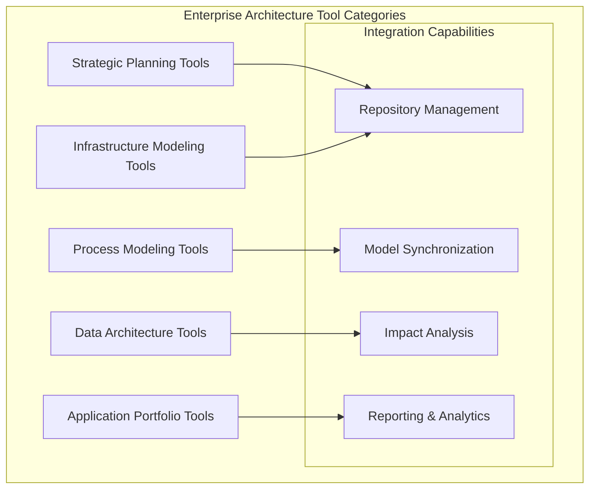

**Leading Enterprise Architecture Platforms:**

| Tool | Strengths | Best For | Pricing Model |
|------|-----------|----------|---------------|
| **Sparx Enterprise Architect** | Comprehensive modeling, affordable | Mid-size organizations | Per-seat license |
| **BiZZdesign Enterprise Studio** | Business-IT alignment, TOGAF support | Large enterprises | Subscription |
| **Software AG ARIS** | Process excellence, governance | Process-heavy organizations | Enterprise license |
| **Mega International HOPEX** | Risk management, regulatory compliance | Highly regulated industries | Subscription |
| **Avolution ABACUS** | Repository management, impact analysis | Complex environments | Per-user license |

#### Cloud Architecture Tools

**AWS Architecture Tools:**
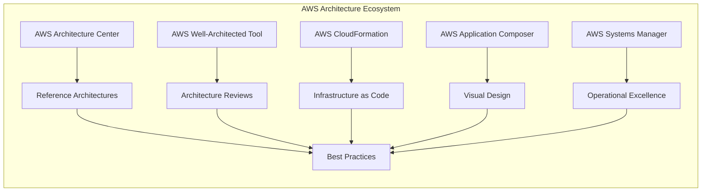

**Multi-Cloud Architecture Platforms:**

| Platform | Capabilities | Cloud Support | Use Cases |
|----------|-------------|---------------|-----------|
| **Terraform** | IaC, resource management | All major clouds | Infrastructure provisioning |
| **Pulumi** | Programming language IaC | Multi-cloud | Developer-friendly IaC |
| **Crossplane** | Kubernetes-based infrastructure | Cloud-agnostic | Cloud-native environments |
| **Azure Resource Manager** | ARM templates, Bicep | Azure-focused | Microsoft-centric shops |
| **Google Cloud Deployment Manager** | YAML/Python templates | GCP-focused | Google Cloud environments |

#### API Design Tools

**API Design and Documentation:**

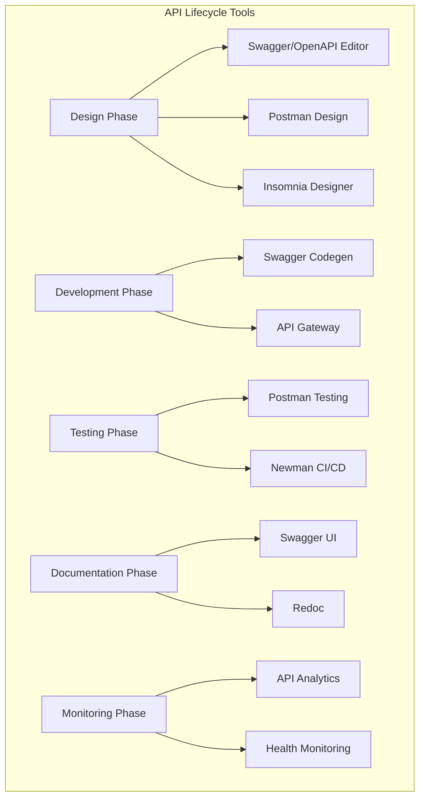

**API Tool Comparison:**

| Tool | Design | Testing | Documentation | Collaboration | Pricing |
|------|--------|---------|---------------|---------------|---------|
| **Postman** | ✅ Good | ✅ Excellent | ✅ Good | ✅ Excellent | Freemium |
| **Insomnia** | ✅ Good | ✅ Good | ✅ Good | ✅ Good | Freemium |
| **Swagger/OpenAPI** | ✅ Excellent | ❌ Limited | ✅ Excellent | ✅ Good | Free/Paid |
| **Apigee** | ✅ Good | ✅ Good | ✅ Good | ✅ Good | Enterprise |
| **AWS API Gateway** | ✅ Good | ✅ Good | ✅ Good | ✅ Good | Pay-per-use |

#### Data Modeling Tools

**Data Architecture Modeling:**

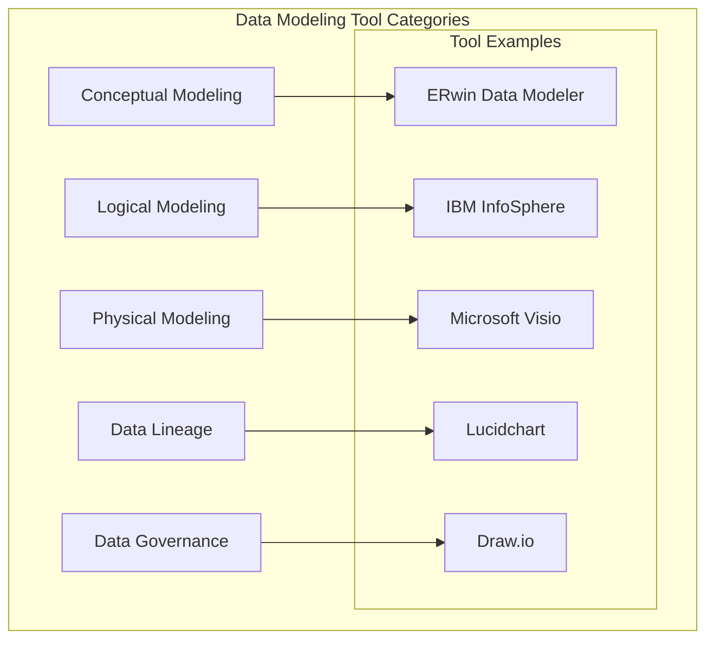

### Collaboration Tools

#### Architecture Documentation Platforms

**Documentation as Code:**

```yaml
# Example: Architecture Decision Record in Markdown
---
title: "ADR-001: Use React for Frontend Framework"
status: "Accepted"
date: "2024-01-15"
decision-makers: ["Tech Lead", "Solution Architect"]
---

## Context
We need to choose a frontend framework for our customer portal.
Team has JavaScript experience and we need component reusability.

## Decision
We will use React with TypeScript for the frontend framework.

## Consequences
### Positive:
- Large ecosystem and community support
- Team can leverage existing JavaScript skills
- Excellent tooling and development experience

### Negative:
- Learning curve for React-specific patterns
- Need additional libraries for routing, state management
```

**Documentation Platform Comparison:**

| Platform | Features | Collaboration | Integration | Best For |
|----------|----------|---------------|-------------|----------|
| **GitBook** | Rich editing, version control | Real-time collaboration | Git integration | Technical documentation |
| **Confluence** | Enterprise features, templates | Commenting, mentions | JIRA integration | Enterprise wikis |
| **Notion** | All-in-one workspace | Team collaboration | API integrations | Flexible documentation |
| **Markdown + Git** | Version control, portable | Pull request reviews | CI/CD integration | Developer-centric teams |
| **Sphinx** | Auto-documentation | Limited | Source code integration | Code documentation |

#### Diagramming Tools

**Architecture Diagramming:**

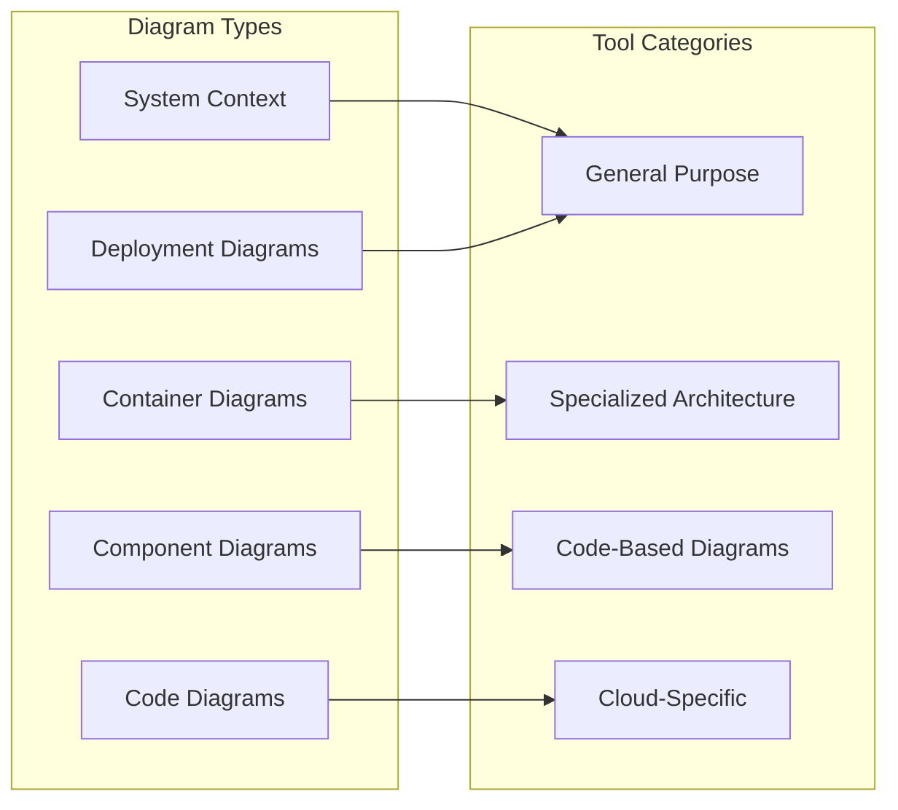

**Diagramming Tool Matrix:**

| Tool | Ease of Use | Architecture Focus | Collaboration | Automation | Price |
|------|-------------|-------------------|---------------|------------|-------|
| **Lucidchart** | ✅ High | ✅ Good | ✅ Excellent | ✅ Good | Subscription |
| **Draw.io** | ✅ High | ✅ Good | ✅ Good | ✅ Limited | Free |
| **Visio** | ⚠️ Medium | ✅ Good | ⚠️ Limited | ⚠️ Limited | License |
| **Miro** | ✅ High | ⚠️ General | ✅ Excellent | ⚠️ Limited | Freemium |
| **PlantUML** | ❌ Low | ✅ Excellent | ✅ Good | ✅ Excellent | Free |
| **Mermaid** | ⚠️ Medium | ✅ Good | ✅ Good | ✅ Excellent | Free |

#### Knowledge Management Systems

**Architecture Knowledge Management:**

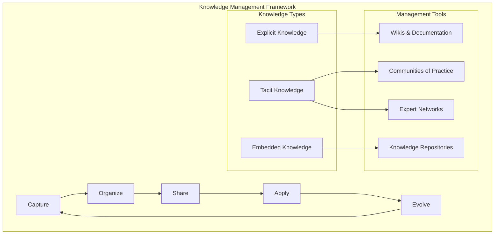

### Communication Platforms

#### Architecture Communication Tools

**Stakeholder Communication Matrix:**

| Stakeholder | Information Need | Communication Channel | Frequency | Format |
|-------------|------------------|----------------------|-----------|--------|
| **Executives** | Strategic impact, ROI | Executive dashboards, presentations | Monthly | High-level summaries |
| **Business Users** | Features, benefits, timeline | Demos, workshops, newsletters | Bi-weekly | User-focused content |
| **Developers** | Technical details, guidelines | Technical docs, code reviews | Daily/Weekly | Detailed specifications |
| **Operations** | Deployment, monitoring | Runbooks, alerts, dashboards | As needed | Operational procedures |

**Communication Tool Selection:**

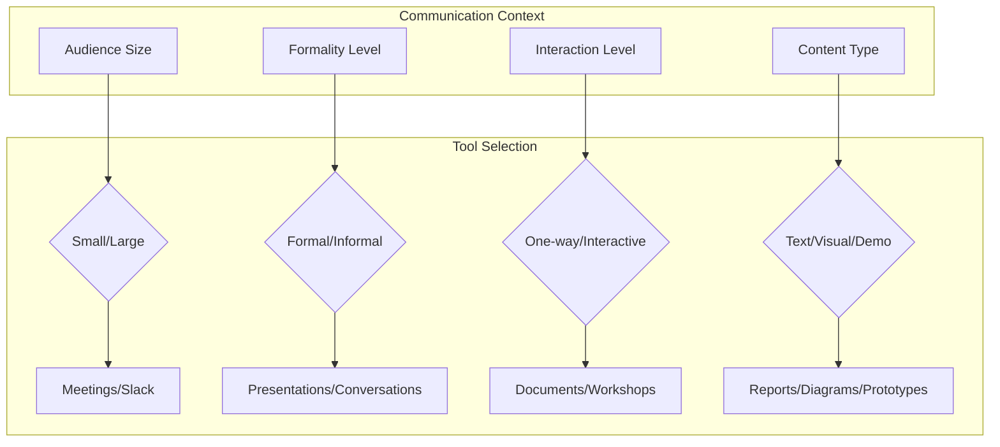

## Architecture Practices

### Agile Architecture

#### Architecture in Agile Development

**Emergent Architecture Approach:**

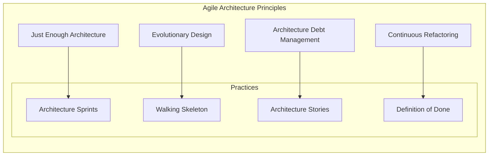

**Architecture Sprint Planning:**

| Sprint Activity | Architecture Focus | Duration | Participants |
|-----------------|-------------------|----------|--------------|
| **Sprint 0** | Initial architecture vision | 1-2 sprints | Architects, tech leads |
| **Architecture Stories** | Architectural requirements | Ongoing | Product owner, architects |
| **Architecture Reviews** | Design validation | Every 2-3 sprints | Team, stakeholders |
| **Refactoring Sprints** | Technical debt reduction | As needed | Development team |

#### Continuous Architecture

**Continuous Architecture Pipeline:**

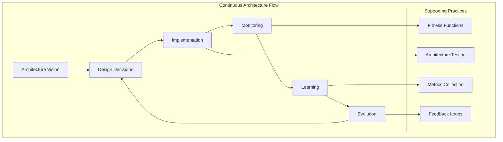

**Architecture Fitness Functions:**

```python
# Example: Architecture fitness function for performance
def test_api_response_time():
    """Ensure API response times meet SLA requirements."""
    response_time = measure_api_response_time()
    assert response_time < 200, f"API response time {response_time}ms exceeds 200ms SLA"

def test_dependency_direction():
    """Ensure dependencies follow clean architecture principles."""
    violations = check_dependency_violations()
    assert len(violations) == 0, f"Dependency violations found: {violations}"

def test_service_coupling():
    """Ensure services maintain loose coupling."""
    coupling_metrics = analyze_service_coupling()
    assert coupling_metrics.average_coupling < 0.3, "Services are too tightly coupled"
```

#### DevOps Integration

**DevOps-Architecture Alignment:**

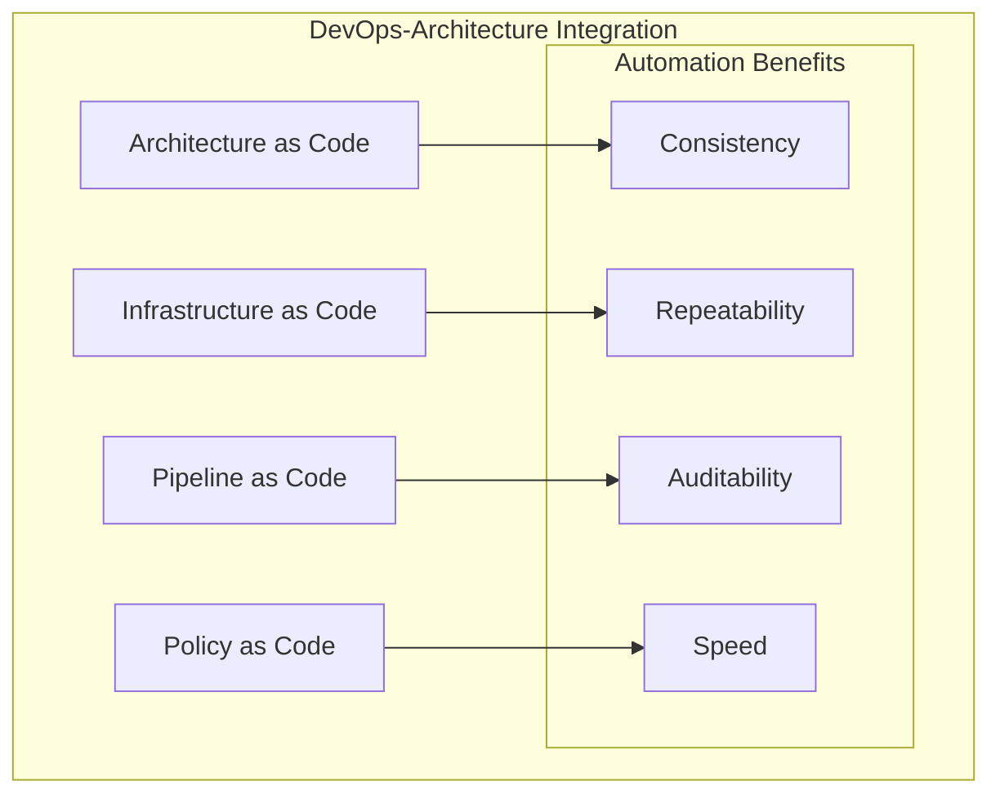

**Architecture in CI/CD Pipeline:**

| Pipeline Stage | Architecture Activity | Tools | Validation |
|----------------|----------------------|-------|------------|
| **Build** | Dependency analysis, code quality | SonarQube, NDepend | Architecture conformance |
| **Test** | Architecture testing, fitness functions | JUnit, pytest | Design verification |
| **Security** | Security scanning, compliance | OWASP ZAP, Checkmarx | Security architecture |
| **Deploy** | Infrastructure provisioning | Terraform, Ansible | Deployment architecture |
| **Monitor** | Performance monitoring, observability | Prometheus, Grafana | Runtime architecture |

### Architecture Communication

#### Architecture Presentations

**Presentation Structure for Different Audiences:**

**Executive Presentation (15-20 minutes):**
```markdown
1. Business Context (2 minutes)
   - Business drivers and objectives
   - Success criteria

2. Solution Overview (5 minutes)
   - High-level architecture diagram
   - Key design decisions
   - Benefits and value proposition

3. Implementation Plan (5 minutes)
   - Timeline and milestones
   - Resource requirements
   - Risk mitigation

4. Investment & ROI (3 minutes)
   - Cost breakdown
   - Expected benefits
   - Return on investment

5. Q&A (5 minutes)
   - Address executive concerns
   - Next steps
```

**Technical Presentation (45-60 minutes):**
```markdown
1. Context & Requirements (10 minutes)
   - Business requirements
   - Non-functional requirements
   - Constraints and assumptions

2. Architecture Overview (15 minutes)
   - System context diagram
   - Container/component architecture
   - Key patterns and principles

3. Detailed Design (20 minutes)
   - Component interactions
   - Data flows and storage
   - Integration patterns
   - Security considerations

4. Implementation Approach (10 minutes)
   - Development strategy
   - Testing approach
   - Deployment pipeline

5. Discussion & Feedback (10 minutes)
   - Technical concerns
   - Alternative approaches
   - Implementation challenges
```

#### Technical Writing

**Architecture Documentation Standards:**

```markdown
# Architecture Document Template

## Executive Summary
- Brief overview (1-2 paragraphs)
- Key decisions and rationale
- Business impact

## Context and Requirements
- Business context
- Functional requirements
- Non-functional requirements
- Constraints and assumptions

## Architecture Overview
- System context diagram
- High-level architecture
- Key architectural patterns
- Design principles applied

## Detailed Design
- Component architecture
- Data architecture
- Integration architecture
- Security architecture

## Quality Attributes
- Performance considerations
- Scalability approach
- Reliability measures
- Security controls

## Implementation Considerations
- Technology choices and rationale
- Development approach
- Testing strategy
- Deployment considerations

## Risk Assessment
- Identified risks
- Mitigation strategies
- Contingency plans

## Appendices
- Detailed diagrams
- Technology evaluations
- Performance models
- Security analysis
```

**Writing Best Practices:**
- Use active voice and clear language
- Include visual diagrams and examples
- Structure content for different audiences
- Maintain version control and change history
- Regular reviews and updates

#### Visual Communication

**Diagram Types and Usage:**

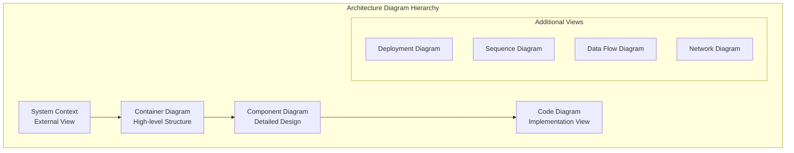

**C4 Model Implementation:**

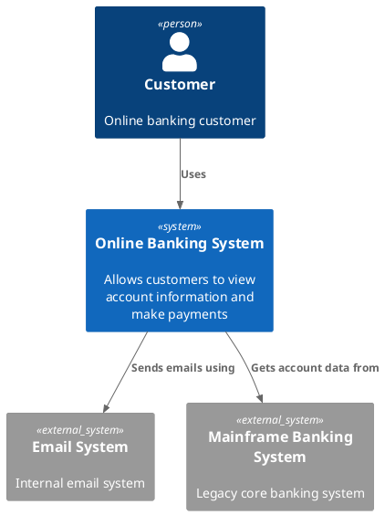

### Stakeholder Engagement

#### Stakeholder Mapping and Analysis

**Stakeholder Analysis Matrix:**

| Stakeholder | Interest Level | Influence Level | Engagement Strategy | Communication Frequency |
|-------------|----------------|-----------------|-------------------|------------------------|
| **CEO** | Medium | High | Keep Satisfied | Monthly updates |
| **CTO** | High | High | Manage Closely | Weekly reviews |
| **Business Users** | High | Medium | Keep Informed | Bi-weekly demos |
| **Development Team** | High | Medium | Keep Informed | Daily standups |
| **Security Team** | Medium | Medium | Monitor | As needed |
| **Compliance** | Low | High | Keep Satisfied | Quarterly reviews |

#### Architecture Workshops

**Workshop Types and Formats:**

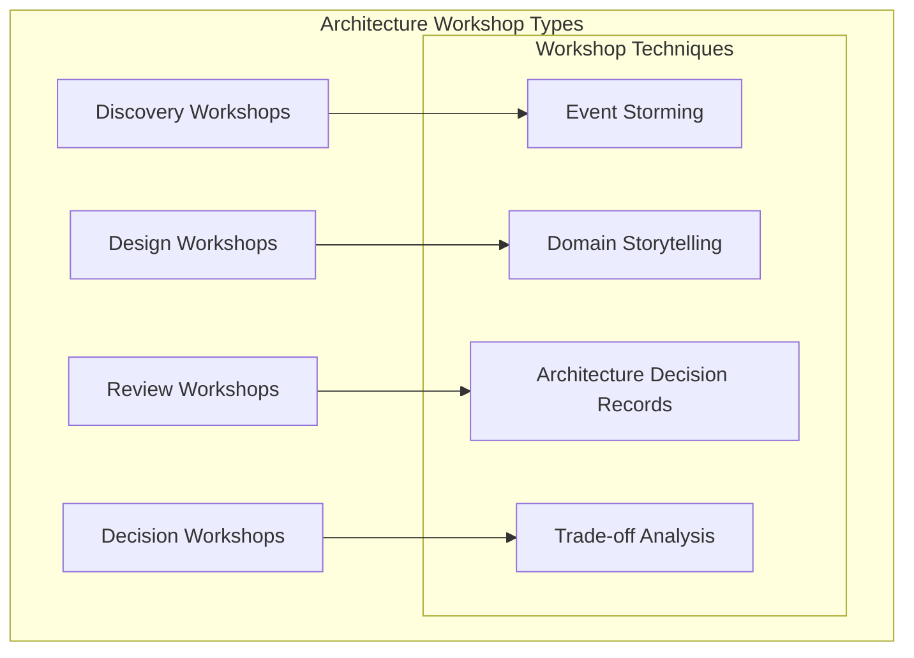

**Event Storming Workshop Process:**

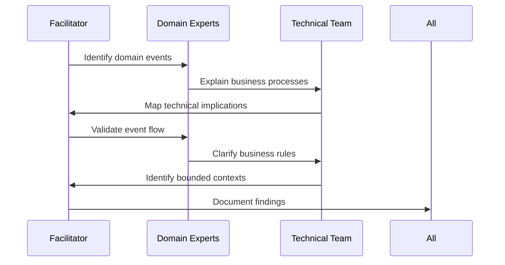

**Workshop Planning Template:**
```markdown
# Architecture Workshop Plan

## Objective
Clear statement of what the workshop aims to achieve

## Participants
- Roles and responsibilities
- Decision-making authority
- Domain expertise required

## Agenda
- Pre-work requirements
- Session structure and timing
- Break schedule
- Follow-up actions

## Materials Needed
- Sticky notes and markers
- Whiteboards or flip charts
- Laptops and projectors
- Reference materials

## Expected Outcomes
- Deliverables and artifacts
- Decisions to be made
- Next steps identified
```

## Tool Selection and Implementation

### Tool Selection Framework

#### Tool Evaluation Criteria

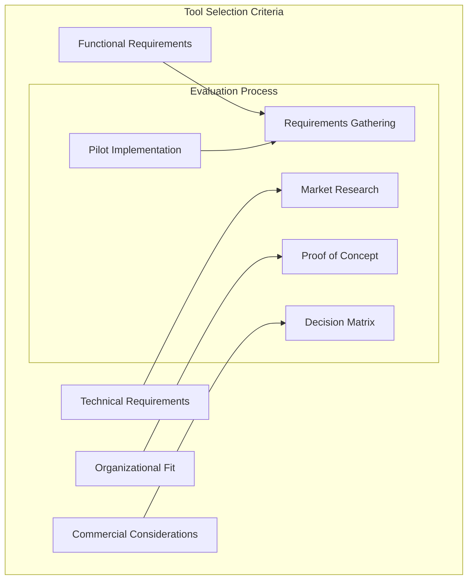

**Evaluation Matrix Template:**

| Criterion | Weight | Tool A Score | Tool A Weighted | Tool B Score | Tool B Weighted | Tool C Score | Tool C Weighted |
|-----------|--------|--------------|-----------------|--------------|-----------------|--------------|-----------------|
| **Functionality** | 30% | 8 | 2.4 | 9 | 2.7 | 7 | 2.1 |
| **Usability** | 25% | 9 | 2.25 | 7 | 1.75 | 8 | 2.0 |
| **Integration** | 20% | 7 | 1.4 | 8 | 1.6 | 9 | 1.8 |
| **Cost** | 15% | 6 | 0.9 | 8 | 1.2 | 5 | 0.75 |
| **Support** | 10% | 8 | 0.8 | 7 | 0.7 | 9 | 0.9 |
| **Total** | 100% | - | 7.75 | - | 7.95 | - | 7.55 |

#### Tool Integration Strategy

**Integration Patterns:**

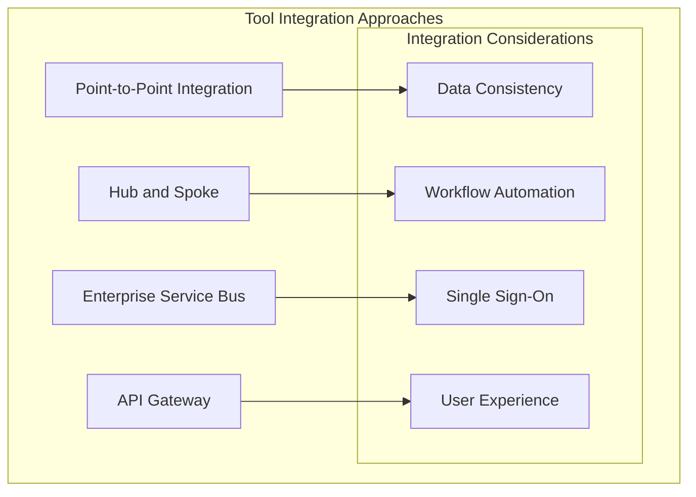

### Implementation Best Practices

#### Tool Rollout Strategy

**Phased Implementation Approach:**

| Phase | Duration | Scope | Success Criteria | Risk Mitigation |
|-------|----------|-------|------------------|-----------------|
| **Pilot** | 2-3 months | Single team/project | Tool validation, user feedback | Limited scope, easy rollback |
| **Expansion** | 3-6 months | Department/division | Process integration, training | Gradual expansion, support team |
| **Enterprise** | 6-12 months | Organization-wide | Full adoption, ROI realization | Change management, governance |
| **Optimization** | Ongoing | Continuous improvement | Efficiency gains, innovation | Regular review, updates |

#### Change Management for Tool Adoption

**Change Management Framework:**

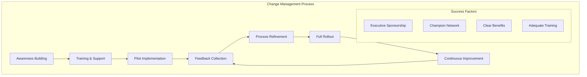

**Training and Support Strategy:**

```markdown
# Tool Adoption Training Plan

## Training Levels
1. **Executive Overview** (2 hours)
   - Business benefits and ROI
   - Implementation timeline
   - Success metrics

2. **Manager Training** (4 hours)
   - Process changes
   - Team management
   - Performance monitoring

3. **User Training** (8-16 hours)
   - Hands-on tool usage
   - Best practices
   - Troubleshooting

4. **Administrator Training** (16-24 hours)
   - System configuration
   - User management
   - Integration setup

## Support Structure
- **Help Desk**: First-level support
- **Super Users**: Peer support network
- **Tool Champions**: Change advocates
- **Vendor Support**: Technical escalation
```

### Measuring Tool Effectiveness

#### Tool ROI Measurement

**ROI Calculation Framework:**

```mermaid
graph TB
    subgraph "ROI Components"
        A[Benefits]
        B[Costs]
        C[ROI Calculation]
        
        A --> D[Time Savings]
        A --> E[Quality Improvements]
        A --> F[Risk Reduction]
        
        B --> G[License Costs]
        B --> H[Implementation Costs]
        B --> I[Training Costs]
        B --> J[Maintenance Costs]
        
        C --> K[ROI = (Benefits - Costs) / Costs × 100%]
    end
```

**Tool Metrics Dashboard:**

| Metric Category | Metric | Baseline | Current | Target | Trend |
|-----------------|---------|----------|---------|---------|-------|
| **Productivity** | Time to create architecture doc | 8 hours | 4 hours | 3 hours | ⬇️ Improving |
| **Quality** | Documentation completeness | 60% | 85% | 90% | ⬆️ Improving |
| **Collaboration** | Stakeholder engagement score | 6.2 | 7.8 | 8.0 | ⬆️ Improving |
| **Compliance** | Standards adherence | 70% | 88% | 95% | ⬆️ Improving |
| **User Adoption** | Active users percentage | - | 78% | 90% | ⬆️ Improving |

## Common Tool Chains and Patterns

### Architecture Toolchain Examples

#### Startup/Small Team Toolchain

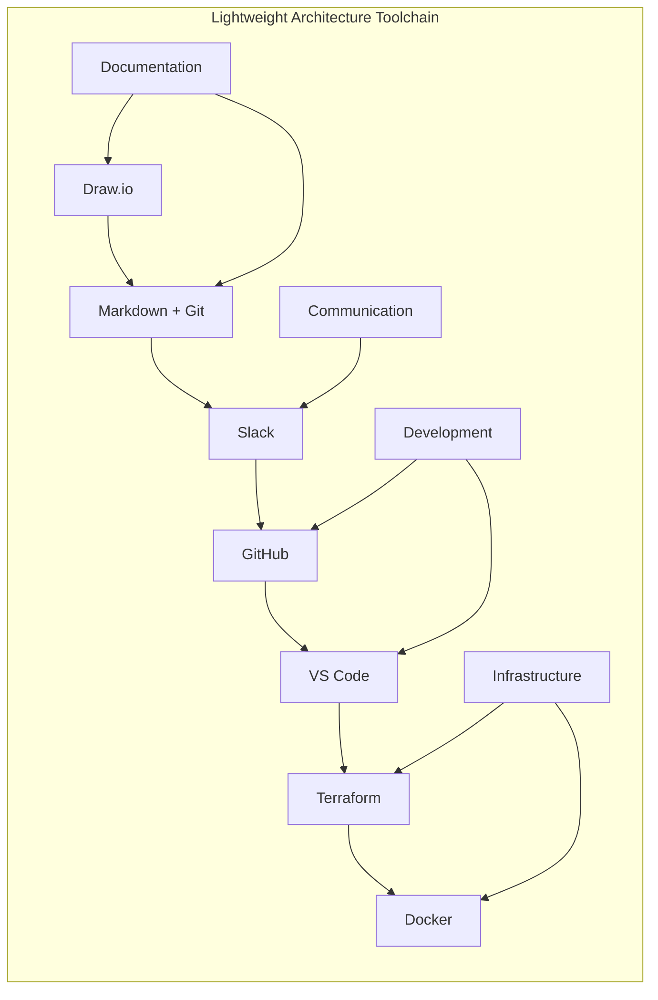

**Characteristics:**
- Low cost (mostly free tools)
- Simple integration
- Developer-friendly
- Quick setup time
- Limited enterprise features

#### Enterprise Toolchain

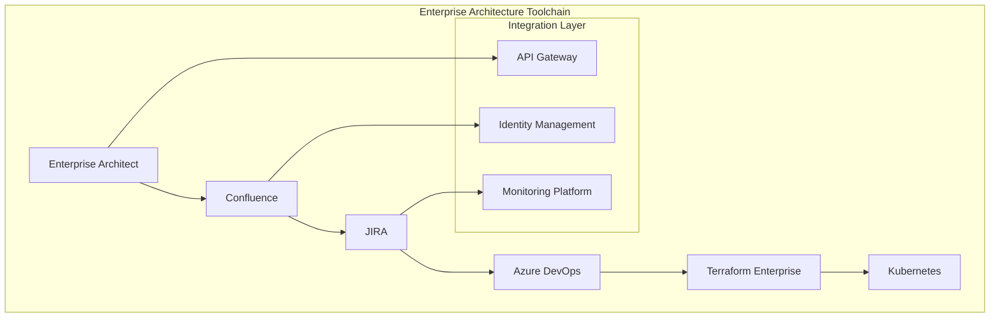

**Characteristics:**
- Comprehensive functionality
- Enterprise security and governance
- Integration capabilities
- Scalability and performance
- Higher cost and complexity

#### Cloud-Native Toolchain

```mermaid
graph TB
    subgraph "Cloud-Native Architecture Tools"
        A[AWS Architecture Center]
        B[CloudFormation/CDK]
        C[API Gateway]
        D[Container Registry]
        E[EKS/ECS]
        
        subgraph "Observability Stack"
            F[CloudWatch]
            G[X-Ray]
            H[CloudTrail]
        end
        
        A --> B
        B --> C
        C --> D
        D --> E
        
        E --> F
        E --> G
        E --> H
    end
```

### Integration Patterns

#### Tool Integration Architecture

```mermaid
graph TB
    subgraph "Integrated Architecture Platform"
        A[Single Sign-On] --> B[User Management]
        B --> C[Tool Dashboard]
        C --> D[Workflow Engine]
        
        subgraph "Tool Layer"
            E[Modeling Tools]
            F[Documentation]
            G[Communication]
            H[Development]
            I[Operations]
        end
        
        D --> E
        D --> F
        D --> G
        D --> H
        D --> I
        
        subgraph "Data Layer"
            J[Model Repository]
            K[Document Store]
            L[Metrics Database]
        end
        
        E --> J
        F --> K
        I --> L
    end
```

## Related Topics

- [Solution Architecture Fundamentals](solution-architecture-fundamentals.md) - Foundation principles and practices
- [Architecture Governance](architecture-governance.md) - Governance tools and processes  
- [Business Architecture](business-architecture.md) - Business architecture tools
- [Technical Architecture](technical-architecture.md) - Technical modeling and design tools
- [Career Guide](../career.md) - Architecture career development and skills

---

*The best architectural tools are the ones your team actually uses consistently. Focus on establishing good practices first, then select tools that support and enhance those practices rather than trying to solve process problems with technology alone.*
