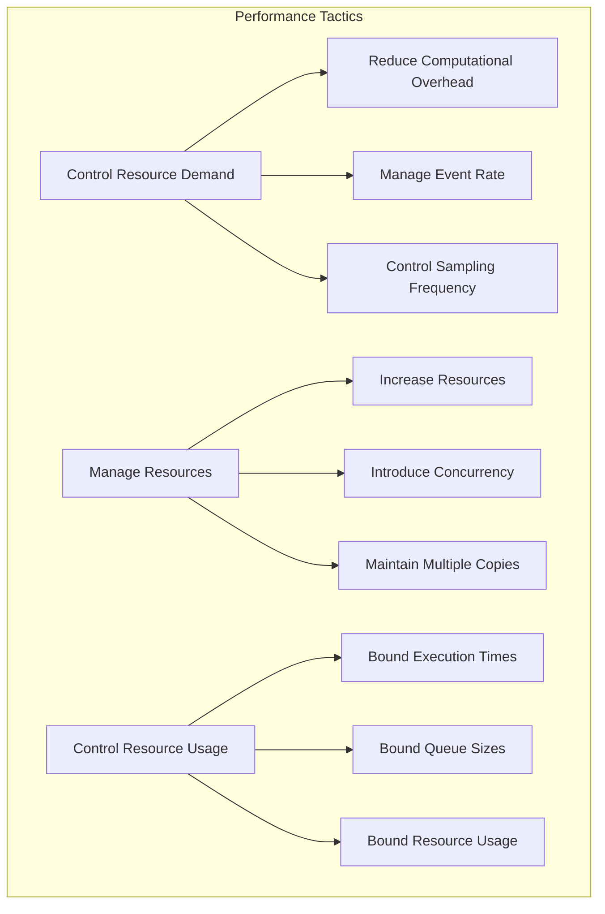
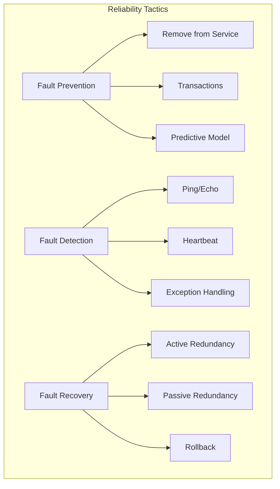
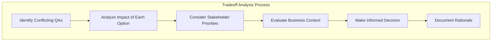

# Quality Attributes

> **📚 Part of the [Awesome AI Architect](../README.md) knowledge base** - Master quality attributes and their impact on solution architecture design decisions


## TL;DR

**Quality Attributes are the non-functional requirements that determine how well a system performs its functions.** They are the primary drivers of architectural decisions and often represent the most critical aspects of system success. Unlike functional requirements that define what the system does, quality attributes define how well it does it.

**Key takeaway:** Quality attributes are the real differentiators between good and great systems—they're what users notice when everything works seamlessly, and what they complain about when it doesn't.

## Overview

Quality Attributes (QAs) are measurable or testable properties of a system that indicate how well the system satisfies stakeholder needs. They represent the "ilities" of software systems—performance, reliability, security, usability, and more. These attributes are crucial because they often determine the success or failure of a system, even when all functional requirements are met.

## Quality Attribute Categories

### Performance Efficiency

Performance efficiency measures how well a system performs relative to the resources used under specific conditions.

**Key Sub-characteristics:**
- **Time Behavior**: Response times, processing speed, throughput
- **Resource Utilization**: CPU, memory, network, storage usage
- **Capacity**: Maximum load the system can handle

**Common Performance Scenarios:**
```
When a user submits a search request under normal load conditions,
the search system shall return results within 2 seconds
for 95% of requests with 1000 concurrent users.
```

**Performance Tactics:**
- **Control Resource Demand**: Reduce computational overhead, manage event rate, control sampling frequency
- **Manage Resources**: Increase resources, introduce concurrency, maintain multiple copies of computations
- **Control Resource Usage**: Bound execution times, bound queue sizes, bound resources used

### Reliability

Reliability refers to the degree to which a system performs its specified functions under specific conditions for a specified period.

**Key Sub-characteristics:**
- **Maturity**: Absence of failures due to faults in the software
- **Availability**: System is operational and accessible when required
- **Fault Tolerance**: System continues operating despite component failures
- **Recoverability**: System can restore to a consistent state after failure

**Reliability Tactics:**
- **Fault Prevention**: Remove from service, transactions, predictive model
- **Fault Detection**: Ping/echo, heartbeat, exception, voting, checksums
- **Fault Recovery**: Active redundancy, passive redundancy, spare, rollback, retry

### Security

Security refers to the degree to which a product or system protects information and data to ensure only authorized persons or systems have appropriate access.

**Key Sub-characteristics:**
- **Confidentiality**: Data is accessible only to authorized users
- **Integrity**: Data cannot be modified without authorization
- **Non-repudiation**: Actions cannot be denied by the user
- **Accountability**: Actions can be traced to users
- **Authenticity**: Users and systems are who they claim to be

**Security Tactics:**
- **Detect Attacks**: Intrusion detection, service denial detection, message integrity checking
- **Resist Attacks**: Authenticate actors, authorize actors, encrypt data, limit exposure
- **React to Attacks**: Revoke access, lock computer, inform actors
- **Recover from Attacks**: Maintain audit trail, restore system state

### Usability

Usability indicates how well users can use a product or system to effectively, efficiently, and satisfactorily achieve specific goals.

**Key Sub-characteristics:**
- **Appropriateness**: System is suitable for the task
- **Recognizability**: Users can recognize what the system does
- **Learnability**: Users can learn to use the system
- **Operability**: Users can control the system
- **User Error Protection**: System prevents user errors
- **User Interface Aesthetics**: Interface is visually appealing
- **Accessibility**: System is usable by people with disabilities

**Usability Tactics:**
- **Support User Initiative**: Cancel, undo, aggregate, multiple views
- **Support System Initiative**: Maintain task model, maintain user model, maintain system model

### Maintainability

Maintainability is the degree of effectiveness and efficiency with which a product or system can be modified to improve, correct, or adapt to changes.

**Key Sub-characteristics:**
- **Modularity**: System is composed of discrete components
- **Reusability**: Components can be used in multiple contexts
- **Analysability**: System can be analyzed for problems
- **Modifiability**: System can be changed easily
- **Testability**: System can be tested effectively

**Maintainability Tactics:**
- **Localize Changes**: Semantic coherence, anticipate expected changes, generalize module, limit possible options
- **Prevent Ripple Effects**: Hide information, maintain existing interfaces, restrict communication paths, use an intermediary
- **Defer Binding Time**: Runtime registration, configuration files, polymorphism, component replacement

### Scalability

Scalability is the system's ability to handle increased load by adding resources.

**Types of Scalability:**
- **Horizontal Scaling**: Adding more servers/nodes
- **Vertical Scaling**: Adding more power to existing servers
- **Elastic Scaling**: Automatic scaling based on demand

**Scalability Tactics:**
- **Distribute Load**: Load balancing, workload distribution
- **Replicate Data**: Data replication, caching
- **Partition Data**: Functional partitioning, data partitioning

## Quality Attribute Scenarios

### SEI Scenario Format

Quality attribute scenarios provide a structured way to specify non-functional requirements:

```
When <source> <stimulus> under <environment>,
the <artifact> shall <response> within <response measure>
```

### Scenario Components

1. **Source**: Who or what generates the stimulus
2. **Stimulus**: What triggers the scenario
3. **Environment**: System conditions when stimulus occurs
4. **Artifact**: What part of the system is affected
5. **Response**: How the system should respond
6. **Response Measure**: How to measure success

### Example Scenarios

#### Performance Scenario
```
When a user submits a search request under normal load conditions,
the search system shall return results within 2 seconds
for 95% of requests with 1000 concurrent users.
```

#### Availability Scenario
```
When a server fails under normal operations,
the system shall continue processing requests
within 30 seconds with 99.9% availability.
```

#### Security Scenario
```
When an unauthorized user attempts to access sensitive data
under normal operations,
the system shall deny access and log the attempt
within 1 second with 100% accuracy.
```

## Quality Attribute Tactics

### What Are Tactics?

Tactics are design decisions that influence the achievement of a quality attribute response. They directly affect the system's response to some stimulus and provide a means to achieve quality attribute requirements.

### Tactics vs. Patterns

- **Tactics**: Focus on a single quality attribute
- **Patterns**: Address multiple quality attributes with inherent tradeoffs

### Common Tactics by Quality Attribute

#### Performance Tactics


#### Reliability Tactics


## Quality Attribute Tradeoffs

### Understanding Tradeoffs

Quality attributes are interconnected and never exist in isolation. Achieving excellence in one quality attribute often comes at the cost of another.

### Common Tradeoff Relationships

#### Performance vs. Security
- **Positive**: Caching can improve both performance and security
- **Negative**: Encryption adds computational overhead

#### Performance vs. Maintainability
- **Positive**: Good modularity can improve both
- **Negative**: Optimizations can reduce code clarity

#### Availability vs. Performance
- **Positive**: Load balancing improves both
- **Negative**: Redundancy adds overhead

#### Security vs. Usability
- **Positive**: Single sign-on improves both
- **Negative**: Complex authentication reduces usability

### Tradeoff Analysis Framework



## Quality Attribute Measurement

### Measurement Approaches

#### Quantitative Measures
- **Performance**: Response time, throughput, resource utilization
- **Reliability**: MTBF, MTTR, availability percentage
- **Security**: Number of security incidents, time to detect breaches

#### Qualitative Measures
- **Usability**: User satisfaction surveys, task completion rates
- **Maintainability**: Code complexity metrics, change impact analysis
- **Scalability**: Load testing results, resource scaling efficiency

### Measurement Challenges

1. **Interdependencies**: Quality attributes affect each other
2. **Context Dependency**: Measures vary by application domain
3. **Stakeholder Differences**: Different stakeholders value different attributes
4. **Dynamic Nature**: Quality attributes change over time

## Quality Attribute Testing

### Testing Strategies

#### Performance Testing
- **Load Testing**: Normal expected load
- **Stress Testing**: Beyond normal capacity
- **Volume Testing**: Large amounts of data
- **Spike Testing**: Sudden load increases

#### Security Testing
- **Penetration Testing**: Simulated attacks
- **Vulnerability Scanning**: Automated security checks
- **Code Review**: Security-focused code analysis
- **Compliance Testing**: Regulatory requirement validation

#### Usability Testing
- **User Testing**: Real users performing tasks
- **A/B Testing**: Comparing different interfaces
- **Accessibility Testing**: Compliance with accessibility standards
- **Heuristic Evaluation**: Expert review against usability principles

## Quality Attribute Patterns

### Common Architectural Patterns for Quality Attributes

#### Performance Patterns
- **Caching**: Improve response times
- **Load Balancing**: Distribute load across servers
- **Connection Pooling**: Reuse database connections
- **Asynchronous Processing**: Non-blocking operations

#### Reliability Patterns
- **Circuit Breaker**: Prevent cascade failures
- **Retry**: Handle transient failures
- **Bulkhead**: Isolate failures
- **Health Checks**: Monitor system health

#### Security Patterns
- **Authentication**: Verify user identity
- **Authorization**: Control access to resources
- **Encryption**: Protect data confidentiality
- **Audit Logging**: Track system activities

## Best Practices

### 1. Start Early
Address quality attributes from the beginning of the design process, not as an afterthought.

### 2. Make Them Measurable
Use quality attribute scenarios to make requirements specific and testable.

### 3. Consider Tradeoffs
Explicitly analyze and document tradeoffs between different quality attributes.

### 4. Involve Stakeholders
Ensure all stakeholders understand the importance of quality attributes.

### 5. Test Continuously
Implement continuous testing for quality attributes throughout development.

### 6. Monitor in Production
Track quality attribute performance in production environments.

### 7. Document Decisions
Record architectural decisions related to quality attributes and their rationale.

## Common Pitfalls

### 1. Ignoring Non-Functional Requirements
Focusing only on functional requirements leads to systems that work but don't meet quality expectations.

### 2. Vague Quality Requirements
Requirements like "system should be fast" are not actionable or measurable.

### 3. Not Considering Tradeoffs
Failing to analyze tradeoffs between quality attributes leads to suboptimal designs.

### 4. Testing Too Late
Waiting until the end to test quality attributes makes fixes expensive and difficult.

### 5. One-Size-Fits-All Approach
Different systems have different quality attribute priorities.

## Conclusion

Quality attributes are the foundation of successful solution architecture. They determine how well a system performs its functions and often represent the difference between a good system and a great one. By understanding the different types of quality attributes, using structured scenarios to specify them, and carefully considering tradeoffs, architects can design systems that truly meet stakeholder needs.

Remember: Quality attributes are not optional—they're essential. Invest the time to understand them, specify them properly, and design for them from the start. Your users will thank you, and your systems will be more successful.

---

## References

- Software Engineering Institute (SEI) - Quality Attribute Scenarios
- "Software Architecture in Practice" by Len Bass, Paul Clements, and Rick Kazman
- ISO/IEC 25010 - Software Quality Model
- "Designing Software Architectures" by Humberto Cervantes and Rick Kazman
- "Patterns of Enterprise Application Architecture" by Martin Fowler
- "Building Microservices" by Sam Newman
