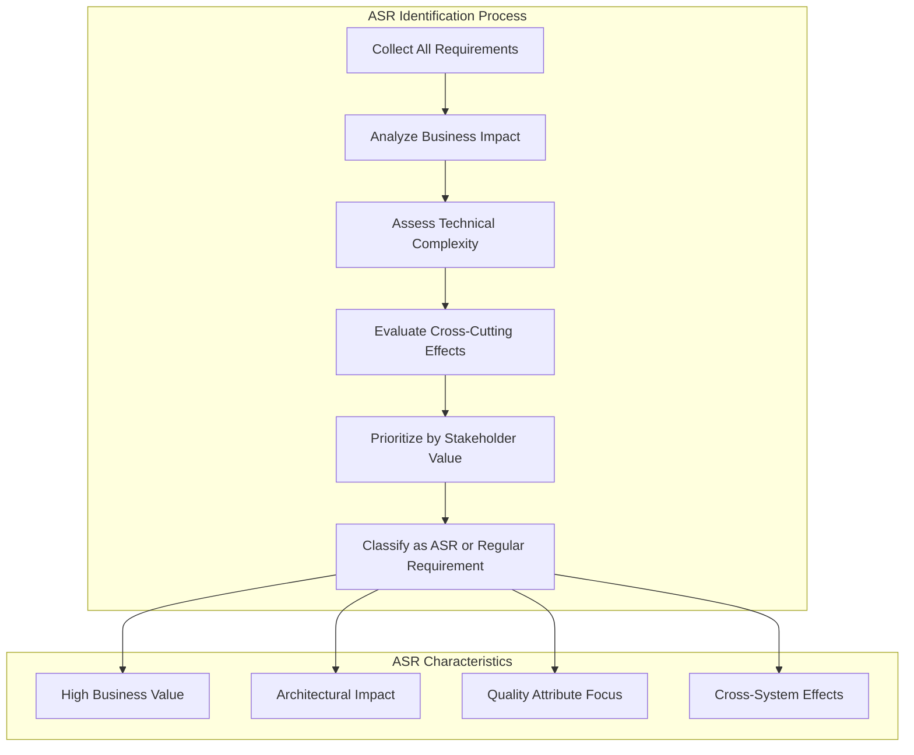
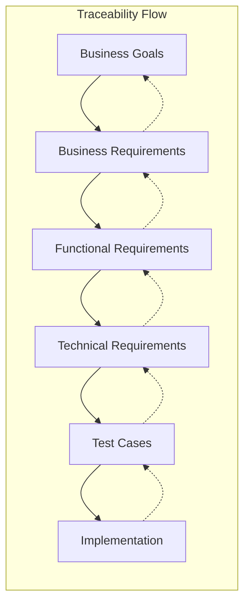
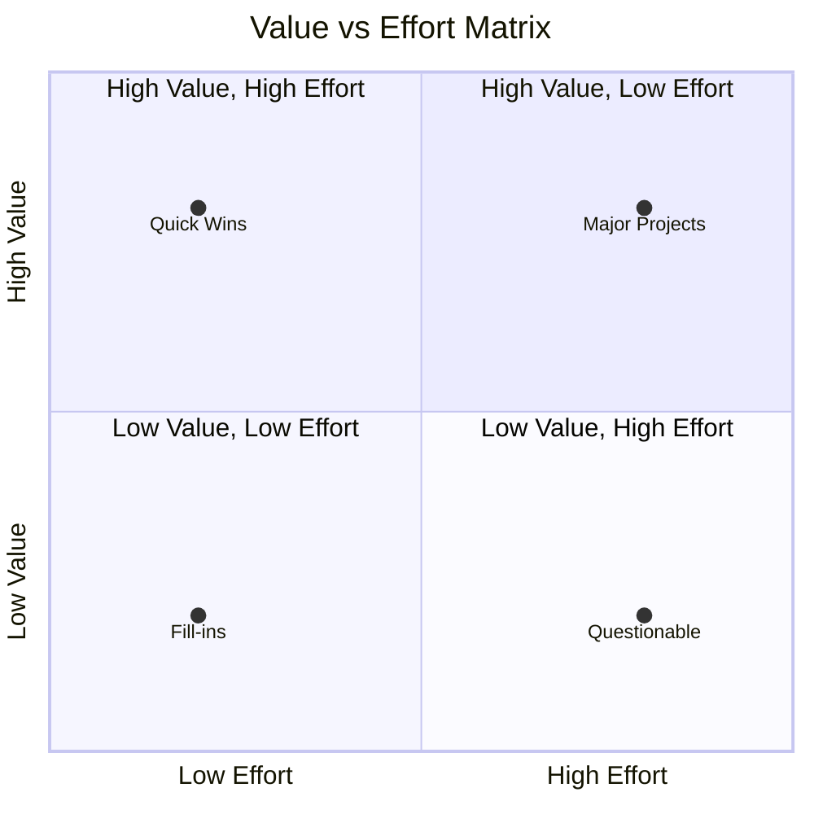

# Requirements Analysis

> **📚 Part of the [Awesome AI Architect](../README.md) knowledge base** - Master the art of requirements analysis and architecturally significant requirements for solution architecture


## TL;DR

**Requirements Analysis is the foundation of successful solution architecture.** It bridges the gap between business needs and technical implementation by identifying, documenting, and prioritizing both functional and non-functional requirements. The key is distinguishing between ordinary requirements and Architecturally Significant Requirements (ASRs) that fundamentally shape system design.

**Key takeaway:** Not all requirements are created equal—focus on ASRs that drive architectural decisions and use quality attribute scenarios to make requirements testable and measurable.

## Overview

Requirements Analysis is a critical discipline in solution architecture that involves systematically identifying, documenting, analyzing, and prioritizing requirements to ensure successful solution delivery. It serves as the bridge between business stakeholders' needs and the technical implementation, providing a clear roadmap for architects and development teams.

## Types of Requirements

### Functional Requirements

Functional requirements define **what** the system must do—the specific behaviors, features, and capabilities that the system must provide to meet business objectives.

**Characteristics:**
- Describe system behavior and functionality
- Define user interactions and system responses
- Specify business rules and logic
- Detail data processing and transformations

**Example:**
```
The system shall allow users to create, edit, and delete customer profiles.
The system shall validate email addresses using RFC 5322 standards.
The system shall generate monthly sales reports automatically.
```

### Non-Functional Requirements (Quality Attributes)

Non-functional requirements define **how well** the system must perform its functions—the quality characteristics that determine system success.

**Key Categories:**
- **Performance**: Response times, throughput, resource utilization
- **Reliability**: Availability, fault tolerance, recoverability
- **Security**: Authentication, authorization, data protection
- **Usability**: User experience, accessibility, learnability
- **Maintainability**: Modularity, testability, modifiability
- **Scalability**: Ability to handle increased load
- **Compatibility**: Integration with existing systems

## Architecturally Significant Requirements (ASRs)

### What Makes a Requirement Architecturally Significant?

ASRs are requirements that have a significant impact on the system's architecture. They drive major design decisions and influence the overall system structure.

**Criteria for ASRs:**
1. **High Business Impact**: Critical to business success
2. **Technical Complexity**: Require significant architectural consideration
3. **Cross-Cutting Concerns**: Affect multiple system components
4. **Quality Attribute Focus**: Primarily non-functional requirements
5. **Stakeholder Priority**: High importance to key stakeholders

### Identifying ASRs



### ASR Documentation Template

**ASR ID**: ASR-001
**Title**: System Response Time Requirements
**Description**: The system must respond to user requests within 2 seconds for 95% of transactions
**Business Justification**: Customer satisfaction and competitive advantage
**Quality Attribute**: Performance
**Stakeholders**: End Users, Business Owners
**Priority**: High
**Acceptance Criteria**: 
- Response time ≤ 2 seconds for 95% of requests
- Measured under normal load conditions
- Includes network latency

## Quality Attribute Scenarios

### SEI Quality Attribute Scenario Format

Quality attribute scenarios provide a structured way to specify non-functional requirements using a consistent format.

**Scenario Components:**
1. **Source**: Who or what generates the stimulus
2. **Stimulus**: What triggers the scenario
3. **Environment**: System conditions when stimulus occurs
4. **Artifact**: What part of the system is affected
5. **Response**: How the system should respond
6. **Response Measure**: How to measure success

### Scenario Template

```
When <source> <stimulus> under <environment>, 
the <artifact> shall <response> within <response measure>
```

**Example Performance Scenario:**
```
When a user submits a search request under normal load conditions,
the search system shall return results within 2 seconds
for 95% of requests with 1000 concurrent users.
```

### Common Quality Attribute Scenarios

#### Performance Scenarios
- **Response Time**: "System responds to user requests within X seconds"
- **Throughput**: "System processes X transactions per second"
- **Resource Utilization**: "System uses no more than X% of available memory"

#### Availability Scenarios
- **Uptime**: "System is available 99.9% of the time"
- **Recovery Time**: "System recovers from failure within X minutes"
- **Fault Tolerance**: "System continues operating with X% component failures"

#### Security Scenarios
- **Authentication**: "System verifies user identity before granting access"
- **Authorization**: "System restricts access based on user roles"
- **Data Protection**: "System encrypts sensitive data in transit and at rest"

## Requirements Traceability

### Traceability Matrix

Requirements traceability ensures that all requirements are addressed throughout the development lifecycle and can be traced back to their business justification.



### Traceability Benefits
- **Impact Analysis**: Understand the effect of requirement changes
- **Coverage Analysis**: Ensure all requirements are implemented
- **Compliance**: Meet regulatory and audit requirements
- **Change Management**: Track requirement evolution

## Requirements Prioritization

### Prioritization Techniques

#### MoSCoW Method
- **Must Have**: Critical for system success
- **Should Have**: Important but not critical
- **Could Have**: Desirable if resources allow
- **Won't Have**: Not included in current release

#### Kano Model
- **Basic**: Expected features (hygiene factors)
- **Performance**: Linear satisfaction relationship
- **Excitement**: Unexpected features that delight users

#### Value vs. Effort Matrix


## Common Pitfalls in Requirements Analysis

### 1. Focusing Only on Functional Requirements
**Problem**: Ignoring non-functional requirements leads to systems that work but don't meet quality expectations.

**Solution**: Use quality attribute scenarios to make non-functional requirements explicit and measurable.

### 2. Vague and Unmeasurable Requirements
**Problem**: Requirements like "system should be fast" are not actionable.

**Solution**: Use specific, measurable criteria with clear acceptance criteria.

### 3. Missing Stakeholder Input
**Problem**: Requirements don't reflect actual user needs.

**Solution**: Engage all relevant stakeholders throughout the requirements process.

### 4. Requirements Creep
**Problem**: Continuously adding new requirements without proper evaluation.

**Solution**: Establish a formal change control process and impact analysis.

### 5. Poor Traceability
**Problem**: Cannot track requirements through implementation.

**Solution**: Maintain traceability matrix and use requirements management tools.

## Requirements Analysis Process

### 1. Requirements Elicitation
- **Stakeholder Interviews**: Direct conversations with key stakeholders
- **Workshops**: Collaborative sessions with multiple stakeholders
- **Observation**: Watching users perform their tasks
- **Document Analysis**: Reviewing existing documentation and systems
- **Prototyping**: Creating mockups to validate requirements

### 2. Requirements Documentation
- **Use Cases**: Describe user interactions with the system
- **User Stories**: Agile format for requirements
- **Requirements Specifications**: Detailed written requirements
- **Quality Attribute Scenarios**: Structured non-functional requirements

### 3. Requirements Analysis
- **Feasibility Analysis**: Can the requirement be implemented?
- **Impact Analysis**: What are the consequences of this requirement?
- **Conflict Resolution**: How to handle conflicting requirements?
- **Prioritization**: Which requirements are most important?

### 4. Requirements Validation
- **Stakeholder Review**: Confirm requirements with stakeholders
- **Prototyping**: Build prototypes to validate understanding
- **Testing**: Create test cases to verify requirements
- **Traceability**: Ensure requirements can be traced to business goals

## Tools and Techniques

### Requirements Management Tools
- **Jira**: Issue tracking and requirements management
- **Confluence**: Collaborative documentation
- **Azure DevOps**: Integrated requirements and development tracking
- **IBM DOORS**: Enterprise requirements management
- **ReqSuite**: Specialized requirements management

### Modeling Techniques
- **Use Case Diagrams**: Show system interactions
- **Activity Diagrams**: Model business processes
- **Sequence Diagrams**: Show interaction flows
- **State Diagrams**: Model system behavior

### Analysis Techniques
- **SWOT Analysis**: Strengths, Weaknesses, Opportunities, Threats
- **Root Cause Analysis**: Identify underlying issues
- **Gap Analysis**: Compare current vs. desired state
- **Risk Analysis**: Identify and assess risks

## Best Practices

### 1. Start with Business Goals
Always begin requirements analysis by understanding the business objectives and success criteria.

### 2. Engage All Stakeholders
Include representatives from all stakeholder groups throughout the process.

### 3. Use Multiple Elicitation Techniques
Combine interviews, workshops, observation, and document analysis for comprehensive requirements.

### 4. Make Requirements Testable
Write requirements in a way that enables clear testing and validation.

### 5. Maintain Traceability
Keep clear links between business goals, requirements, and implementation.

### 6. Manage Changes Systematically
Establish formal processes for requirement changes and impact analysis.

### 7. Focus on ASRs
Prioritize architecturally significant requirements that drive design decisions.

### 8. Use Quality Attribute Scenarios
Structure non-functional requirements using the SEI scenario format.

## Conclusion

Requirements analysis is the cornerstone of successful solution architecture. By systematically identifying, documenting, and prioritizing both functional and non-functional requirements, architects can ensure that solutions meet business needs while maintaining the necessary quality attributes. The key is distinguishing between ordinary requirements and ASRs, using quality attribute scenarios to make requirements measurable, and maintaining traceability throughout the development lifecycle.

Remember: Great architecture starts with great requirements analysis. Invest the time upfront to get requirements right, and the rest of the development process will be much smoother and more successful.

---

## References

- Software Engineering Institute (SEI) - Quality Attribute Scenarios
- IEEE 830 - Software Requirements Specifications
- ISO/IEC 25010 - Software Quality Model
- BABOK Guide - Business Analysis Body of Knowledge
- "Software Requirements" by Karl Wiegers
- "Requirements Engineering" by Elizabeth Hull, Ken Jackson, and Jeremy Dick
