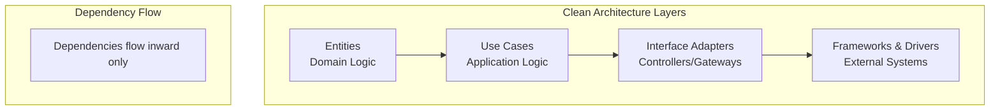
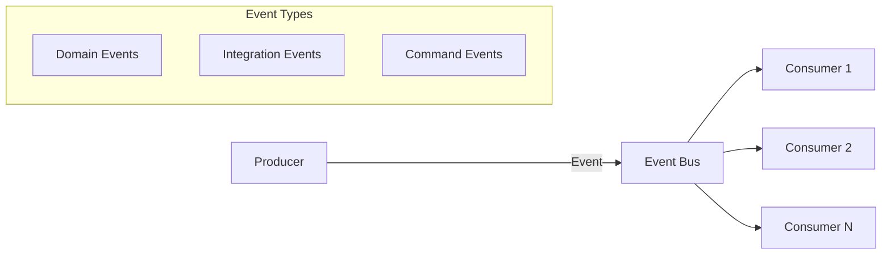
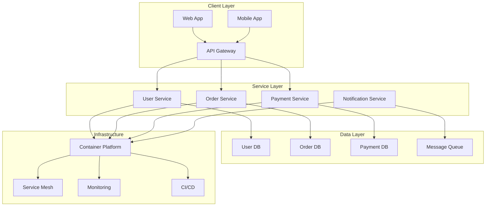

# Solution Architecture Fundamentals

> **📚 Part of the [Awesome AI Architect](../README.md) knowledge base** - Master solution architecture principles, patterns, and practices for modern enterprise systems


## TL;DR

**Solution Architecture is the bridge between business requirements and technical implementation.** It defines the high-level structure of systems, integrates multiple components, and ensures alignment with business goals. Think of it as the blueprint that guides technical decisions while balancing stakeholder needs, constraints, and trade-offs.

**Key takeaway:** Great solution architects combine technical depth with business acumen, focusing on solving problems rather than just applying technology.

## Overview

Solution Architecture is a discipline focused on designing and implementing solutions that meet specific business requirements. Unlike Enterprise Architecture (which focuses on the entire organization) or Technical Architecture (which focuses on specific technologies), Solution Architecture bridges the gap between business needs and technical capabilities.

## Architecture Principles & Patterns

### Core Design Principles

#### 1. **Separation of Concerns**
- **Definition**: Each component should have a single, well-defined responsibility
- **Benefits**: Improved maintainability, testability, and flexibility
- **Implementation**: Use layered architectures, microservices, or domain-driven design
- **Example**: Authentication service handles only authentication, not user profile management

#### 2. **Single Responsibility Principle**
- **Definition**: A component should have only one reason to change
- **Benefits**: Reduced coupling, easier testing, clearer code organization
- **Anti-pattern**: "God objects" that handle multiple responsibilities
- **Example**: Payment processor handles payments, not inventory management

#### 3. **Don't Repeat Yourself (DRY)**
- **Definition**: Every piece of knowledge should have a single representation
- **Benefits**: Reduced maintenance burden, consistency, easier updates
- **Implementation**: Shared libraries, configuration management, code templates
- **Balance**: Don't over-abstract—some duplication is acceptable

#### 4. **KISS (Keep It Simple, Stupid)**
- **Definition**: Solutions should be as simple as possible, but no simpler
- **Benefits**: Easier to understand, maintain, and debug
- **Trade-offs**: Balance simplicity with functionality and future needs
- **Example**: Choose REST over GraphQL if you don't need GraphQL's complexity

### Architectural Patterns

#### Clean Architecture & Hexagonal Architecture



- **Core Principle**: Dependencies point inward, business logic is independent
- **Benefits**: Testable, maintainable, framework-independent
- **Use Cases**: Complex business applications, long-term projects
- **Trade-offs**: Initial complexity vs. long-term maintainability

#### Microservices vs Monoliths

| Aspect | Monolith | Microservices |
|--------|----------|---------------|
| **Deployment** | Single deployable unit | Independent deployments |
| **Scaling** | Scale entire application | Scale individual services |
| **Technology** | Single tech stack | Polyglot architecture |
| **Complexity** | Lower initial complexity | Higher operational complexity |
| **Team Structure** | Single team can manage | Requires multiple teams |
| **Data Management** | Shared database | Service-owned databases |

**When to Choose Microservices:**
- Large, complex applications
- Multiple development teams
- Need for independent scaling
- Different technology requirements per service

**When to Choose Monoliths:**
- Simple to moderate complexity
- Small teams (< 10 developers)
- Rapid prototyping
- Cost-sensitive projects

#### Event-Driven Architecture



- **Benefits**: Loose coupling, scalability, asynchronous processing
- **Challenges**: Event ordering, debugging, eventual consistency
- **Use Cases**: Real-time systems, microservices integration, audit trails

#### CQRS & Event Sourcing

**Command Query Responsibility Segregation (CQRS):**
- Separate read and write models
- Optimized data structures for different operations
- Improved performance and scalability

**Event Sourcing:**
- Store events instead of current state
- Perfect audit trail and time-travel debugging
- Complex to implement and query

**When to Use:**
- Complex business domains
- Audit requirements
- High-performance read/write needs
- Temporal data analysis

### Domain-Driven Design (DDD)

#### Core Concepts

**Bounded Context:**
- Clear boundaries around domain models
- Prevents model contamination
- Enables independent evolution

**Ubiquitous Language:**
- Shared vocabulary between business and technical teams
- Reduces misunderstandings
- Improves collaboration

**Aggregates:**
- Consistency boundaries within the domain
- Transactional units
- Encapsulate business rules

#### DDD Implementation Strategy

1. **Start with Domain Exploration**
   - Event storming sessions
   - Domain expert interviews
   - Identify core vs. supporting domains

2. **Define Bounded Contexts**
   - Map business capabilities
   - Identify data ownership
   - Define integration points

3. **Design Aggregates**
   - Identify invariants
   - Define aggregate roots
   - Minimize dependencies

### API-First Design

#### Principles

**Design Before Implementation:**
- Define API contracts first
- Use OpenAPI/Swagger specifications
- Enable parallel development

**Consumer-Driven:**
- Understand API usage patterns
- Version APIs properly
- Provide excellent developer experience

#### REST vs GraphQL vs gRPC

| Protocol | Best For | Pros | Cons |
|----------|----------|------|------|
| **REST** | Standard web APIs | Simple, cacheable, widely supported | Over/under fetching, multiple requests |
| **GraphQL** | Client-driven APIs | Single endpoint, flexible queries | Complex caching, steep learning curve |
| **gRPC** | Internal services | High performance, type safety | HTTP/2 only, limited browser support |

## Architecture Decision Records (ADRs)

### ADR Structure

```markdown
# ADR-001: Use React for Frontend Framework

## Status
Accepted

## Context
We need to choose a frontend framework for our new customer portal.
- Team has JavaScript experience
- Need component reusability
- Performance is important
- Large ecosystem preferred

## Decision
We will use React with TypeScript for the frontend framework.

## Consequences
Positive:
- Large ecosystem and community
- Good performance with React 18
- Team can leverage existing JavaScript skills
- Excellent tooling support

Negative:
- Learning curve for React-specific patterns
- Need additional libraries for routing, state management
- Bundle size considerations

## Alternatives Considered
- Vue.js: Smaller ecosystem, less team experience
- Angular: Too complex for current team size
- Svelte: Limited ecosystem, newer technology
```

### ADR Best Practices

**Decision Criteria:**
- Technical requirements
- Team capabilities
- Business constraints
- Long-term maintenance

**Review Process:**
- Stakeholder review
- Technical review
- Impact assessment
- Regular revisiting

## Reference Architectures

### Cloud-Native Architecture



**Key Characteristics:**
- Container-based deployment
- Microservices architecture
- API-driven integration
- DevOps automation
- Observability built-in

### Hybrid Cloud Patterns

**Multi-Cloud Strategy:**
- Avoid vendor lock-in
- Leverage best-of-breed services
- Improved disaster recovery
- Regulatory compliance

**Edge Computing Integration:**
- Reduced latency
- Local data processing
- Improved user experience
- Bandwidth optimization

## Implementation Guidelines

### Starting a New Solution

1. **Requirements Analysis**
   - Functional requirements
   - Non-functional requirements (NFRs)
   - Constraints and assumptions
   - Success criteria

2. **Architecture Design**
   - High-level architecture
   - Component design
   - Integration patterns
   - Data architecture

3. **Technology Selection**
   - Evaluation criteria
   - Proof of concepts
   - Risk assessment
   - ADR documentation

4. **Implementation Planning**
   - Development phases
   - Risk mitigation
   - Team structure
   - Delivery timeline

### Common Pitfalls

#### ❌ **Over-Engineering**
- **Problem**: Building for imaginary future requirements
- **Solution**: Start simple, evolve based on real needs
- **Example**: Don't build microservices for a simple CRUD app

#### ❌ **Technology-First Thinking**
- **Problem**: Choosing technology before understanding requirements
- **Solution**: Requirements → Architecture → Technology
- **Example**: Don't choose Kubernetes because it's trendy

#### ❌ **Ignoring Non-Functional Requirements**
- **Problem**: Focusing only on features, not quality attributes
- **Solution**: Define and test NFRs from the start
- **Example**: Performance, security, scalability, maintainability

#### ❌ **Poor Documentation**
- **Problem**: Undocumented architectural decisions
- **Solution**: Use ADRs, maintain architecture documentation
- **Example**: Future developers can't understand design rationale

## Quality Attributes

### Performance

**Key Metrics:**
- Response time: < 200ms for UI interactions
- Throughput: Requests per second
- Resource utilization: CPU, memory, storage
- Scalability: Horizontal vs. vertical scaling

**Optimization Strategies:**
- Caching (Redis, CDN)
- Database optimization
- Asynchronous processing
- Load balancing

### Security

**Security by Design:**
- Threat modeling
- Defense in depth
- Zero trust principles
- Security testing

**Common Patterns:**
- Authentication and authorization
- Data encryption
- API security
- Network security

### Scalability

**Horizontal Scaling:**
- Add more instances
- Stateless design
- Load balancing
- Auto-scaling

**Vertical Scaling:**
- Increase instance capacity
- Limited by hardware
- Easier to implement
- Single point of failure

### Maintainability

**Code Quality:**
- Clean code principles
- Automated testing
- Code reviews
- Documentation

**Architecture Quality:**
- Low coupling
- High cohesion
- Clear boundaries
- Consistent patterns

## When to Use Different Approaches

### Simple Applications
- **Architecture**: Layered monolith
- **Patterns**: MVC, Repository pattern
- **Technology**: Single language/framework
- **Database**: Single database

### Complex Business Applications
- **Architecture**: Clean/Hexagonal architecture
- **Patterns**: DDD, CQRS, Event sourcing
- **Technology**: Multi-language if needed
- **Database**: Domain-specific databases

### High-Scale Applications
- **Architecture**: Microservices
- **Patterns**: Event-driven, API gateway
- **Technology**: Cloud-native, containers
- **Database**: Polyglot persistence

### Rapid Prototypes
- **Architecture**: Simple layered
- **Patterns**: Active record, MVC
- **Technology**: Familiar stack
- **Database**: SQLite or simple cloud database

## Resources

### Books
- [Building Evolutionary Architectures](https://www.amazon.com/Building-Evolutionary-Architectures-Support-Constant/dp/1491986360) by Neal Ford
- [Software Architecture in Practice](https://www.amazon.com/Software-Architecture-Practice-3rd-Engineering/dp/0321815734) by Len Bass
- [Clean Architecture](https://www.amazon.com/Clean-Architecture-Craftsmans-Software-Structure/dp/0134494164) by Robert Martin
- [Domain-Driven Design](https://www.amazon.com/Domain-Driven-Design-Tackling-Complexity-Software/dp/0321125215) by Eric Evans

### Online Resources
- [Microsoft Architecture Center](https://docs.microsoft.com/en-us/azure/architecture/)
- [AWS Architecture Center](https://aws.amazon.com/architecture/)
- [Google Cloud Architecture Center](https://cloud.google.com/architecture)
- [Martin Fowler's Architecture Patterns](https://martinfowler.com/architecture/)

### Tools
- **Modeling**: Lucidchart, Draw.io, ArchiMate tools
- **Documentation**: Confluence, Notion, GitBook
- **ADRs**: adr-tools, Markdown templates
- **API Design**: Swagger/OpenAPI, Postman

## Related Topics

- [Clean Architecture](clean-architecture.md) - Detailed clean architecture implementation
- [Architecture Decision Records](architecture-decision-records.md) - ADR templates and practices
- [AI Architecture Patterns](../ai-architecture-topics/ai-architecture-patterns.md) - AI-specific patterns
- [Career Guide](../career.md) - Solution architect career development
- [Interview Prep](../interview-prep.md) - Architecture interview preparation

---

*Solution architecture is about making informed trade-offs. There's no perfect architecture—only architectures that are appropriate for your specific context, constraints, and requirements. Focus on solving real problems, not implementing textbook solutions.*
