# Architecture Assessment & Maturity

> **📚 Part of the [Awesome AI Architect](../README.md) knowledge base** - Evaluate, measure, and continuously improve architectural capabilities and organizational maturity


## TL;DR

**Architecture Assessment & Maturity frameworks provide systematic approaches to evaluate current architectural capabilities, identify improvement opportunities, and guide transformation initiatives.** They help organizations understand where they are, where they need to go, and how to get there. Think of it as a GPS for your architectural journey.

**Key takeaway:** You can't improve what you don't measure—assessment and maturity models provide the foundation for systematic architectural improvement.

## Overview

Architecture Assessment & Maturity encompasses the methods, tools, and frameworks used to evaluate architectural capabilities across people, processes, technology, and governance dimensions. It provides objective, measurable insights into architectural effectiveness and guides improvement investments.

## Architecture Assessment

### Assessment Frameworks

#### Capability-Based Assessment

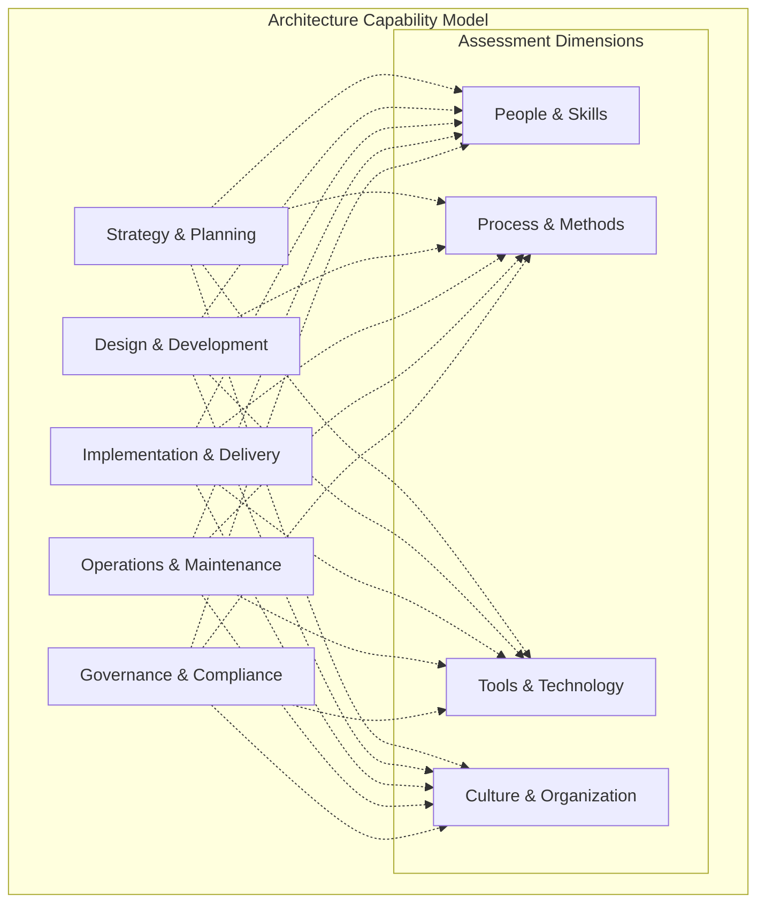

**Assessment Methodology:**
1. **Current State Analysis**: Where are we now?
2. **Target State Definition**: Where do we want to be?
3. **Gap Analysis**: What's the difference?
4. **Roadmap Development**: How do we get there?
5. **Implementation Planning**: What's our action plan?

#### Multi-Dimensional Assessment

**Technical Architecture Assessment:**
- System architecture quality
- Technology stack appropriateness
- Integration architecture effectiveness
- Performance and scalability
- Security and compliance

**Business Architecture Assessment:**
- Business-IT alignment
- Capability model maturity
- Value stream optimization
- Stakeholder engagement
- Strategic planning effectiveness

**Information Architecture Assessment:**
- Data quality and governance
- Information flow optimization
- Master data management
- Analytics capabilities
- Knowledge management

**Application Architecture Assessment:**
- Application portfolio health
- Modernization needs
- Integration complexity
- Redundancy and gaps
- Lifecycle management

### Assessment Methods

#### Quantitative Assessment

**Metrics-Based Evaluation:**

| Category | Metric | Target | Current | Gap |
|----------|---------|---------|---------|-----|
| **Performance** | System Response Time | <200ms | 350ms | -150ms |
| **Availability** | System Uptime | 99.9% | 97.5% | -2.4% |
| **Security** | Vulnerabilities | 0 Critical | 3 Critical | -3 |
| **Compliance** | Standards Adherence | 95% | 78% | -17% |
| **Cost** | Architecture Debt | <15% | 28% | -13% |

**Scoring Models:**

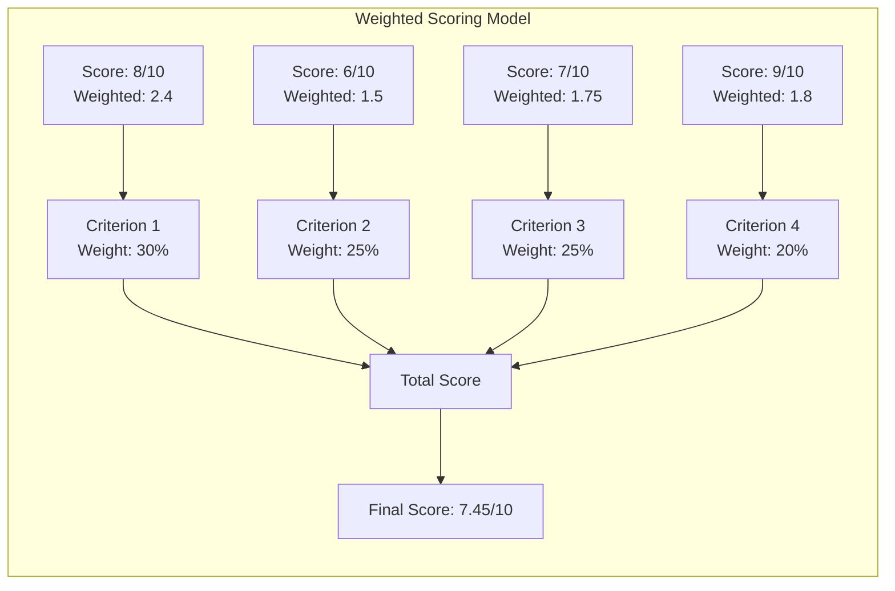

#### Qualitative Assessment

**Stakeholder Interviews:**
- Executive leadership perspectives
- Technical team feedback
- Business user experiences
- External partner insights

**Workshop-Based Assessments:**
- Facilitated group sessions
- Collaborative problem identification
- Consensus building on priorities
- Action planning workshops

**Document and Artifact Reviews:**
- Architecture documentation quality
- Standards compliance verification
- Decision rationale evaluation
- Process adherence assessment

#### Assessment Tools and Techniques

**Architecture Review Checklists:**

```markdown
# Technical Architecture Review Checklist

## Scalability
- [ ] Horizontal scaling capabilities defined
- [ ] Load balancing strategy documented
- [ ] Caching strategy implemented
- [ ] Database scaling approach defined

## Security
- [ ] Authentication mechanism implemented
- [ ] Authorization controls in place
- [ ] Data encryption at rest and in transit
- [ ] Security monitoring capabilities

## Reliability
- [ ] Fault tolerance mechanisms
- [ ] Disaster recovery procedures
- [ ] Monitoring and alerting systems
- [ ] SLA requirements defined

## Maintainability
- [ ] Code quality standards followed
- [ ] Documentation current and complete
- [ ] Test coverage adequate
- [ ] Change management process defined
```

**Automated Assessment Tools:**
- Static code analysis (SonarQube, CodeClimate)
- Architecture conformance tools (ArchUnit, NDepend)
- Security scanning (Checkmarx, Veracode)
- Performance testing (JMeter, Gatling)
- Infrastructure scanning (Terraform Sentinel, AWS Config)

### Technology Assessment

#### Technology Portfolio Analysis

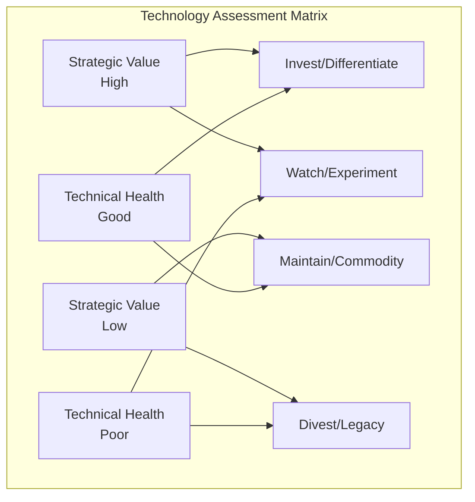

**Assessment Criteria:**

**Strategic Value:**
- Business criticality
- Competitive advantage
- Innovation potential
- Future readiness

**Technical Health:**
- Vendor support status
- Security vulnerability exposure
- Performance characteristics
- Integration capabilities
- Skill availability

#### Technology Lifecycle Assessment

| Technology | Current Stage | Strategic Value | Technical Health | Recommended Action |
|------------|---------------|-----------------|------------------|--------------------|
| **Java 8** | Mature | High | Good | Maintain, plan upgrade |
| **Legacy Mainframe** | Declining | Medium | Poor | Modernize/Replace |
| **Kubernetes** | Growth | High | Good | Expand usage |
| **Machine Learning** | Emerging | High | Good | Invest/Experiment |
| **Flash Storage** | Commodity | Medium | Good | Standard deployment |

### Risk Assessment

#### Architecture Risk Framework

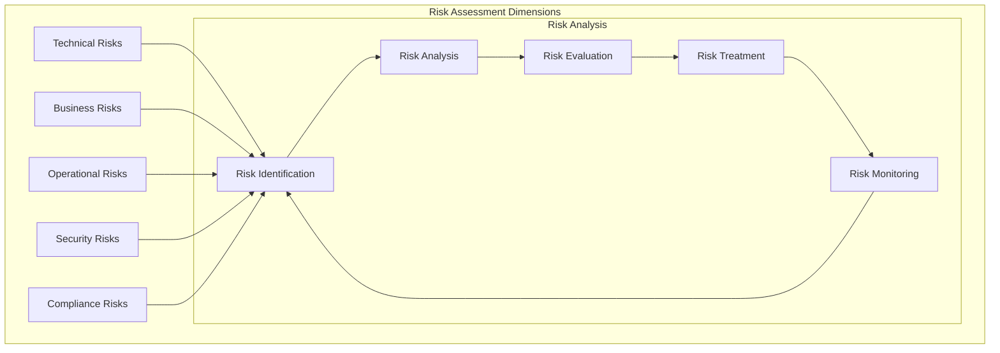

**Risk Assessment Template:**

| Risk ID | Risk Description | Category | Probability | Impact | Risk Score | Mitigation Strategy | Owner |
|---------|------------------|----------|-------------|--------|------------|-------------------|-------|
| AR-001 | Legacy system failure | Technical | High | High | 9 | Accelerate modernization | CTO |
| AR-002 | Skill shortage | Operational | Medium | High | 6 | Training program | HR |
| AR-003 | Vendor lock-in | Strategic | Medium | Medium | 4 | Multi-vendor strategy | Architect |
| AR-004 | Data breach | Security | Low | High | 3 | Security controls | CISO |

#### Performance Assessment

**Performance Benchmarking:**

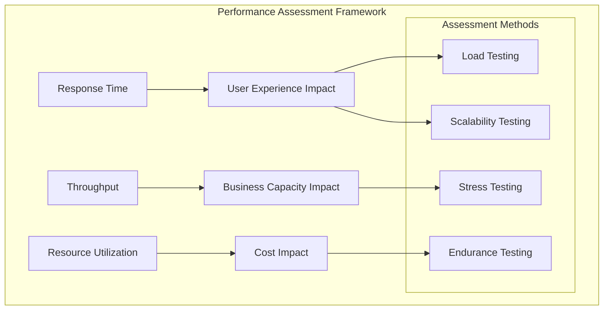

**Performance Metrics:**

| System Component | Metric | Current | Target | Status |
|------------------|---------|---------|---------|---------|
| **Web Application** | Response Time (95th percentile) | 850ms | 200ms | 🔴 Needs Attention |
| **API Gateway** | Requests per second | 500 RPS | 1000 RPS | 🟡 Moderate Performance |
| **Database** | Query response time | 50ms | 100ms | 🟢 Good Performance |
| **Message Queue** | Message throughput | 2000/sec | 5000/sec | 🟡 Moderate Performance |

## Maturity Models

### Architecture Maturity Assessment

#### TOGAF Architecture Maturity Model

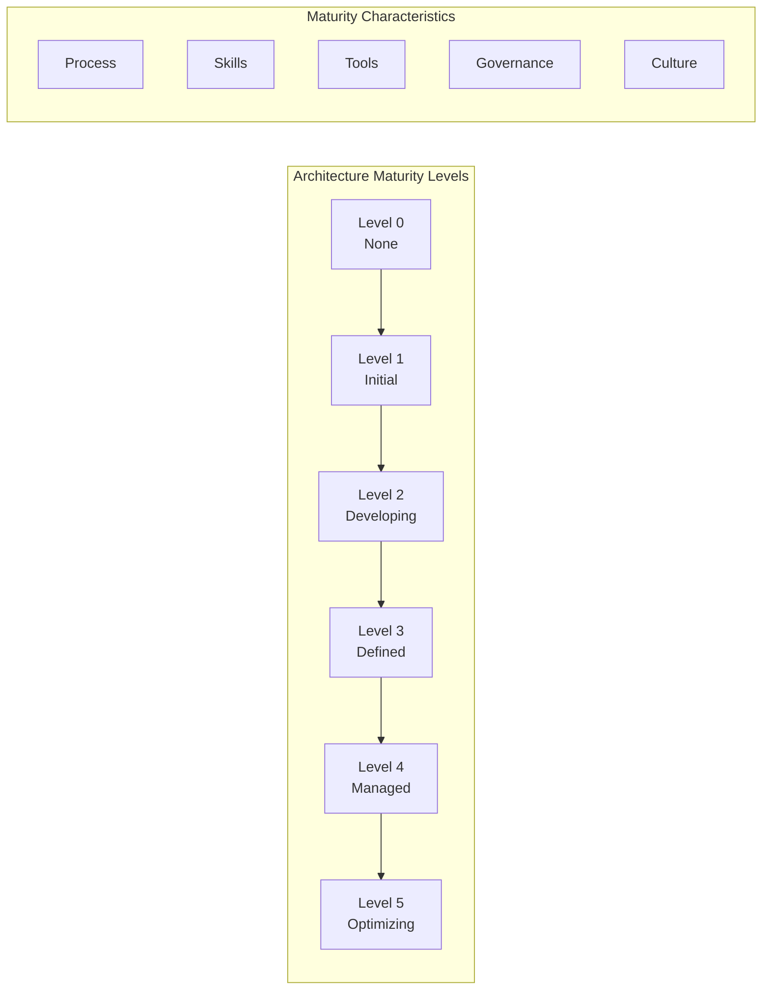

**Maturity Level Descriptions:**

**Level 0 - None:**
- No formal architecture capability
- Ad hoc approach to system design
- Technology decisions made in isolation
- No architecture documentation

**Level 1 - Initial:**
- Basic awareness of architecture needs
- Some informal architecture activities
- Limited architecture documentation
- Reactive approach to problems

**Level 2 - Developing:**
- Architecture process under development
- Some architecture standards defined
- Basic governance structures forming
- Project-level architecture focus

**Level 3 - Defined:**
- Formal architecture process established
- Architecture standards documented
- Governance structure in place
- Enterprise-wide architecture view

**Level 4 - Managed:**
- Architecture metrics and KPIs defined
- Continuous process improvement
- Performance measurement systems
- Quantitative decision making

**Level 5 - Optimizing:**
- Continuous innovation and improvement
- Adaptive architecture practices
- Predictive capabilities
- Industry leadership position

#### Custom Maturity Model

**Domain-Specific Assessment:**

| Capability Area | Level 1 | Level 2 | Level 3 | Level 4 | Level 5 | Current |
|----------------|---------|---------|---------|---------|---------|---------|
| **Strategy Alignment** | Ad hoc | Project-level | Enterprise view | Measured alignment | Predictive alignment | Level 2 |
| **Design Quality** | No standards | Basic patterns | Formal standards | Quality metrics | Continuous optimization | Level 3 |
| **Technology Management** | Reactive | Basic portfolio | Strategic portfolio | Measured outcomes | Adaptive portfolio | Level 3 |
| **Skills Development** | Individual learning | Team training | Formal programs | Competency management | Innovation culture | Level 2 |
| **Governance** | No governance | Informal review | Formal process | Measured compliance | Adaptive governance | Level 2 |

### CMMI for Architecture

#### CMMI Capability Levels

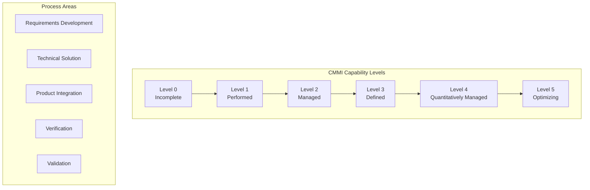

**CMMI Architecture Process Areas:**

**Requirements Development:**
- Stakeholder needs analysis
- Requirements elicitation and analysis
- Requirements specification
- Requirements validation

**Technical Solution:**
- Alternative solution analysis
- Technical architecture design
- Product component design
- Technical data management

**Product Integration:**
- Integration environment preparation
- Component integration
- Product assembly and delivery
- Interface management

### Digital Transformation Maturity

#### Digital Maturity Framework

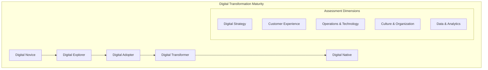

**Maturity Assessment Criteria:**

| Dimension | Digital Novice | Digital Explorer | Digital Adopter | Digital Transformer | Digital Native |
|-----------|----------------|------------------|-----------------|---------------------|----------------|
| **Strategy** | No digital strategy | Experimenting | Focused initiatives | Integrated strategy | Native digital |
| **Customer** | Traditional channels | Some digital touchpoints | Omnichannel approach | Customer-centric design | Real-time personalization |
| **Operations** | Manual processes | Basic automation | Integrated systems | Intelligent automation | Autonomous operations |
| **Culture** | Resistance to change | Cautious adoption | Embracing change | Innovation-driven | Digital-first mindset |
| **Analytics** | Basic reporting | Descriptive analytics | Predictive analytics | Prescriptive analytics | AI-driven insights |

## Benchmarking & Best Practices

### Industry Benchmarking

#### Benchmarking Framework

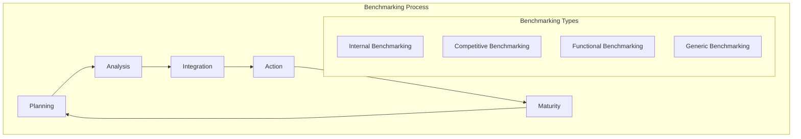

**Benchmarking Categories:**

**Internal Benchmarking:**
- Compare across business units
- Historical performance comparison
- Best practice identification
- Resource optimization

**Competitive Benchmarking:**
- Direct competitor comparison
- Market position analysis
- Competitive advantage identification
- Strategic gap analysis

**Functional Benchmarking:**
- Similar function comparison
- Cross-industry learning
- Process improvement opportunities
- Innovation identification

**Generic Benchmarking:**
- Best-in-class comparison
- Breakthrough improvement
- Paradigm shifting
- Revolutionary change

#### Benchmarking Metrics

**Architecture Efficiency Metrics:**

| Metric | Industry Average | Top Quartile | Our Performance | Gap to Top Quartile |
|--------|------------------|--------------|-----------------|-------------------|
| **Project Success Rate** | 65% | 85% | 72% | -13% |
| **Time to Market** | 9 months | 6 months | 12 months | -6 months |
| **Architecture Debt Ratio** | 25% | 15% | 32% | -17% |
| **Standards Compliance** | 78% | 92% | 68% | -24% |
| **Cost per Capability** | $150K | $100K | $180K | -$80K |

### Best Practice Identification

#### Best Practice Framework

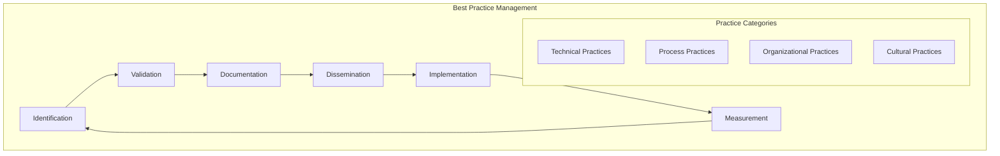

**Best Practice Criteria:**
- Measurable impact on outcomes
- Repeatable across contexts
- Supported by evidence
- Aligned with strategic objectives
- Feasible for implementation

**Practice Documentation Template:**
```markdown
# Best Practice: [Name]

## Context
When and where this practice applies

## Description
What the practice involves

## Benefits
- Quantifiable benefits
- Qualitative improvements
- Success metrics

## Implementation
- Prerequisites
- Step-by-step approach
- Resource requirements
- Timeline

## Lessons Learned
- Common pitfalls
- Success factors
- Adaptation considerations

## Metrics
- How to measure success
- KPIs and targets
- Monitoring approach
```

## Assessment Tools & Techniques

### Assessment Questionnaires

#### Architecture Capability Self-Assessment

**Strategy & Planning Assessment:**

1. **Architecture Vision**
   - [ ] Clear architecture vision exists and is communicated
   - [ ] Vision aligns with business strategy
   - [ ] Vision is regularly reviewed and updated
   - [ ] Stakeholders understand and support vision

2. **Strategic Planning**
   - [ ] Architecture roadmap is developed and maintained
   - [ ] Roadmap aligns with business roadmap
   - [ ] Dependencies are identified and managed
   - [ ] Regular roadmap reviews are conducted

**Rating Scale:**
- 1 = Not at all
- 2 = Partially
- 3 = Mostly
- 4 = Completely

#### Stakeholder Assessment Survey

**Business Stakeholder Perspective:**

| Question | Rating (1-5) | Comments |
|----------|-------------|----------|
| How well does IT architecture support business objectives? | | |
| How satisfied are you with system performance? | | |
| How well are integration requirements met? | | |
| How effectively are changes managed? | | |
| How confident are you in system security? | | |

### Automated Assessment Tools

#### Code Quality Assessment

```python
# Example: Architecture Conformance Testing with ArchUnit

@Test
def test_services_should_not_depend_on_controllers():
    """Services should not have dependencies on controllers."""
    assert_that(classes()
        .that(reside_in_a_package("..service.."))
        .should(not_depend_on_classes()
            .that(reside_in_a_package("..controller..")))) \
        .check()

@Test
def test_repositories_should_only_be_accessed_by_services():
    """Repository layer should only be accessed by service layer."""
    assert_that(classes()
        .that(reside_in_a_package("..repository.."))
        .should(only_be_accessed_by_classes()
            .that(reside_in_a_package("..service..")))) \
        .check()
```

#### Infrastructure Assessment

```yaml
# Example: Terraform Policy as Code with Sentinel

import "tfplan"

# Policy: Ensure all EC2 instances have proper tagging
main = rule {
    all tfplan.resource_changes as _, rc {
        rc.type is "aws_instance" and
        rc.change.after.tags contains "Environment" and
        rc.change.after.tags contains "Owner" and
        rc.change.after.tags contains "CostCenter"
    }
}
```

### Assessment Reporting

#### Executive Summary Dashboard

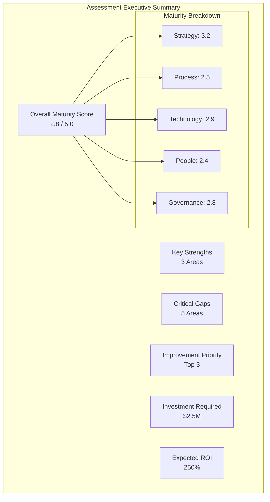

#### Detailed Assessment Report Structure

```markdown
# Architecture Assessment Report

## Executive Summary
- Overall assessment findings
- Key recommendations
- Investment requirements
- Expected outcomes

## Assessment Methodology
- Assessment approach used
- Data sources and collection methods
- Stakeholders involved
- Timeline and scope

## Current State Analysis
- Capability assessment results
- Maturity level evaluation
- Performance metrics
- Risk assessment findings

## Gap Analysis
- Current vs. target state comparison
- Priority gaps identification
- Impact analysis
- Root cause analysis

## Recommendations
- Improvement roadmap
- Quick wins identification
- Strategic initiatives
- Resource requirements

## Implementation Plan
- Phased approach
- Timeline and milestones
- Success metrics
- Risk mitigation strategies

## Appendices
- Detailed metrics
- Survey results
- Interview summaries
- Supporting documentation
```

## Implementation Guidelines

### Assessment Planning

#### Assessment Scope Definition

**Scope Dimensions:**
- **Breadth**: What areas to assess (technical, business, data, etc.)
- **Depth**: How detailed the assessment should be
- **Timeline**: Duration and frequency of assessments
- **Stakeholders**: Who to involve in the assessment
- **Resources**: Budget and personnel allocation

**Assessment Types:**
- **Comprehensive Assessment**: Full enterprise-wide evaluation
- **Focused Assessment**: Specific domain or capability area
- **Health Check**: Quick evaluation of key metrics
- **Compliance Assessment**: Standards and regulatory compliance
- **Risk Assessment**: Risk-focused evaluation

#### Success Factors

**Organizational Readiness:**
- Executive sponsorship and support
- Stakeholder commitment and engagement
- Resource availability and allocation
- Change management capability

**Assessment Quality:**
- Clear objectives and success criteria
- Appropriate methodology selection
- Skilled assessment team
- Objective and unbiased approach

**Follow-Through:**
- Action-oriented recommendations
- Implementation planning and support
- Progress monitoring and tracking
- Continuous improvement culture

### Common Pitfalls

#### ❌ **Assessment for Assessment's Sake**
- **Problem**: Conducting assessments without clear purpose
- **Solution**: Define specific objectives and intended outcomes
- **Example**: Annual assessments that gather dust

#### ❌ **Analysis Paralysis**
- **Problem**: Over-analyzing without taking action
- **Solution**: Focus on actionable insights and quick wins
- **Example**: Six-month assessment with no implementation

#### ❌ **Unrealistic Expectations**
- **Problem**: Expecting immediate transformation
- **Solution**: Set realistic timelines and incremental goals
- **Example**: Expecting Level 5 maturity in one year

#### ❌ **Ignoring Organizational Context**
- **Problem**: Using generic models without customization
- **Solution**: Adapt frameworks to organizational context
- **Example**: Applying startup practices to large enterprises

#### ❌ **Poor Communication**
- **Problem**: Not effectively communicating findings
- **Solution**: Tailor communication to audience needs
- **Example**: Technical details to executive audience

### Continuous Improvement

#### Assessment Rhythm

**Annual Comprehensive Assessment:**
- Complete maturity evaluation
- Strategic planning alignment
- Roadmap validation
- Investment planning

**Quarterly Health Checks:**
- Key metrics monitoring
- Progress tracking
- Issue identification
- Course correction

**Monthly Pulse Checks:**
- Performance indicators
- Operational metrics
- Risk monitoring
- Stakeholder feedback

#### Improvement Tracking

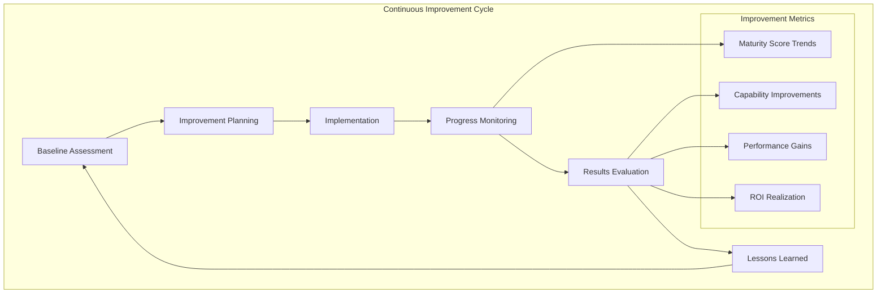

## Related Topics

- [Solution Architecture Fundamentals](solution-architecture-fundamentals.md) - Foundation principles for assessment
- [Architecture Governance](architecture-governance.md) - Governance frameworks and processes
- [Business Architecture](business-architecture.md) - Business capability assessment
- [Technical Architecture](technical-architecture.md) - Technical assessment methods
- [Career Guide](../career.md) - Architecture leadership and development

---

*Architecture assessment and maturity management is not about achieving perfect scores—it's about creating a culture of continuous improvement and making informed decisions about where to invest your architectural efforts for maximum business value.*