# Architecture Governance

> **📚 Part of the [Awesome AI Architect](../README.md) knowledge base** - Establish effective governance frameworks to ensure architectural consistency, quality, and alignment with business objectives


## TL;DR

**Architecture Governance is the systematic approach to managing architectural decisions, standards, and compliance across an organization.** It provides the framework for making consistent, informed architectural decisions while balancing innovation with risk management. Think of it as the "constitution" that guides how architecture decisions are made and enforced.

**Key takeaway:** Effective governance enables innovation while maintaining control—it's about providing guardrails, not roadblocks.

## Overview

Architecture Governance encompasses the processes, policies, and organizational structures that guide architectural decision-making across an enterprise. It ensures that architectural decisions align with business objectives, comply with standards, and support long-term sustainability while enabling innovation and agility.

## Governance Models

### Enterprise Architecture Governance

#### TOGAF Governance Framework

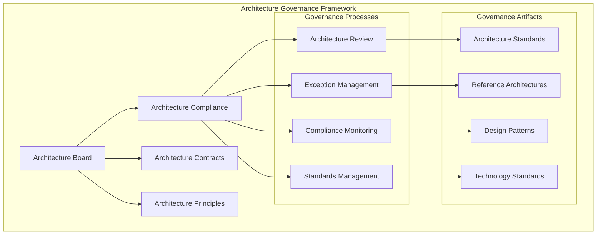

**Architecture Board Responsibilities:**
- Define architecture principles and standards
- Review and approve architectural decisions
- Manage architectural risks and exceptions
- Ensure business-IT alignment
- Oversee architecture maturity development

#### Governance Operating Model

**Centralized Governance:**
- Single architecture authority
- Consistent standards across organization
- Slower decision-making
- Better for regulatory environments

**Decentralized Governance:**
- Domain-specific architecture decisions
- Faster innovation and adaptation
- Potential inconsistencies
- Better for dynamic environments

**Federated Governance:**
- Central principles, distributed execution
- Balance of control and agility
- Collaborative decision-making
- Most common in large enterprises

### Solution Architecture Governance

#### Project Governance Framework

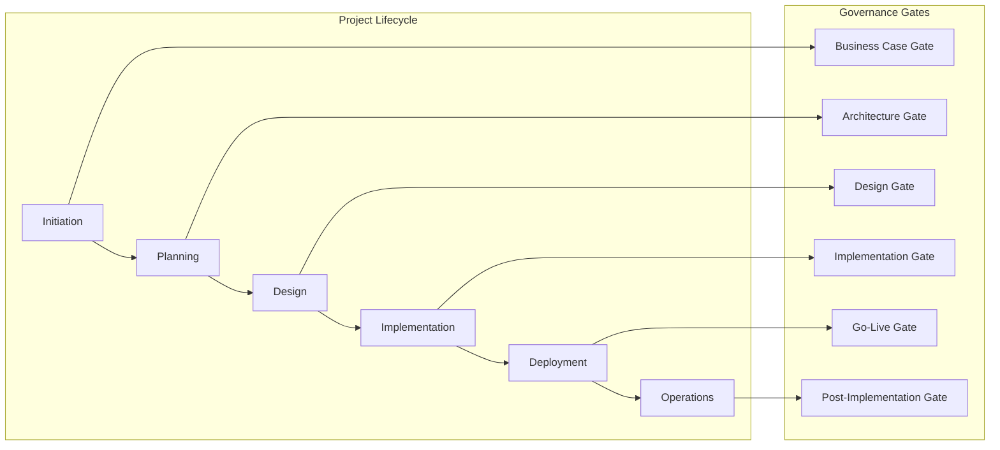

**Governance Gate Criteria:**

**Business Case Gate:**
- Business justification
- Strategic alignment
- Resource availability
- Risk assessment

**Architecture Gate:**
- Architecture principles compliance
- Standards adherence
- Integration requirements
- Technology stack approval

**Design Gate:**
- Technical design quality
- Security requirements
- Performance specifications
- Operational readiness

### Technology Governance

#### Technology Standards Framework

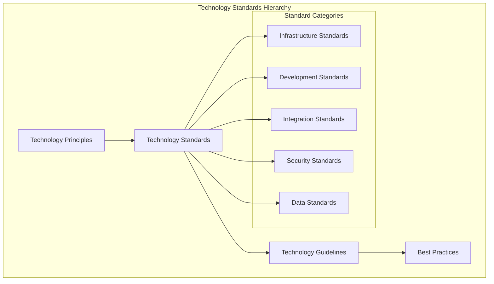

**Technology Standards Example:**

| Category | Standard | Rationale | Exceptions |
|----------|----------|-----------|------------|
| **Programming Languages** | Java, Python, JavaScript | Team expertise, enterprise support | Research projects |
| **Databases** | PostgreSQL, MongoDB | Performance, licensing | Legacy system integration |
| **Cloud Platforms** | AWS, Azure | Multi-cloud strategy | Geographic requirements |
| **Container Platform** | Kubernetes | Standardization, scalability | Simple deployments |
| **API Standards** | REST, GraphQL | Interoperability | Real-time requirements |

#### Technology Evaluation Process

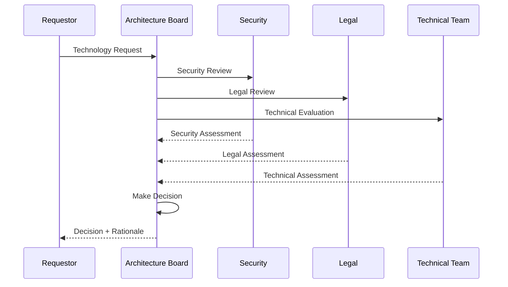

### Data Governance

#### Data Governance Framework

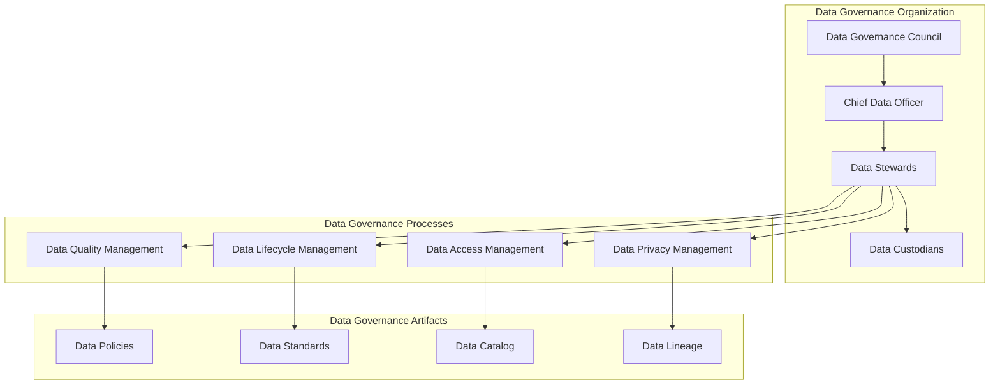

**Data Governance Roles:**

**Chief Data Officer (CDO):**
- Strategic data leadership
- Data governance strategy
- Cross-functional coordination
- Data value realization

**Data Stewards:**
- Domain expertise
- Data quality oversight
- Business rules definition
- User community liaison

**Data Custodians:**
- Technical implementation
- Data maintenance
- Access controls
- System administration

## Governance Processes

### Architecture Review Boards

#### ARB Structure and Charter

**Architecture Review Board Composition:**
- Chief Architect (Chair)
- Domain Architects
- Senior Developers
- Security Representatives
- Operations Representatives
- Business Representatives

**ARB Charter:**
- Review architectural decisions
- Ensure standards compliance
- Manage architectural risks
- Approve technology selections
- Oversee architecture evolution

#### Review Process

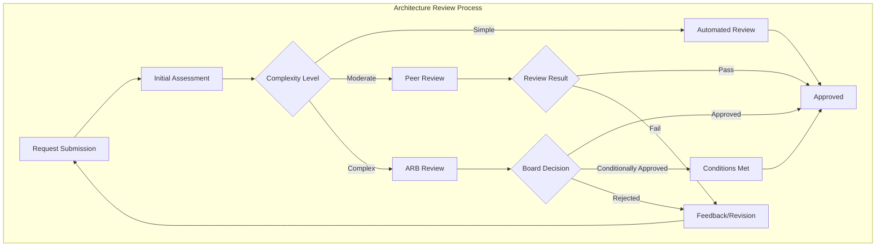

**Review Criteria:**
- Architecture principles compliance
- Standards adherence
- Risk assessment
- Cost-benefit analysis
- Strategic alignment
- Technical feasibility

### Technology Standards & Policies

#### Standards Development Process

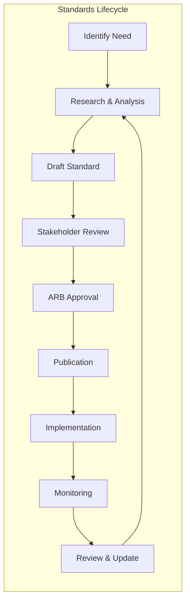

**Standard Categories:**

**Mandatory Standards:**
- Security requirements
- Regulatory compliance
- Corporate policies
- Risk management

**Recommended Standards:**
- Best practices
- Preferred technologies
- Design patterns
- Performance guidelines

**Optional Guidelines:**
- Emerging technologies
- Experimental approaches
- Domain-specific patterns
- Innovation frameworks

#### Policy Management

**Policy Hierarchy:**
```
Enterprise Policies
├── IT Policies
│   ├── Architecture Policies
│   ├── Security Policies
│   ├── Data Policies
│   └── Infrastructure Policies
├── Development Policies
│   ├── Coding Standards
│   ├── Testing Standards
│   └── Documentation Standards
└── Operations Policies
    ├── Deployment Standards
    ├── Monitoring Standards
    └── Incident Management
```

**Policy Template:**
```markdown
# Policy Title: [Descriptive Name]

## Purpose
Brief statement of why this policy exists

## Scope
Who and what this policy applies to

## Policy Statement
Clear, actionable policy requirements

## Roles and Responsibilities
Who is responsible for what

## Compliance
How compliance is measured and enforced

## Exceptions
Process for requesting exceptions

## Related Documents
Links to related policies, standards, procedures

## Approval and Review
Approval authority and review schedule
```

### Architecture Compliance

#### Compliance Monitoring

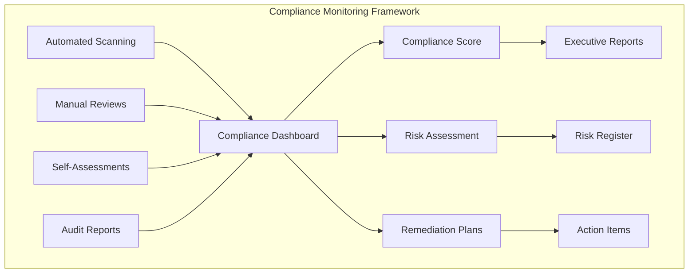

**Compliance Metrics:**

| Metric | Description | Target | Current |
|--------|-------------|---------|---------|
| **Standards Compliance** | % of projects following standards | 95% | 87% |
| **Security Compliance** | % of security controls implemented | 100% | 94% |
| **Documentation Coverage** | % of systems with current architecture docs | 90% | 73% |
| **Review Completion** | % of projects completing architecture reviews | 100% | 82% |
| **Exception Rate** | % of projects with approved exceptions | <10% | 15% |

#### Compliance Tools

**Static Analysis Tools:**
- Code quality scanners (SonarQube)
- Security scanners (Checkmarx, Veracode)
- Architecture conformance tools
- Infrastructure as Code validators

**Dynamic Analysis Tools:**
- Runtime monitoring
- Performance testing
- Security testing
- Integration testing

**Documentation Tools:**
- Architecture repositories
- Model-driven documentation
- Automated diagram generation
- Compliance reporting tools

### Exception Management

#### Exception Process

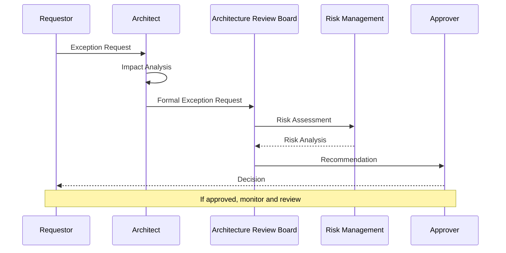

**Exception Types:**

**Technical Exceptions:**
- Non-standard technology usage
- Architecture pattern deviations
- Performance requirement variations
- Integration approach differences

**Business Exceptions:**
- Time-to-market pressures
- Budget constraints
- Regulatory requirements
- Strategic initiatives

**Temporary Exceptions:**
- Pilot projects
- Proof of concepts
- Migration phases
- Emergency fixes

#### Exception Management Framework

**Exception Request Template:**
```markdown
# Exception Request

## Project Information
- Project Name:
- Project Manager:
- Solution Architect:
- Expected Duration:

## Exception Details
- Standard/Policy Being Exceeded:
- Justification:
- Business Impact:
- Technical Impact:

## Risk Assessment
- Identified Risks:
- Mitigation Strategies:
- Monitoring Plan:

## Alternative Analysis
- Alternatives Considered:
- Why Standard Approach Won't Work:

## Approval
- Risk Owner Approval:
- Architecture Board Approval:
- Business Sponsor Approval:
```

## Governance Tools & Metrics

### Architecture Dashboards

#### Executive Dashboard

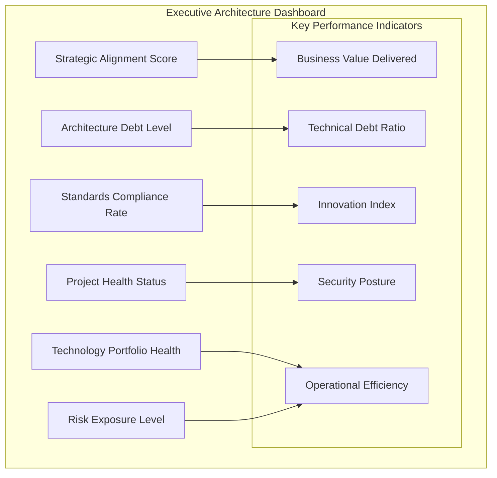

**Dashboard Components:**

**Strategic View:**
- Architecture maturity assessment
- Business-IT alignment score
- Digital transformation progress
- Investment efficiency metrics

**Operational View:**
- Project portfolio status
- Standards compliance tracking
- Risk and issue management
- Resource utilization metrics

**Technical View:**
- Technology inventory health
- Architecture debt tracking
- Performance metrics
- Security compliance status

#### Compliance Monitoring Dashboard

| Domain | Standard | Status | Compliance % | Trend | Action Required |
|---------|----------|---------|--------------|-------|----------------|
| **Security** | OWASP Top 10 | 🟡 Partial | 85% | ⬆️ | Medium priority remediation |
| **Performance** | Response Time SLA | 🟢 Compliant | 98% | ➡️ | Continue monitoring |
| **Integration** | API Standards | 🔴 Non-compliant | 65% | ⬇️ | Immediate attention required |
| **Data** | Privacy Controls | 🟢 Compliant | 95% | ⬆️ | Maintain current level |
| **Infrastructure** | Cloud Standards | 🟡 Partial | 78% | ⬆️ | Migration planning needed |

### Technology Portfolio Management

#### Portfolio Analysis Framework

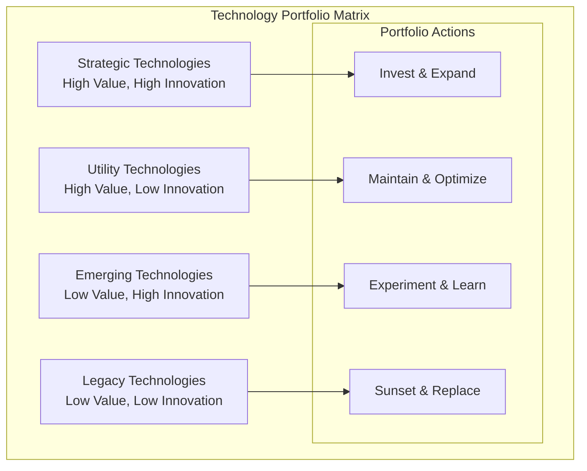

**Technology Lifecycle Management:**

| Stage | Characteristics | Governance Approach | Investment Level |
|-------|----------------|-------------------|------------------|
| **Emerging** | Experimental, high risk | Light governance, innovation focus | Low, experimental |
| **Strategic** | Proven value, competitive advantage | Active governance, standards development | High, strategic |
| **Utility** | Stable, commoditized | Standard governance, efficiency focus | Maintenance level |
| **Legacy** | End-of-life, technical debt | Strict governance, migration planning | Minimal, sunset only |

#### Portfolio Metrics

**Technology Health Metrics:**
- Age of technology components
- Vendor support status
- Security vulnerability exposure
- Performance degradation trends
- Maintenance cost evolution

**Innovation Metrics:**
- New technology adoption rate
- Time to market for new capabilities
- Experiment success rate
- Innovation investment ratio
- Technology standardization level

### Architecture Maturity Assessment

#### Maturity Model

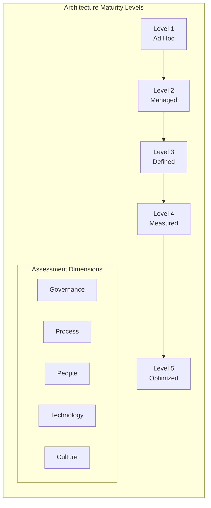

**Maturity Assessment Criteria:**

**Level 1 - Ad Hoc:**
- No formal architecture process
- Technology decisions made in isolation
- Reactive approach to problems
- Limited architecture documentation

**Level 2 - Managed:**
- Basic architecture process established
- Some architecture documentation
- Project-level architecture reviews
- Informal governance structures

**Level 3 - Defined:**
- Formal architecture process
- Architecture governance established
- Standards and guidelines documented
- Architecture training programs

**Level 4 - Measured:**
- Architecture metrics and KPIs
- Performance measurement systems
- Continuous process improvement
- Quantitative decision making

**Level 5 - Optimized:**
- Continuous innovation focus
- Adaptive architecture practices
- Predictive capabilities
- Industry leadership position

#### Assessment Process

**Assessment Methods:**
- Self-assessment questionnaires
- Stakeholder interviews
- Architecture artifact reviews
- Process observation
- Benchmarking against industry standards

**Assessment Areas:**
- Governance structures and processes
- Architecture documentation and communication
- Technology standards and compliance
- Skills and competency development
- Innovation and continuous improvement

## Implementation Guidelines

### Establishing Governance

#### Phase 1: Foundation (Months 1-3)

**Governance Structure:**
- Form Architecture Review Board
- Define roles and responsibilities
- Establish decision-making processes
- Create governance charter

**Initial Standards:**
- Define core architecture principles
- Establish technology standards
- Create decision-making frameworks
- Develop exception processes

#### Phase 2: Process Development (Months 4-6)

**Process Design:**
- Architecture review processes
- Standards development lifecycle
- Compliance monitoring procedures
- Exception management workflows

**Tool Implementation:**
- Governance dashboards
- Compliance monitoring tools
- Architecture repositories
- Communication platforms

#### Phase 3: Rollout and Training (Months 7-9)

**Change Management:**
- Stakeholder communication
- Training program development
- Pilot project implementation
- Feedback collection and refinement

**Process Refinement:**
- Process optimization based on feedback
- Tool configuration and customization
- Metrics collection and analysis
- Continuous improvement planning

#### Phase 4: Optimization (Months 10+)

**Maturity Development:**
- Advanced governance capabilities
- Predictive analytics implementation
- Automation of routine processes
- Innovation framework development

### Governance Anti-Patterns

#### ❌ **Architecture Ivory Tower**
- **Problem**: Governance body disconnected from reality
- **Solution**: Include practitioners in governance processes
- **Example**: ARB with no hands-on experience

#### ❌ **Standards for Standards' Sake**
- **Problem**: Creating standards without business justification
- **Solution**: Standards must solve real problems
- **Example**: Mandating specific frameworks without clear benefit

#### ❌ **Governance Bureaucracy**
- **Problem**: Processes that slow down development
- **Solution**: Streamline processes, automate where possible
- **Example**: Weeks-long approval processes for simple decisions

#### ❌ **Exception Rule**
- **Problem**: Too many exceptions undermine standards
- **Solution**: Regular review and update of standards
- **Example**: 50% of projects having exceptions

#### ❌ **No Metrics or Feedback**
- **Problem**: Governance effectiveness unknown
- **Solution**: Measure governance outcomes and iterate
- **Example**: No tracking of compliance or business value

### Success Factors

#### Organizational Factors

**Executive Support:**
- Clear mandate from leadership
- Adequate resource allocation
- Regular executive review
- Cultural alignment

**Stakeholder Engagement:**
- Cross-functional representation
- Regular communication
- Feedback incorporation
- Benefit demonstration

#### Process Factors

**Lightweight Processes:**
- Right-sized for organization
- Minimal bureaucracy
- Automated where possible
- Regular process review

**Clear Accountability:**
- Defined roles and responsibilities
- Decision-making authority
- Escalation procedures
- Performance metrics

## Tools and Resources

### Governance Tools

**Enterprise Architecture Tools:**
- TOGAF-compliant platforms
- Architecture modeling tools
- Repository management systems
- Impact analysis tools

**Compliance Tools:**
- Static code analysis
- Security scanning platforms
- Configuration management tools
- Audit trail systems

**Dashboard and Reporting:**
- Business intelligence platforms
- Custom dashboard development
- Automated reporting tools
- Executive briefing systems

### Industry Frameworks

**TOGAF (The Open Group Architecture Framework):**
- Architecture governance framework
- Architecture Development Method (ADM)
- Content framework and metamodel
- Certification programs

**COBIT (Control Objectives for Information Technology):**
- IT governance and management
- Process capability assessment
- Risk and compliance management
- Audit and assurance

**ITIL (Information Technology Infrastructure Library):**
- Service management best practices
- Process improvement framework
- Governance integration
- Operational excellence

## Related Topics

- [Solution Architecture Fundamentals](solution-architecture-fundamentals.md) - Foundation principles and patterns
- [Business Architecture](business-architecture.md) - Business-driven governance
- [Technical Architecture](technical-architecture.md) - Technical standards and patterns
- [Architecture Decision Records](architecture-decision-records.md) - Decision documentation
- [Career Guide](../career.md) - Governance leadership roles

---

*Effective architecture governance is about enabling innovation while managing risk. It should provide clear guidance and guardrails without becoming bureaucratic overhead. The best governance frameworks are those that teams want to follow because they see the value.*