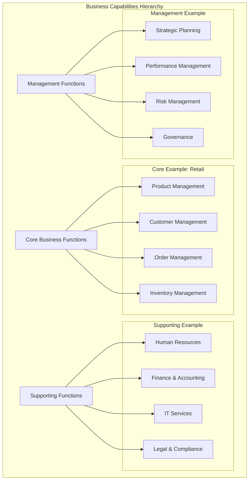
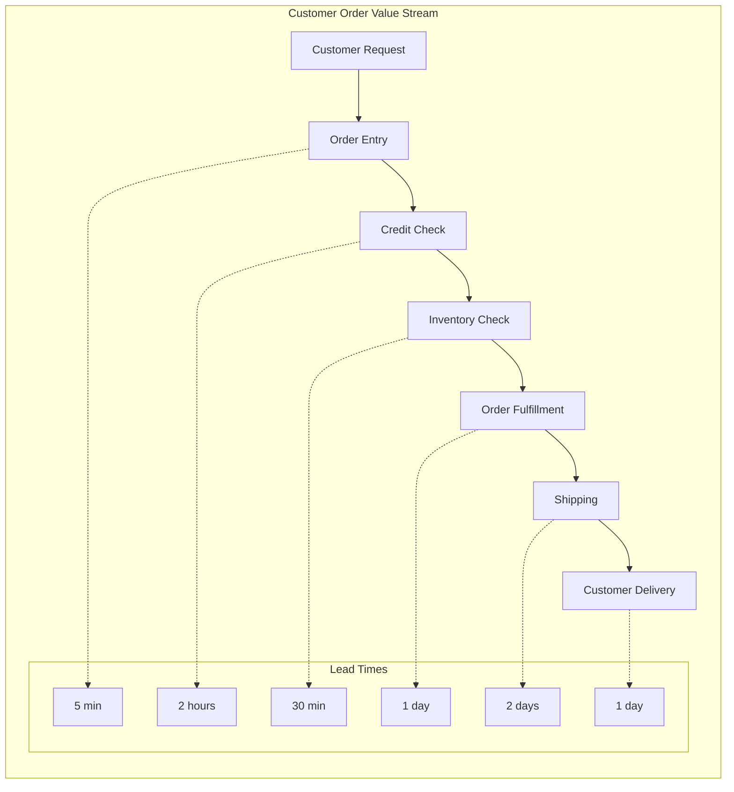
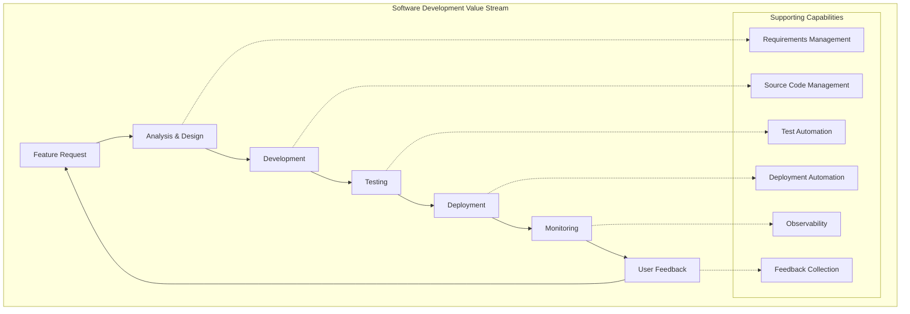
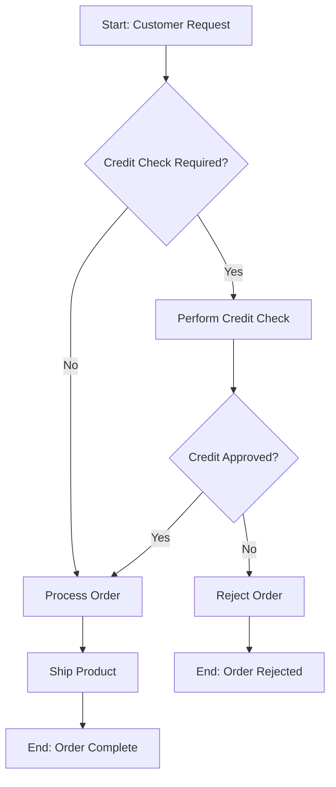
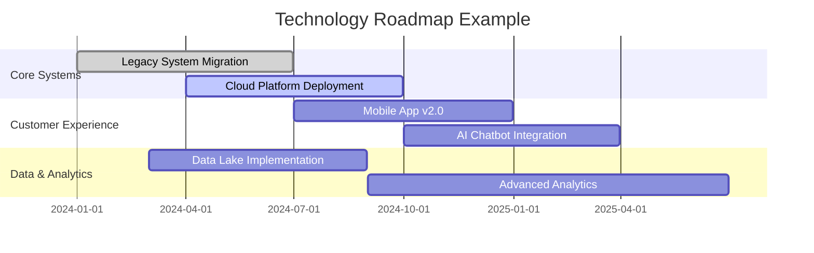
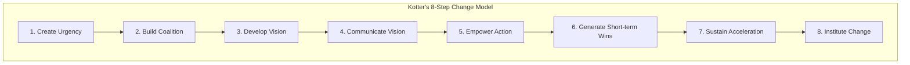
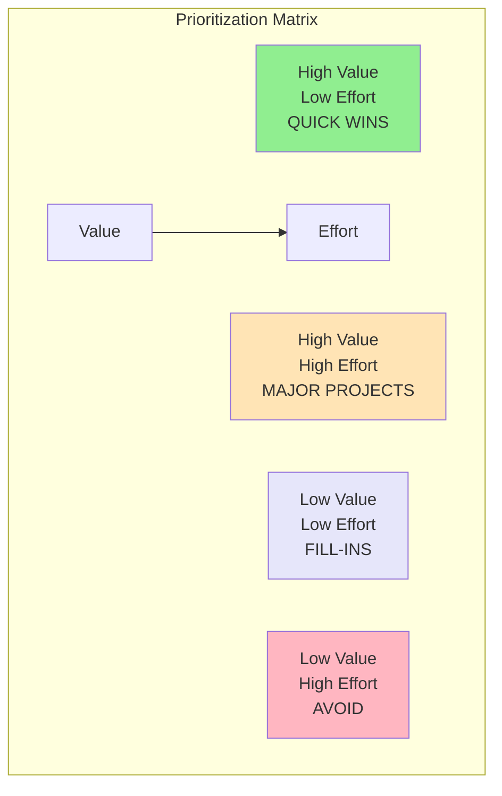
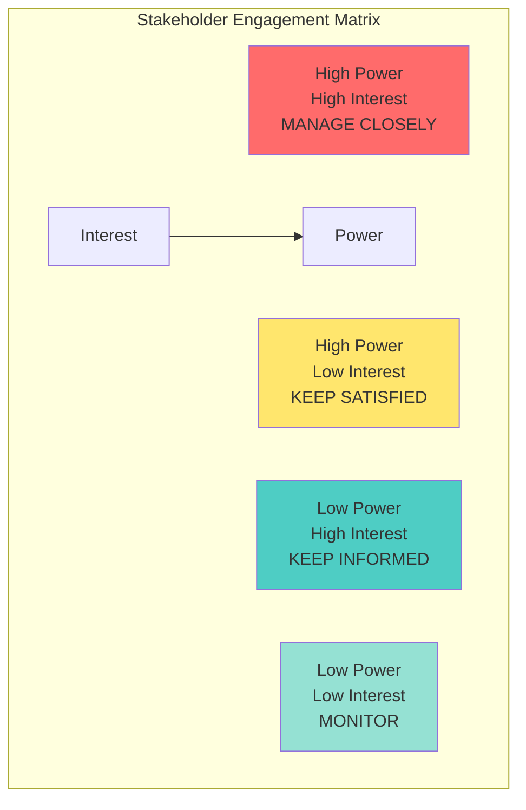
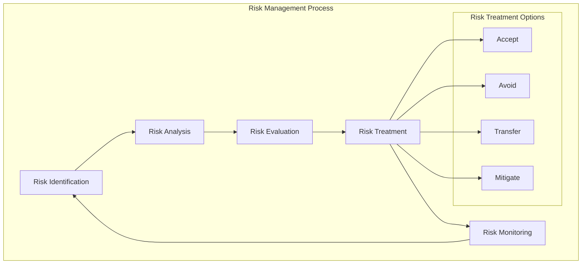

# Business Architecture

> **📚 Part of the [Awesome AI Architect](../README.md) knowledge base** - Bridge business strategy and technology implementation through systematic business architecture practices


## TL;DR

**Business Architecture provides a structured view of an organization's business capabilities, processes, and information flows.** It serves as the foundation for aligning technology investments with business strategy. Think of it as the blueprint that translates "what the business needs to do" into "how technology can enable it."

**Key takeaway:** Business architecture is about understanding the business before building the technology—it's the critical link between strategy and execution.

## Overview

Business Architecture focuses on the business dimension of architecture, providing a structured representation of the business in terms of its capabilities, processes, organization, and information. It serves as a bridge between business strategy and enterprise architecture, ensuring that technology initiatives are aligned with business objectives.

## Business Capability Modeling

### What Are Business Capabilities?

Business capabilities represent **what a business does** rather than **how it does it**. They are stable over time and form the foundation for business architecture.



### Capability Mapping Process

#### 1. **Capability Identification**

**Top-Down Approach:**
- Start with business strategy
- Identify high-level capabilities
- Decompose into sub-capabilities
- Stop at actionable level (usually 3-4 levels)

**Bottom-Up Approach:**
- Start with current processes
- Group related activities
- Abstract to capabilities
- Validate against strategy

**Example Capability Decomposition:**
```
Customer Management
├── Customer Acquisition
│   ├── Lead Generation
│   ├── Lead Qualification
│   └── Customer Onboarding
├── Customer Service
│   ├── Issue Resolution
│   ├── Account Management
│   └── Customer Support
└── Customer Retention
    ├── Loyalty Programs
    ├── Customer Analytics
    └── Churn Prevention
```

#### 2. **Capability Assessment**

**Maturity Levels:**
- **Level 1 - Initial**: Ad hoc, reactive, inconsistent
- **Level 2 - Managed**: Some processes defined, locally managed
- **Level 3 - Defined**: Standard processes, organization-wide
- **Level 4 - Quantitatively Managed**: Measured and controlled
- **Level 5 - Optimizing**: Continuous improvement focus

**Assessment Dimensions:**
- **People**: Skills, roles, organization
- **Process**: Standardization, efficiency, effectiveness
- **Technology**: Tools, systems, integration
- **Information**: Quality, availability, governance

### Capability Heat Maps

Heat maps provide a visual representation of capability performance across multiple dimensions:

| Capability | Current Maturity | Strategic Importance | Investment Priority | Gap Analysis |
|------------|------------------|----------------------|-------------------|--------------|
| Customer Onboarding | 🔴 Level 2 | 🟢 High | 🟠 Medium | Large Gap |
| Order Processing | 🟡 Level 3 | 🟢 High | 🟢 High | Medium Gap |
| Inventory Management | 🟢 Level 4 | 🟡 Medium | 🟡 Medium | Small Gap |
| Financial Reporting | 🟢 Level 4 | 🟡 Medium | 🔴 Low | No Gap |

**Color Coding:**
- 🔴 Red: Needs immediate attention
- 🟠 Orange: Requires improvement
- 🟡 Yellow: Acceptable but monitor
- 🟢 Green: Performing well

## Value Stream Mapping

### Understanding Value Streams

A value stream represents the sequence of activities required to design, produce, and deliver a specific product or service to a customer.



### Value Stream Analysis

**Key Metrics:**
- **Lead Time**: Total time from request to delivery
- **Process Time**: Actual value-add time
- **Wait Time**: Time spent waiting between activities
- **Touch Time**: Time spent actively working on the request
- **Process Efficiency**: Process Time / Lead Time

**Common Issues Identified:**
- Handoff delays
- Approval bottlenecks
- Information gaps
- System integration issues
- Resource constraints

### Digital Value Streams

In digital organizations, value streams often include technology components:



## Business Process Modeling

### Process vs. Capability

| Aspect | Process | Capability |
|--------|---------|------------|
| **Focus** | How work gets done | What the business does |
| **Stability** | Changes frequently | Relatively stable |
| **View** | Operational | Strategic |
| **Level** | Detailed activities | Outcome-oriented |
| **Example** | "Submit expense report" | "Expense management" |

### Process Modeling Techniques

#### BPMN (Business Process Model and Notation)



**BPMN Elements:**
- **Events**: Start, intermediate, end points
- **Activities**: Tasks, sub-processes
- **Gateways**: Decision points, parallel flows
- **Flows**: Sequence flows, message flows
- **Artifacts**: Data objects, annotations

#### Service-Oriented Business Architecture (SOBA)

SOBA aligns business services with IT services:

**Business Service Characteristics:**
- Well-defined business outcome
- Clear ownership
- Measurable value
- Technology-independent
- Reusable across processes

**Example Business Services:**
- Customer Validation
- Payment Processing
- Inventory Allocation
- Shipment Tracking
- Invoice Generation

## Strategic Planning

### Technology Roadmaps

Technology roadmaps align technology evolution with business strategy:



**Roadmap Components:**
- **Time Horizon**: Usually 12-36 months
- **Business Drivers**: Strategic initiatives, market changes
- **Technology Themes**: Major technology focus areas
- **Dependencies**: Prerequisites and sequencing
- **Milestones**: Key delivery points
- **Resources**: Budget and team requirements

### Digital Transformation Strategies

#### Transformation Patterns

**Big Bang Approach:**
- Replace entire systems
- High risk, high reward
- Suitable for simple systems
- Requires significant resources

**Strangler Fig Pattern:**
- Gradually replace system components
- Lower risk, incremental value
- Maintains business continuity
- Longer overall timeline

**API-First Modernization:**
- Expose legacy systems via APIs
- Enable new channels and integration
- Preserve existing investments
- Foundation for future modernization

#### Change Management Strategy



**Change Management Activities:**
- Stakeholder analysis and engagement
- Communication planning
- Training and skill development
- Resistance management
- Success measurement

### Business-IT Alignment

#### Alignment Models

**Henderson-Venkatraman Model:**

| Business | IT |
|----------|-----|
| **Strategy** | **Strategy** |
| Business scope, competencies | Technology scope, capabilities |
| **Infrastructure** | **Infrastructure** |
| Organization, processes | Architecture, processes |

**Alignment Perspectives:**
1. **Strategy Execution**: IT implements business strategy
2. **Technology Transformation**: IT enables new business strategies
3. **Competitive Potential**: Business leverages IT for advantage
4. **Service Level**: IT provides efficient business services

#### Alignment Metrics

**Strategic Alignment:**
- Business-IT planning integration
- Shared understanding of objectives
- Communication effectiveness
- Partnership quality

**Operational Alignment:**
- Service level achievement
- Project success rates
- User satisfaction
- Cost effectiveness

## Investment Prioritization

### Portfolio Management

#### Investment Categories

**Strategic Investments:**
- New business capabilities
- Competitive differentiation
- Long-term positioning
- High risk, high reward

**Operational Investments:**
- Process improvement
- Cost reduction
- Risk mitigation
- Moderate risk, moderate reward

**Maintenance Investments:**
- System updates
- Compliance requirements
- Technical debt reduction
- Low risk, low reward

#### Prioritization Frameworks

**Business Value vs. Implementation Effort:**



**Weighted Scoring Model:**

| Initiative | Business Value (40%) | Risk (20%) | Effort (25%) | Strategic Fit (15%) | Total Score |
|------------|----------------------|------------|--------------|-------------------|-------------|
| CRM Upgrade | 8 × 0.4 = 3.2 | 6 × 0.2 = 1.2 | 4 × 0.25 = 1.0 | 9 × 0.15 = 1.35 | 6.75 |
| Mobile App | 9 × 0.4 = 3.6 | 5 × 0.2 = 1.0 | 7 × 0.25 = 1.75 | 8 × 0.15 = 1.2 | 7.55 |
| Data Analytics | 7 × 0.4 = 2.8 | 4 × 0.2 = 0.8 | 6 × 0.25 = 1.5 | 9 × 0.15 = 1.35 | 6.45 |

## Stakeholder Management

### Stakeholder Analysis

#### Stakeholder Categories

**Primary Stakeholders:**
- Business owners/sponsors
- End users
- Project team members
- Executive leadership

**Secondary Stakeholders:**
- IT support teams
- Compliance/legal
- Vendors/partners
- External customers

**Key Stakeholders:**
- Those with decision authority
- Those who control resources
- Those impacted by changes
- Those who can influence success

#### Engagement Strategy

**Power-Interest Grid:**



**Engagement Activities:**
- **Manage Closely**: Regular meetings, detailed updates, collaborative decision-making
- **Keep Satisfied**: Executive summaries, milestone updates, escalation path
- **Keep Informed**: Regular communications, project status, impact assessment
- **Monitor**: Basic updates, available for consultation

### Communication Planning

#### Communication Matrix

| Stakeholder Group | Information Needs | Frequency | Method | Responsible |
|-------------------|-------------------|-----------|---------|-------------|
| Executive Sponsors | Progress, risks, decisions | Monthly | Executive dashboard | Project Manager |
| Business Users | Features, training, timeline | Bi-weekly | Newsletters, demos | Business Analyst |
| IT Teams | Technical specs, dependencies | Weekly | Technical reviews | Solution Architect |
| Vendors | Requirements, contracts | As needed | Formal meetings | Procurement |

#### Message Tailoring

**Executive Level:**
- Focus on business value and ROI
- Highlight risks and mitigation
- Provide summary-level information
- Emphasize strategic alignment

**Management Level:**
- Focus on operational impact
- Highlight resource requirements
- Provide detailed timelines
- Emphasize process changes

**Operational Level:**
- Focus on day-to-day impact
- Highlight training needs
- Provide detailed functionality
- Emphasize user benefits

## Risk Assessment

### Business Architecture Risks

#### Strategic Risks

**Misalignment Risk:**
- Business and IT strategies diverge
- Mitigation: Regular alignment reviews, shared governance

**Capability Gap Risk:**
- Missing critical business capabilities
- Mitigation: Comprehensive capability assessment, investment planning

**Change Resistance Risk:**
- Stakeholders resist business changes
- Mitigation: Change management, communication, training

#### Operational Risks

**Process Risk:**
- Business processes not optimized
- Mitigation: Process modeling, continuous improvement

**Information Risk:**
- Poor data quality or availability
- Mitigation: Data governance, quality management

**Technology Risk:**
- Technology doesn't support business needs
- Mitigation: Architecture governance, technology evaluation

### Risk Management Framework



**Risk Assessment Criteria:**
- **Probability**: How likely is the risk to occur?
- **Impact**: What is the potential business impact?
- **Urgency**: How soon must we address this risk?
- **Detectability**: How easily can we identify the risk occurring?

## Implementation Guidelines

### Business Architecture Maturity

#### Maturity Levels

**Level 1 - Ad Hoc:**
- No formal business architecture
- Technology-driven decisions
- Reactive approach
- Limited stakeholder engagement

**Level 2 - Developing:**
- Basic capability modeling
- Some business-IT alignment
- Project-level architecture
- Informal governance

**Level 3 - Defined:**
- Comprehensive capability model
- Formal architecture processes
- Enterprise-level view
- Established governance

**Level 4 - Managed:**
- Metrics-driven approach
- Continuous improvement
- Mature stakeholder engagement
- Value realization focus

**Level 5 - Optimizing:**
- Innovation-focused
- Predictive capabilities
- Ecosystem integration
- Adaptive architecture

### Getting Started

#### Phase 1: Foundation (Months 1-3)
- Establish business architecture team
- Define governance framework
- Create initial capability model
- Identify key stakeholders

#### Phase 2: Assessment (Months 4-6)
- Conduct capability assessment
- Map current value streams
- Analyze business processes
- Identify improvement opportunities

#### Phase 3: Planning (Months 7-9)
- Develop target state vision
- Create transformation roadmap
- Prioritize investments
- Plan change management

#### Phase 4: Implementation (Months 10+)
- Execute transformation initiatives
- Monitor progress and value
- Continuously refine architecture
- Expand maturity

## Tools and Resources

### Business Architecture Tools

**Enterprise Tools:**
- BiZZdesign Enterprise Studio
- Software AG ARIS
- Sparx Systems Enterprise Architect
- IBM Rational System Architect

**Collaboration Tools:**
- Lucidchart
- Draw.io (now diagrams.net)
- Microsoft Visio
- Miro/Mural

**Specialized Tools:**
- Business Process Management (BPM) suites
- Enterprise Portfolio Management tools
- Strategy execution platforms
- Value stream mapping tools

### Frameworks and Standards

**TOGAF (The Open Group Architecture Framework):**
- Business Architecture domain
- ADM (Architecture Development Method)
- Content framework and metamodel

**Zachman Framework:**
- Business perspective (row 2)
- Focus on business motivation and rules

**Business Architecture Guild:**
- BIZBOK (Business Architecture Body of Knowledge)
- Common standards and practices

## Related Topics

- [Solution Architecture Fundamentals](solution-architecture-fundamentals.md) - Core architecture principles
- [Architecture Governance](architecture-governance.md) - Governance frameworks and processes
- [Technical Architecture](technical-architecture.md) - Technical architecture patterns
- [Career Guide](../career.md) - Business architecture career paths
- [AI Architecture](../ai-architecture-topics/ai-architecture-patterns.md) - Business considerations for AI

---

*Business architecture is about understanding the business deeply before proposing technology solutions. It's the foundation that ensures your technical architecture actually serves business needs rather than just implementing technology for its own sake.*