# Technical Architecture

> **📚 Part of the [Awesome AI Architect](../README.md) knowledge base** - Design robust, scalable, and maintainable technical solutions using proven patterns and practices


## TL;DR

**Technical Architecture defines the structural design of technology systems, including components, their relationships, and the principles governing their design and evolution.** It bridges the gap between business requirements and implementation, focusing on non-functional requirements like scalability, reliability, and maintainability.

**Key takeaway:** Great technical architecture balances current needs with future flexibility, emphasizing simplicity and proven patterns over complexity and novelty.

## Overview

Technical Architecture encompasses the design and organization of technology systems at multiple levels—from individual applications to enterprise-wide technology ecosystems. It provides the blueprint for building systems that meet functional requirements while achieving quality attributes like performance, security, and scalability.

## System Design Patterns

### Scalability Patterns

#### Horizontal vs. Vertical Scaling

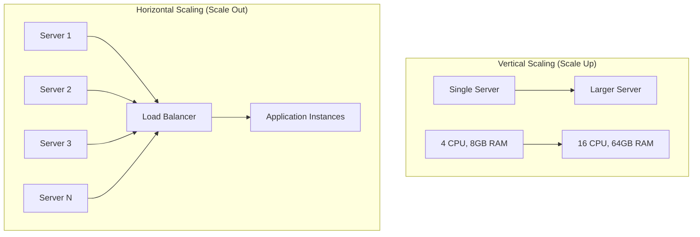

**Vertical Scaling:**
- **Pros**: Simple implementation, no application changes, strong consistency
- **Cons**: Hardware limits, single point of failure, expensive at scale
- **Use Cases**: Legacy applications, databases requiring consistency, small to medium scale

**Horizontal Scaling:**
- **Pros**: Nearly unlimited scalability, fault tolerance, cost-effective
- **Cons**: Application complexity, eventual consistency, coordination overhead
- **Use Cases**: Web applications, stateless services, microservices architectures

#### Load Balancing Patterns

**Round Robin:**
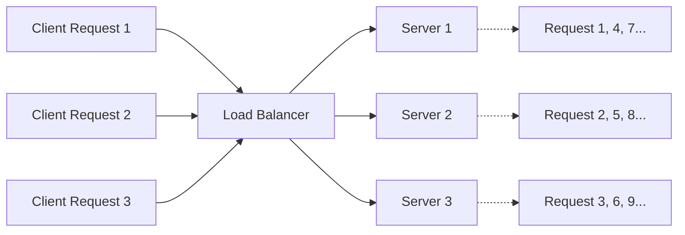

**Weighted Round Robin:**
- Distribute based on server capacity
- Higher-spec servers receive more requests
- Good for heterogeneous environments

**Least Connections:**
- Route to server with fewest active connections
- Better for long-running requests
- More complex to implement

**IP Hash/Session Affinity:**
- Route based on client IP or session
- Maintains stickiness for stateful applications
- Can create hot spots

#### Caching Strategies

**Cache-Aside (Lazy Loading):**
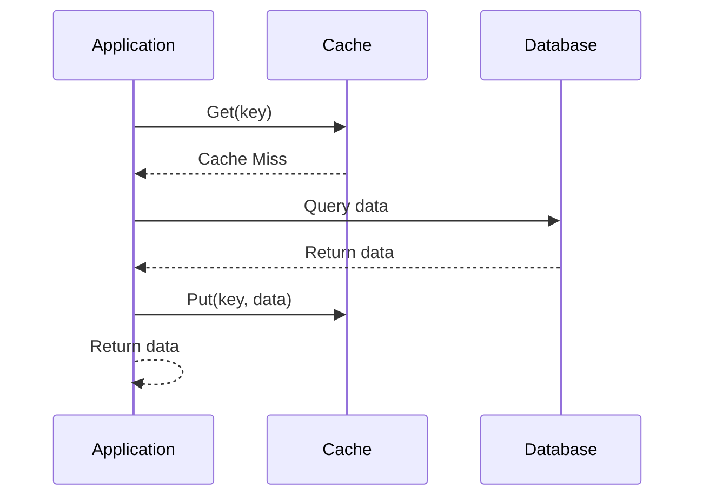

**Write-Through:**
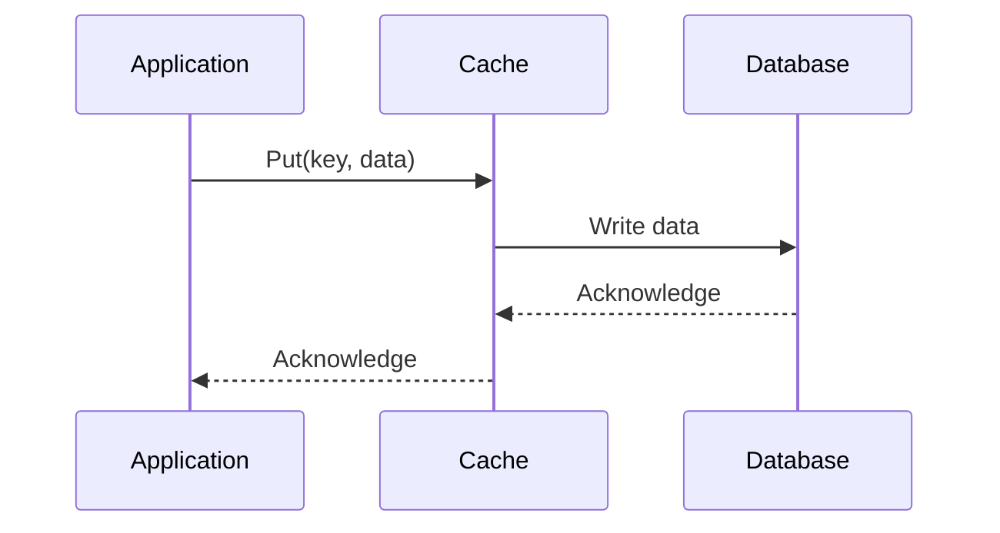

**Write-Behind (Write-Back):**
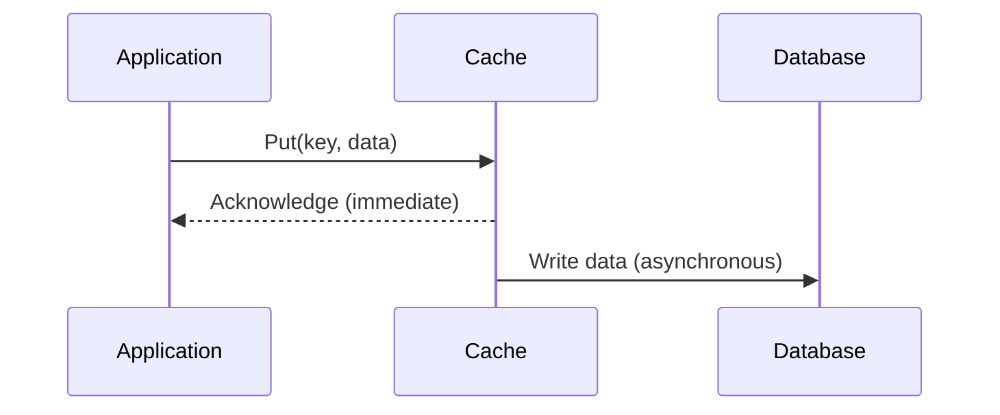

**Cache Patterns Comparison:**

| Pattern | Consistency | Performance | Complexity | Use Case |
|---------|-------------|-------------|------------|----------|
| Cache-Aside | Eventually consistent | Read optimization | Low | Read-heavy workloads |
| Write-Through | Strong consistency | Slower writes | Medium | Mixed workloads |
| Write-Behind | Eventually consistent | Fast writes | High | Write-heavy workloads |

### Resilience Patterns

#### Circuit Breaker Pattern

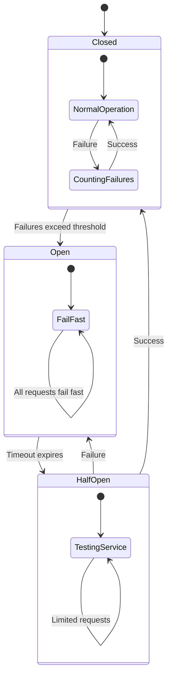

**Circuit Breaker States:**
- **Closed**: Normal operation, requests pass through
- **Open**: Service unavailable, requests fail fast
- **Half-Open**: Testing if service recovered, limited requests

**Implementation Example:**
```python
class CircuitBreaker:
    def __init__(self, failure_threshold=5, recovery_timeout=60):
        self.failure_threshold = failure_threshold
        self.recovery_timeout = recovery_timeout
        self.failure_count = 0
        self.last_failure_time = None
        self.state = 'CLOSED'
    
    def call(self, func, *args, **kwargs):
        if self.state == 'OPEN':
            if time.time() - self.last_failure_time > self.recovery_timeout:
                self.state = 'HALF_OPEN'
            else:
                raise CircuitBreakerOpenException()
        
        try:
            result = func(*args, **kwargs)
            self.on_success()
            return result
        except Exception as e:
            self.on_failure()
            raise
    
    def on_success(self):
        self.failure_count = 0
        self.state = 'CLOSED'
    
    def on_failure(self):
        self.failure_count += 1
        self.last_failure_time = time.time()
        
        if self.failure_count >= self.failure_threshold:
            self.state = 'OPEN'
```

#### Retry Patterns

**Simple Retry:**
```python
def retry_with_backoff(func, max_retries=3, base_delay=1):
    for attempt in range(max_retries + 1):
        try:
            return func()
        except Exception as e:
            if attempt == max_retries:
                raise
            delay = base_delay * (2 ** attempt)  # Exponential backoff
            time.sleep(delay)
```

**Retry Strategies:**
- **Fixed Interval**: Same delay between retries
- **Exponential Backoff**: Increasing delays (1s, 2s, 4s, 8s...)
- **Linear Backoff**: Linear increase (1s, 2s, 3s, 4s...)
- **Exponential Backoff with Jitter**: Add randomness to prevent thundering herd

#### Bulkhead Pattern

Isolate critical resources to prevent cascading failures:

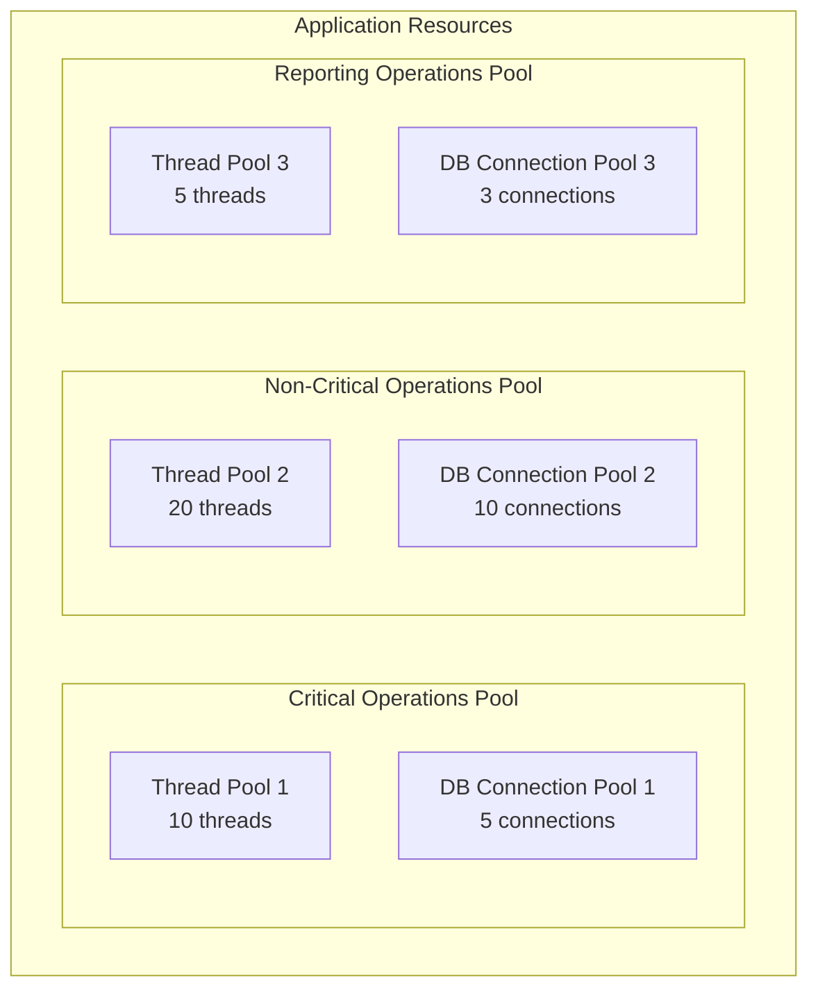

### Security Patterns

#### Defense in Depth

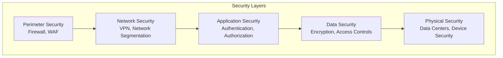

**Security Controls by Layer:**

**Perimeter Security:**
- Web Application Firewall (WAF)
- DDoS protection
- External network firewalls
- Intrusion detection systems

**Network Security:**
- Internal network segmentation
- Virtual Private Networks (VPN)
- Network access control
- Micro-segmentation

**Application Security:**
- Identity and access management
- OAuth/SAML authentication
- Role-based access control
- Input validation and sanitization

**Data Security:**
- Encryption at rest and in transit
- Data loss prevention (DLP)
- Database access controls
- Key management systems

#### Zero Trust Architecture

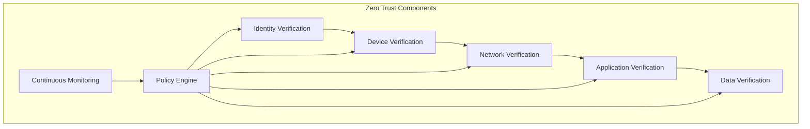

**Zero Trust Principles:**
1. **Verify Explicitly**: Always authenticate and authorize
2. **Use Least Privileged Access**: Minimize user access rights
3. **Assume Breach**: Verify end-to-end encryption

### Performance Patterns

#### Database Performance Patterns

**Database Sharding:**
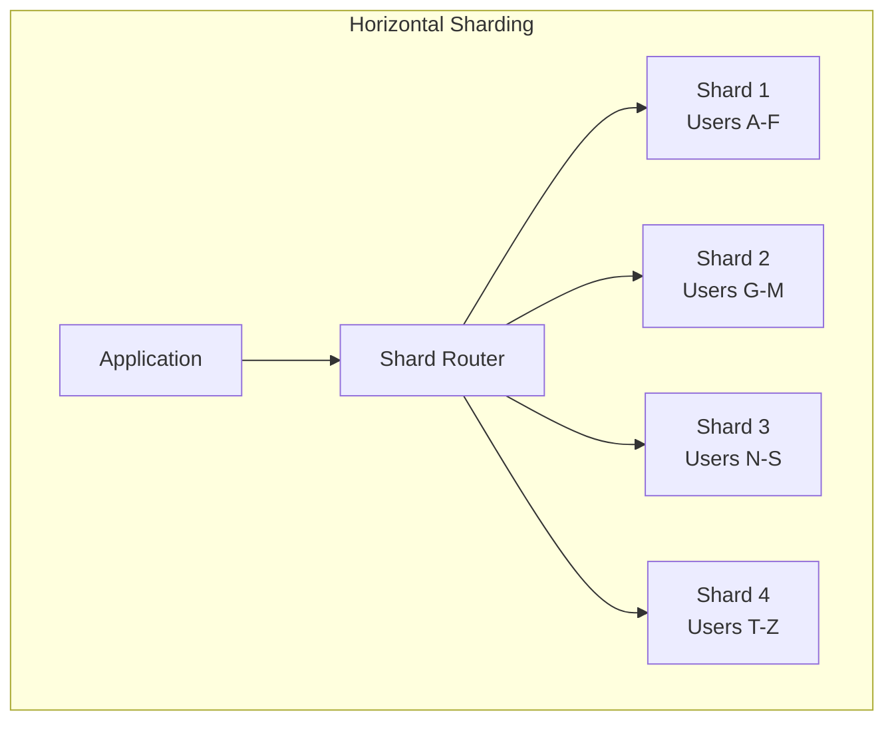

**Sharding Strategies:**
- **Range-based**: Partition by value ranges
- **Hash-based**: Partition by hash function
- **Directory-based**: Lookup service for partition mapping
- **Geographic**: Partition by location

**CQRS (Command Query Responsibility Segregation):**
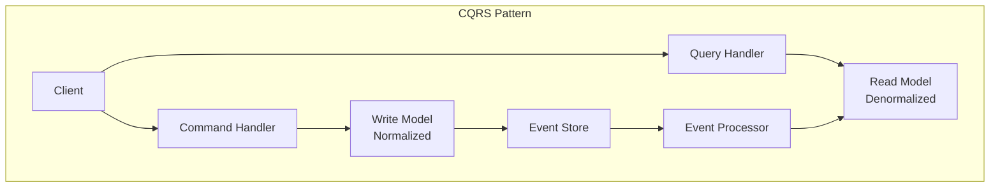

**Benefits:**
- Optimized read and write models
- Independent scaling
- Complex business logic isolation
- Better performance for read-heavy workloads

**Challenges:**
- Eventual consistency
- Additional complexity
- Data synchronization

## Integration Architecture

### API Management

#### API Gateway Pattern

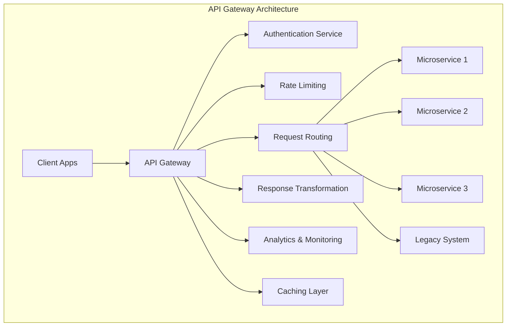

**API Gateway Functions:**
- **Security**: Authentication, authorization, threat protection
- **Traffic Management**: Rate limiting, throttling, load balancing
- **Mediation**: Protocol transformation, request/response modification
- **Monitoring**: Analytics, logging, health checks
- **Developer Experience**: Documentation, testing tools

#### API Design Patterns

**RESTful API Design:**

```http
# Resource-based URLs
GET    /api/v1/customers          # Get all customers
GET    /api/v1/customers/123      # Get specific customer
POST   /api/v1/customers          # Create new customer
PUT    /api/v1/customers/123      # Update customer
DELETE /api/v1/customers/123      # Delete customer

# Nested resources
GET    /api/v1/customers/123/orders       # Get customer's orders
POST   /api/v1/customers/123/orders       # Create order for customer
```

**GraphQL API Design:**
```graphql
type Query {
  customer(id: ID!): Customer
  customers(filter: CustomerFilter): [Customer]
}

type Mutation {
  createCustomer(input: CreateCustomerInput!): Customer
  updateCustomer(id: ID!, input: UpdateCustomerInput!): Customer
}

type Customer {
  id: ID!
  name: String!
  email: String!
  orders: [Order]
}
```

**API Versioning Strategies:**

| Strategy | Example | Pros | Cons |
|----------|---------|------|------|
| URL Versioning | `/api/v1/customers` | Clear, cacheable | URL proliferation |
| Header Versioning | `Accept: application/vnd.api+json;version=1` | Clean URLs | Not visible in URLs |
| Query Parameter | `/api/customers?version=1` | Simple | Can be ignored |
| Content Negotiation | `Accept: application/json;v=1` | Standards-based | Complex |

### Message Queues & Event Streaming

#### Message Queue Patterns

**Point-to-Point Messaging:**
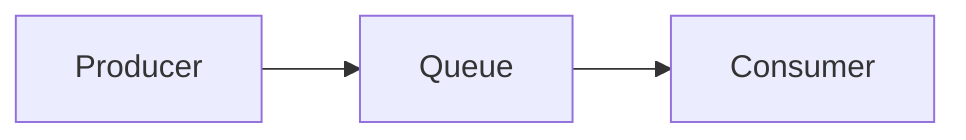

**Publish-Subscribe Messaging:**
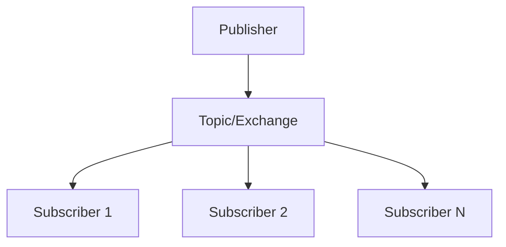

**Message Queue Technologies:**

| Technology | Pattern | Use Cases | Guarantees |
|-----------|---------|-----------|------------|
| **RabbitMQ** | AMQP, various patterns | Complex routing, reliable delivery | At-least-once, exactly-once |
| **Apache Kafka** | Publish-subscribe, log-based | High throughput, event streaming | At-least-once, exactly-once |
| **Amazon SQS** | Point-to-point | Simple queuing, AWS integration | At-least-once |
| **Redis Streams** | Log-based streams | Fast in-memory processing | At-least-once |

#### Event-Driven Architecture Patterns

**Event Sourcing:**
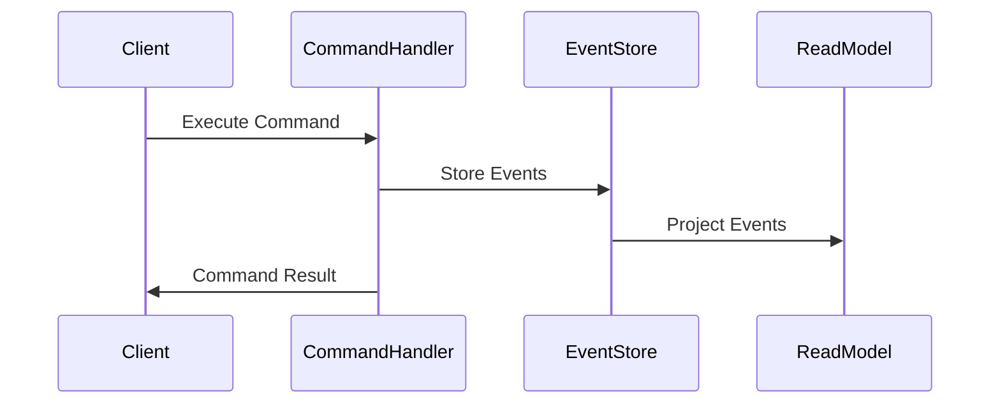

**Saga Pattern (Choreography):**
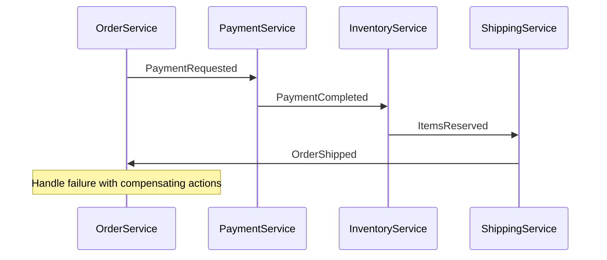

### Data Integration Patterns

#### Extract, Transform, Load (ETL)

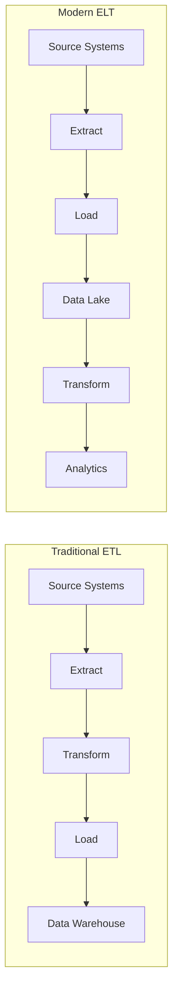

**ETL vs. ELT Comparison:**

| Aspect | ETL | ELT |
|--------|-----|-----|
| **Transformation** | Before loading | After loading |
| **Processing Power** | ETL server | Target system |
| **Data Types** | Structured data | Structured + unstructured |
| **Flexibility** | Fixed schemas | Schema on read |
| **Use Cases** | Traditional DW | Big data, cloud analytics |

#### Data Virtualization

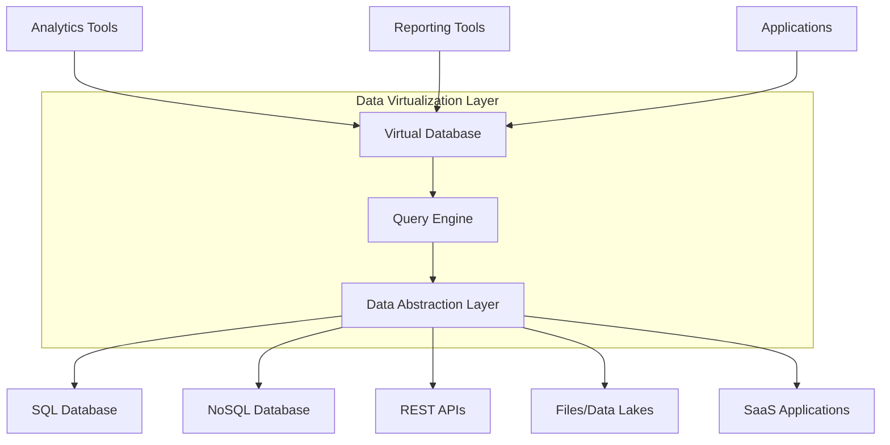

### Legacy System Integration

#### Strangler Fig Pattern

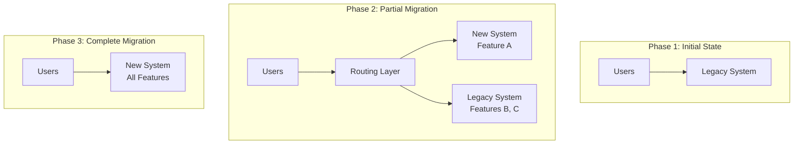

**Strangler Fig Benefits:**
- Gradual migration reduces risk
- Continuous value delivery
- Maintains business continuity
- Allows for learning and adjustment

#### Anti-Corruption Layer

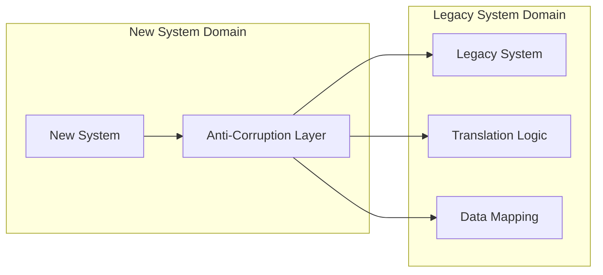

## Infrastructure Architecture

### Cloud Architecture Patterns

#### Multi-Tier Architecture

```mermaid
graph TB
    subgraph "Presentation Tier"
        A[Web Server]
        B[Load Balancer]
        C[CDN]
    end
    
    subgraph "Application Tier"
        D[Application Server 1]
        E[Application Server 2]
        F[Application Server N]
    end
    
    subgraph "Data Tier"
        G[Database Primary]
        H[Database Replica]
        I[Cache Layer]
    end
    
    subgraph "Infrastructure Tier"
        J[Monitoring]
        K[Logging]
        L[Security Services]
    end
    
    B --> D
    B --> E
    B --> F
    
    D --> G
    E --> G
    F --> G
    
    G --> H
    
    D --> I
    E --> I
    F --> I
```

#### Serverless Architecture

```mermaid
graph TB
    subgraph "Event Sources"
        A[HTTP Request]
        B[File Upload]
        C[Database Change]
        D[Scheduled Event]
    end
    
    subgraph "Serverless Functions"
        E[Function 1]
        F[Function 2]
        G[Function 3]
        H[Function 4]
    end
    
    subgraph "Managed Services"
        I[Database]
        J[Storage]
        K[Message Queue]
        L[Third-party APIs]
    end
    
    A --> E
    B --> F
    C --> G
    D --> H
    
    E --> I
    F --> J
    G --> K
    H --> L
```

**Serverless Benefits:**
- No server management
- Automatic scaling
- Pay-per-execution
- Built-in high availability

**Serverless Challenges:**
- Cold start latency
- Vendor lock-in
- Limited execution time
- Complex debugging

### Container & Orchestration

#### Container Architecture

```mermaid
graph TB
    subgraph "Container Host"
        subgraph "Application Container"
            A[App Code]
            B[Runtime]
            C[Libraries]
        end
        
        subgraph "Database Container"
            D[Database Engine]
            E[Data Volume]
        end
        
        subgraph "Reverse Proxy Container"
            F[Nginx/HAProxy]
        end
        
        G[Container Runtime<br/>Docker/containerd]
        H[Host OS]
        I[Physical/Virtual Infrastructure]
        
        A --> G
        D --> G
        F --> G
        G --> H
        H --> I
    end
```

#### Kubernetes Architecture

```mermaid
graph TB
    subgraph "Control Plane"
        A[API Server]
        B[etcd]
        C[Controller Manager]
        D[Scheduler]
    end
    
    subgraph "Worker Node 1"
        E[kubelet]
        F[kube-proxy]
        G[Container Runtime]
        H[Pod 1]
        I[Pod 2]
    end
    
    subgraph "Worker Node 2"
        J[kubelet]
        K[kube-proxy]
        L[Container Runtime]
        M[Pod 3]
        N[Pod 4]
    end
    
    A --> E
    A --> J
    D --> H
    D --> I
    D --> M
    D --> N
```

### Infrastructure as Code

#### Declarative vs. Imperative

**Declarative (Desired State):**
```yaml
# Terraform example
resource "aws_instance" "web" {
  ami           = "ami-0c55b159cbfafe1d0"
  instance_type = "t3.micro"
  
  tags = {
    Name = "WebServer"
  }
}
```

**Imperative (Steps to Execute):**
```bash
# Script example
aws ec2 run-instances \
  --image-id ami-0c55b159cbfafe1d0 \
  --instance-type t3.micro \
  --tag-specifications 'ResourceType=instance,Tags=[{Key=Name,Value=WebServer}]'
```

#### IaC Tools Comparison

| Tool | Type | Cloud Support | Learning Curve | Use Cases |
|------|------|---------------|----------------|-----------|
| **Terraform** | Declarative | Multi-cloud | Medium | Infrastructure provisioning |
| **CloudFormation** | Declarative | AWS only | Medium | AWS-native deployments |
| **Ansible** | Both | Multi-cloud | Low | Configuration management |
| **Pulumi** | Imperative | Multi-cloud | High | Programming language familiarity |

### Disaster Recovery

#### Recovery Patterns

**Backup and Restore:**
```mermaid
graph LR
    A[Primary Site] --> B[Regular Backups]
    B --> C[Storage]
    
    D[Disaster] --> E[Restore Process]
    E --> F[Secondary Site]
    C --> E
```
- **RTO**: Hours to days
- **RPO**: Hours
- **Cost**: Low
- **Use Case**: Non-critical systems

**Pilot Light:**
```mermaid
graph TB
    subgraph "Primary Site"
        A[Full Infrastructure]
        B[Applications]
        C[Database Primary]
    end
    
    subgraph "DR Site"
        D[Minimal Infrastructure]
        E[Database Replica]
    end
    
    C --> E
    
    F[Disaster] --> G[Scale Up DR Site]
    G --> H[Redirect Traffic]
```
- **RTO**: Minutes to hours
- **RPO**: Minutes
- **Cost**: Medium
- **Use Case**: Moderate criticality

**Warm Standby:**
```mermaid
graph TB
    subgraph "Primary Site"
        A[Full Infrastructure]
        B[Applications]
        C[Database Primary]
    end
    
    subgraph "DR Site"
        D[Scaled Infrastructure]
        E[Applications (Standby)]
        F[Database Replica]
    end
    
    C --> F
    
    G[Disaster] --> H[Activate DR Site]
    H --> I[Redirect Traffic]
```
- **RTO**: Minutes
- **RPO**: Minutes
- **Cost**: Medium-High
- **Use Case**: Business-critical systems

**Hot Standby (Active-Active):**
```mermaid
graph TB
    subgraph "Site A"
        A[Full Infrastructure]
        B[Applications]
        C[Database]
    end
    
    subgraph "Site B"
        D[Full Infrastructure]
        E[Applications]
        F[Database]
    end
    
    G[Load Balancer] --> A
    G --> D
    
    C <--> F
```
- **RTO**: Seconds
- **RPO**: Near zero
- **Cost**: High
- **Use Case**: Mission-critical systems

## Implementation Guidelines

### Architecture Decision Framework

#### Decision Criteria

**Functional Requirements:**
- Features and capabilities
- Performance requirements
- Integration needs
- User experience goals

**Non-Functional Requirements:**
- Scalability targets
- Availability requirements
- Security constraints
- Compliance needs

**Technical Constraints:**
- Existing technology stack
- Team skills and expertise
- Budget limitations
- Timeline constraints

**Business Constraints:**
- Strategic alignment
- Risk tolerance
- Vendor relationships
- Long-term vision

#### Technology Evaluation Matrix

| Technology | Functionality (25%) | Performance (20%) | Maturity (15%) | Cost (15%) | Team Fit (25%) | Total |
|------------|---------------------|-------------------|----------------|------------|---------------|-------|
| Option A | 8 × 0.25 = 2.0 | 7 × 0.20 = 1.4 | 9 × 0.15 = 1.35 | 6 × 0.15 = 0.9 | 8 × 0.25 = 2.0 | 7.65 |
| Option B | 9 × 0.25 = 2.25 | 6 × 0.20 = 1.2 | 7 × 0.15 = 1.05 | 8 × 0.15 = 1.2 | 7 × 0.25 = 1.75 | 7.45 |
| Option C | 7 × 0.25 = 1.75 | 9 × 0.20 = 1.8 | 8 × 0.15 = 1.2 | 5 × 0.15 = 0.75 | 9 × 0.25 = 2.25 | 7.75 |

### Common Anti-Patterns

#### ❌ **Premature Optimization**
- **Problem**: Optimizing before understanding actual bottlenecks
- **Solution**: Measure first, then optimize based on real data
- **Example**: Don't add caching without proving it's needed

#### ❌ **Golden Hammer**
- **Problem**: Using familiar technology for all problems
- **Solution**: Evaluate each problem independently
- **Example**: Don't use microservices for every application

#### ❌ **Big Ball of Mud**
- **Problem**: System grows organically without architectural guidance
- **Solution**: Regular architecture reviews and refactoring
- **Example**: Enforce coding standards and architectural boundaries

#### ❌ **Vendor Lock-in**
- **Problem**: Over-dependence on specific vendor technologies
- **Solution**: Use standards-based interfaces and abstraction layers
- **Example**: Use standard SQL instead of vendor-specific features

### Performance Testing

#### Types of Performance Testing

**Load Testing:**
- Normal expected load
- Validates performance under typical conditions
- Identifies baseline performance

**Stress Testing:**
- Load beyond normal capacity
- Identifies breaking points
- Tests system recovery

**Spike Testing:**
- Sudden load increases
- Tests auto-scaling capabilities
- Validates traffic spike handling

**Volume Testing:**
- Large amounts of data
- Tests database performance
- Identifies storage limitations

**Endurance Testing:**
- Extended periods
- Identifies memory leaks
- Tests long-running stability

#### Performance Metrics

**Response Time Metrics:**
- Average response time
- 95th percentile response time
- 99th percentile response time
- Maximum response time

**Throughput Metrics:**
- Requests per second (RPS)
- Transactions per second (TPS)
- Concurrent users supported
- Data transfer rates

**Resource Utilization:**
- CPU utilization
- Memory usage
- Disk I/O
- Network bandwidth

**Error Metrics:**
- Error rate
- Error types and distribution
- Recovery time from errors

## Tools and Technologies

### Development Tools

**IDE and Editors:**
- IntelliJ IDEA / VS Code
- Language-specific IDEs
- Architecture modeling tools

**Version Control:**
- Git (GitHub, GitLab, Bitbucket)
- Branching strategies
- Code review processes

**Build and CI/CD:**
- Jenkins, GitHub Actions, GitLab CI
- Maven, Gradle, npm
- Docker, Kubernetes
- Infrastructure as Code tools

### Monitoring and Observability

**Application Performance Monitoring (APM):**
- New Relic, Datadog, AppDynamics
- Distributed tracing
- Performance analytics

**Infrastructure Monitoring:**
- Prometheus, Grafana
- CloudWatch, Azure Monitor
- System metrics and alerts

**Log Management:**
- ELK Stack (Elasticsearch, Logstash, Kibana)
- Splunk, Sumo Logic
- Centralized log aggregation

**Synthetic Monitoring:**
- Uptime monitoring
- User journey testing
- Performance benchmarking

### Security Tools

**Static Application Security Testing (SAST):**
- SonarQube, Checkmarx
- Code vulnerability scanning
- Security code reviews

**Dynamic Application Security Testing (DAST):**
- OWASP ZAP, Burp Suite
- Runtime vulnerability testing
- Penetration testing tools

**Dependency Scanning:**
- Snyk, WhiteSource
- Third-party vulnerability monitoring
- License compliance

## Related Topics

- [Solution Architecture Fundamentals](solution-architecture-fundamentals.md) - Core architecture principles
- [Business Architecture](business-architecture.md) - Business-driven architecture
- [Architecture Governance](architecture-governance.md) - Governance and standards
- [Clean Architecture](clean-architecture.md) - Clean architecture patterns
- [AI Architecture](../ai-architecture-topics/ai-architecture-patterns.md) - AI-specific technical patterns

---

*Technical architecture is about making informed trade-offs between competing quality attributes. Perfect architecture doesn't exist—only architecture that's appropriate for your specific context, requirements, and constraints. Focus on solving real problems with proven patterns.*